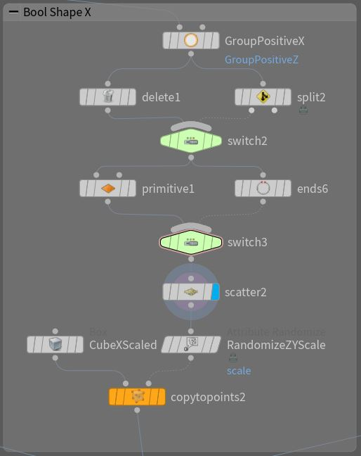

# Step-by-step guide

Main steps will be explained here, for extended version see .HIP file.

Create a project: File -> New Project.

Save Houdini file (.HIP) file inside the project: File -> Save As.

Ensure that `Build` desktop is selected (default). The following window panes should be visible: `obj/` scene view, `obj/` network view, network parameter view.

Inside `obj/` network create `geometry` network node and name it "geo".

Double click created `geometry` network node `geo/` to enter `obj/geo/` network. Note: scene view will also automatically switch to `obj/geo/` network.

All the following steps are done in `obj/geo/` network, also known as geometry network with SOP (surface operator) nodes.

### Complete building network overview

Building Module:

Building Module Result:

Stacking building module:

Stacking result:

Scattering stacked building modules:

Result:

### Starting with a cube

Network overview:

Start with a "Cube"/"Box" Node. Good modeling practice is to place objects on ZX plane (ground). For this we use "Copy parameter" and "Paste Relative References".

Parameters             |  Result
:-------------------------:|:-------------------------:
  |  

### Adding large geometrical details

Large geometrical details are often added using "Boolean" node. We use copy to points and scatter to copy geometry on desired positions on the cube.
For selecting desired positions for scattering we use "Group" node combined with "Delete" and "Primitive Properties" to remove faces we don't need.
Scaling of geometry which is copied is done using Attributes. We create attributes using "Attribute Randomize node".

Network             |  Result
:-------------------------:|:-------------------------:
  |  

This operation is repeated for any desired side of the cube.

### Adding smaller geometrical details

Adding smaller geometrical details require using subdivisions and extrusions with beveling. 
First, we use "Group" and "Delete"/"Blast" or "Labs Split Primitives by Normal" to isolate part of geometry where we want to add details.
Next, we apply "Labs Lots Subdivisions" to obtain irregular quad subdivisions which are preserving shape.
Then we use "Poly Extrude" node to extrude subdivided faces. For that we also need to use "Split Points" node which gives each face its separate points to extude. Also, we need to add randomized attribude called "zscale" for each primitive which is local control of extrusions for each face. For randomized attributes we use "Attribute Randomize".
For more details we add "Poly Bevel" node.

Network1             |  Network2
:-------------------------:|:-------------------------:
  |  

Finally, we can color attribute to each primitive using "Color" or "Color Adjust Color" node.

NOTE: assigning group to created details, we can use this groups as material group while exporting and creating different materials in other DCCs or engines.

We merge smaller geometrical details with the starting shape with larger geometrical details:

This is a complete module. A function. We can create subnetwork from these nodes and expose paramters we want to use via "Edit Paramter Interface". Again we use "Copy Parameter" and "Paste Relative references" for connecting created paramters and existing network paramteres. Interesting parameters to expose are "Seed" parameter of "Scatter" nodes we use for placing large geometrical details because they directly affect the large portion of geometry and everything that comes after. 

### Stacking building modules

For stacking we can simply use "Copy and Transform node". But then all modules will be the same.

For enhanced stacking we use "For loop Node" which is configured to be "Feedback Loop":
* Create "For Each Number For Loop Node"
* In "Block Begin" set Method to "Fetch Feedback"
* In "Block End" set Gather Method to "Feedback Each Iteration"

Now, we merge input and previous feedback using merge node and our building modue subnetwork. Also, we need to adjust position for each input based on its BB and feedback geometry BB. For this se use "Match Size" node.

Finally, we can use expression `detail("../foreach_count1", iteration, 0)` in our subnetwork building module to randomize paramters per building module.

Network1             |  Network2
:-------------------------:|:-------------------------:
  |  

Again, this is self-standing module, we create "Subnetwork", configure paramters via "Edit Parameter Interface". Interesting parameter would be "Seed" which is added to our "Subnetwork" node to expression `detail("../foreach_count1", iteration, 0)`.

### Scattering building modules

For scattering we use "Scatter" and "Copy to Points" nodes where input is grid for scattering points and our stacked building for copying.

Again, we use "For Loop" node and configure it to be "Feedback Loop":
* Create "For Each Number For Loop Node"
* In "Block Begin" set Method to "Fetch Feedback"
* In "Block End" set Gather Method to "Feedback Each Iteration"

We configure scatter to sample and create only one point. We use expression `detail("../foreach_count1", iteration, 0)` to randomized "Scatter Seed" in each "For Loop" iteration.

Network1             |  Network2
:-------------------------:|:-------------------------:
  |  

### Exporting

For export we use "File" node. Set it to write and desired path. Resulting geometry will have material groups if we have created "Group" nodes for desired parts.

