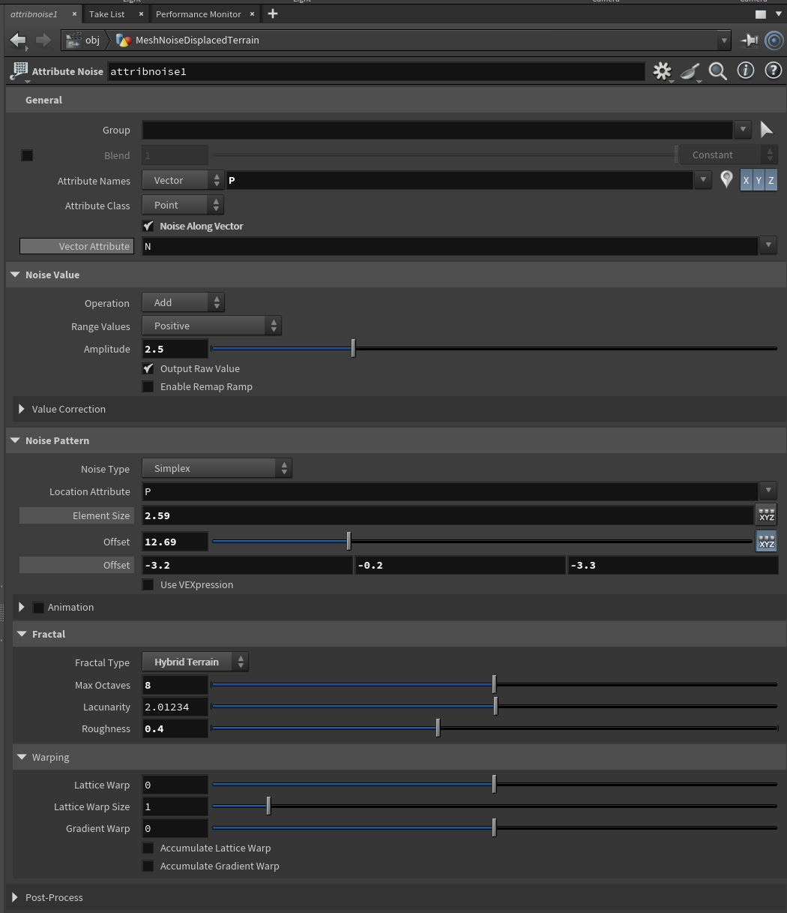
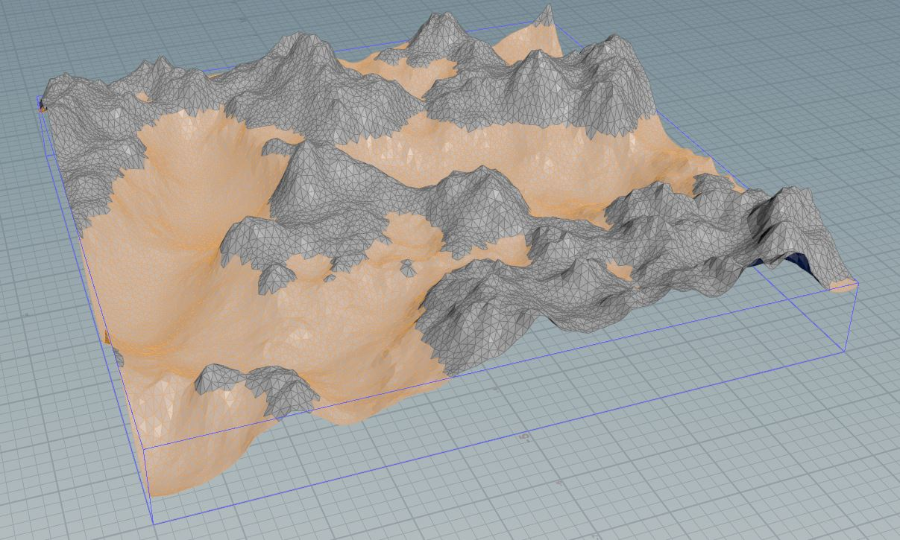
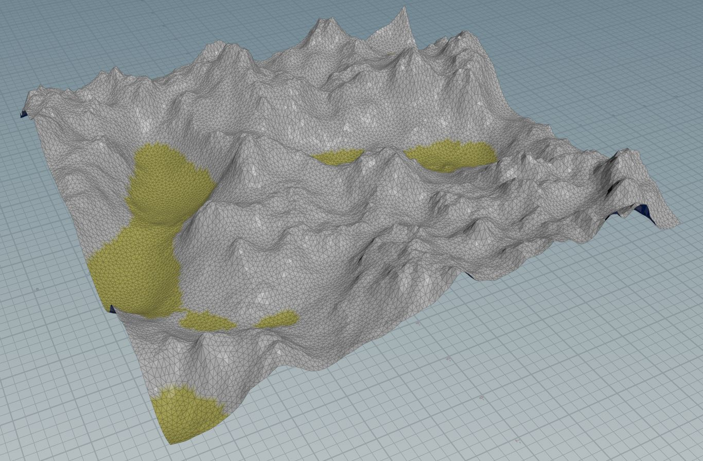

# Step-by-step guide

Main steps will be explained here, for extended version see .HIP file.

Create a project: File -> New Project.

Save Houdini file (.HIP) file inside the project: File -> Save As.

Ensure that `Build` desktop is selected (default). The following window panes should be visible: `obj/` scene view, `obj/` network view, network parameter view.

Inside `obj/` network create `geometry` network node and name it "geo".

Double click created `geometry` network node `geo/` to enter `obj/geo/` network. Note: scene view will also automatically switch to `obj/geo/` network.

All the following steps are done in `obj/geo/` network, also known as geometry network with SOP (surface operator) nodes.

### Complete Terrain network

Overview of complete network. Each step is explained below.

### General terrain geometry

Overview:

Explanation for each node follows.

Create `Grid` node, select and set parameters:
* Size: 10, 10
* Rows: 2
* Columns: 2

Parameters             |  Result
:-------------------------:|:-------------------------:
  |  

Create `Remesh` node, select and set parameters:
* Element Sizing -> Target Size: 0.1

Parameters             |  Result
:-------------------------:|:-------------------------:
  |  

Create `Attribute Noise` node, select and set parameters:
* General -> Attribute Names -> Vector -> P
* General -> Check "Noise Along Vector"
* Noise Value -> Range Values: Positive
* Noise Value -> Amplitude
* Noise Pattern Type -> Noise Type
* Noise Pattern Type -> Element Size
* Noise Pattern Type -> Fractal -> Fractal Type
* Noise Pattern Type -> Fractal: set other parameters to desired value

Parameters             |  Result
:-------------------------:|:-------------------------:
  |  

### Terrain groups

Result of final node above (Attribute Noise), connect with following network:

Explanation for each node follows.

Create `Group` node, select and set parameters:
* Group Name: "sand"
* Base Group: deselect "Enable" checkbox
* Keep in Bounding Regions: select "Enable" checkbox
* Keep in Bounding Regions -> Size X: ch("../grid1/sizex") (Copy parameter from Grid node Size X and use paste relative references)
* Keep in Bounding Regions -> Size Z: ch("../grid1/sizey") (Copy parameter from Grid node Size Y and use paste relative references)
* Keep in Bounding Regions -> Center Y: ch("sizey")/2 (Copy parameter from Bounding Regions -> Size Y and use paste relative references)
* Keep in Bounding Regions -> Size Y: set to desired height, e.g., 0.6, depending on amplitude set in `Attribute Noise` node

Parameters             |  Result
:-------------------------:|:-------------------------:
  |  

Create `Group` node, select and set parameters:
* Group Name: "grass"
* Base Group: deselect "Enable" checkbox
* Keep in Bounding Regions: select "Enable" checkbox
* Keep in Bounding Regions -> Size X: ch("../grid1/sizex") (Copy parameter from Grid node Size X and use paste relative references)
* Keep in Bounding Regions -> Size Z: ch("../grid1/sizey") (Copy parameter from Grid node Size Y and use paste relative references)
* Keep in Bounding Regions -> Center Y: ch("sizey")/2 (Copy parameter from Bounding Regions -> Size Y and use paste relative references)
* Keep in Bounding Regions -> Size Y: set to desired height, e.g., 1.2, depending on amplitude set in `Attribute Noise` node

Parameters             |  Result
:-------------------------:|:-------------------------:
  |  

Create `Group Combine` node, select and set paramters:

Parameters             |  Result
:-------------------------:|:-------------------------:
  |  

Create `Group` node, select and set parameters:
* Group Name: "forest"
* Base Group: deselect "Enable" checkbox
* Keep in Bounding Regions: select "Enable" checkbox
* Keep in Bounding Regions -> Size X: ch("../grid1/sizex") (Copy parameter from Grid node Size X and use paste relative references)
* Keep in Bounding Regions -> Size Z: ch("../grid1/sizey") (Copy parameter from Grid node Size Y and use paste relative references)
* Keep in Bounding Regions -> Center Y: ch("sizey")/2 (Copy parameter from Bounding Regions -> Size Y and use paste relative references)
* Keep in Bounding Regions -> Size Y: set to desired height, e.g., 1.7, depending on amplitude set in `Attribute Noise` node

Parameters             |  Result
:-------------------------:|:-------------------------:
  |  

Create `Group Combine` node, select and set paramters:

Parameters             |  Result
:-------------------------:|:-------------------------:
  |  

Create `Group` node, select and set parameters:
* Group Name: "stone"
* Base Group: deselect "Enable" checkbox
* Keep in Bounding Regions: select "Enable" checkbox
* Keep in Bounding Regions -> Size X: ch("../grid1/sizex") (Copy parameter from Grid node Size X and use paste relative references)
* Keep in Bounding Regions -> Size Z: ch("../grid1/sizey") (Copy parameter from Grid node Size Y and use paste relative references)
* Keep in Bounding Regions -> Center Y: ch("sizey")/2 (Copy parameter from Bounding Regions -> Size Y and use paste relative references)
* Keep in Bounding Regions -> Size Y: set to desired height, e.g., 3, depending on amplitude set in `Attribute Noise` node

Parameters             |  Result
:-------------------------:|:-------------------------:
  |  

Create `Group Combine` node, select and set paramters:

Parameters             |  Result
:-------------------------:|:-------------------------:
  |  

### Terrain color

Result of final node above (Group combine), connect with following network:

Explanation for each node follows.

Create `Color` node, select and set paramters:

Parameters             |  Result
:-------------------------:|:-------------------------:
  |  

Create `Color` node, select and set paramters:

Parameters             |  Result
:-------------------------:|:-------------------------:
  |  

Create `Color` node, select and set paramters:

Parameters             |  Result
:-------------------------:|:-------------------------:
  |  

Create `Color` node, select and set paramters:

Parameters             |  Result
:-------------------------:|:-------------------------:
  |  

Create `Attribute Blur` node, select and set paramters:

Parameters             |  Result
:-------------------------:|:-------------------------:
  |  

### Water plane

Network overview:

Explanation for each node follows.

Create `Grid` node, select and set paramters:

Parameters             |  Result
:-------------------------:|:-------------------------:
  |  

Create `Transform` node, select and set paramters:

Parameters             |  Result
:-------------------------:|:-------------------------:
  |  

Create `Attribute Noise` node, select and set paramters:

Parameters             |  Result
:-------------------------:|:-------------------------:
  |  

Create `Smooth` node, select and set paramters:

Parameters             |  Result
:-------------------------:|:-------------------------:
  |  

Create `Attribute Adjust Color` node, select and set paramters:

Parameters             |  Result
:-------------------------:|:-------------------------:
  |  

Create `Merge` node and connect result of water plane and terrain geometry:

Parameters             |  Result
:-------------------------:|:-------------------------:
  |  

### Instancing

Connect the result of terrain network to scatter node in following network:

Explanation for each node follows.

Create `Scatter` node, select and set paramters:
* Group: forest
* Force Total Count: 500

The result of terrain geometry with groups and colors connect to the input of scatter node.

Parameters             |  Result
:-------------------------:|:-------------------------:
  |  

Create `Attribute Randomize` node, select and set paramters:
* Attribute name: `pscale`
* Distribution -> Min Value: 0.1
* Distribution -> Max Value: 0.2

Parameters             |  Result
:-------------------------:|:-------------------------:
  |  

Create `Attribute Randomize` node, select and set paramters:
* Attribute name: `Cd`
* Distribution -> Min Value: 0, 0.1, 0
* Distribution -> Max Value: 0.1, 0.3, 0.1

Parameters             |  Result
:-------------------------:|:-------------------------:
  |  

Create `Copy To Points` node, select and set paramters:

Parameters             |  Result
:-------------------------:|:-------------------------:
  |  

Any kind of geometry can be inputted to `Copy To Points` node.

Create `Merge` node and connect result of copy to points node and terrain geometry with water plane:

Parameters             |  Result
:-------------------------:|:-------------------------:
  |  

Same approach can be used to add different types on trees on different parts of terrain, e.g., on grass group.