Ensure that current network is obj/.

Create geometry node inside obj/ network.

Enter geometry network.

Create Font node:

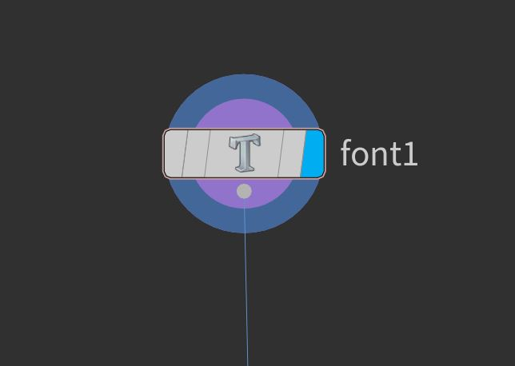

* Inside Text field type "H". CTRL + S to save.
* Set vertical alignment to Bottom.

Result:

Create Poly Bevel node and connect Font node to it:

* Set Distance to 0.25
* Set Output Back (Extrusion -> Output Geometry and Group)

Result:

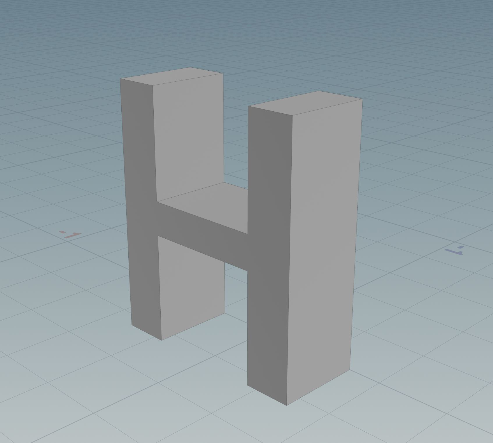

Create Remesh To Grid node and connect Poly Extrude node with it:

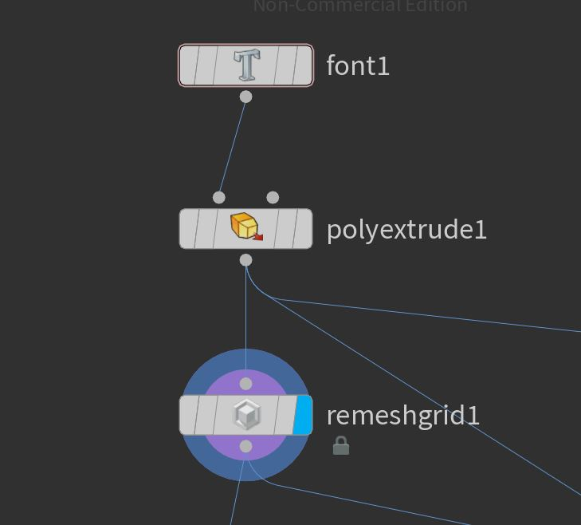

* Set division Size to 0.01

Result:

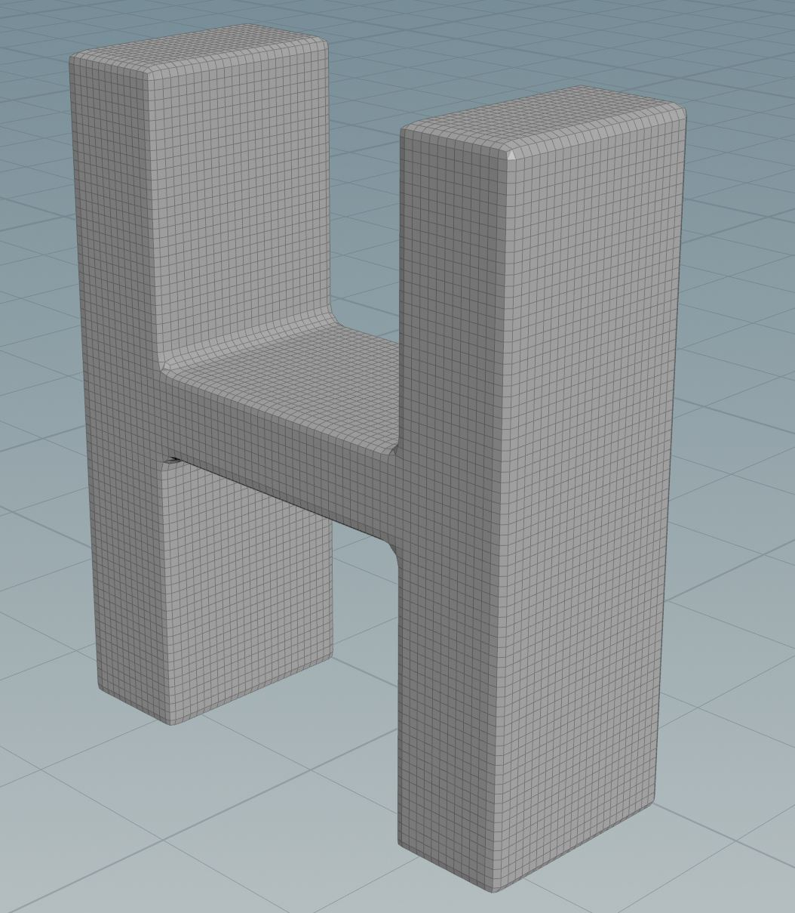

Create Group Node and connect Remesh To Grid node with it:

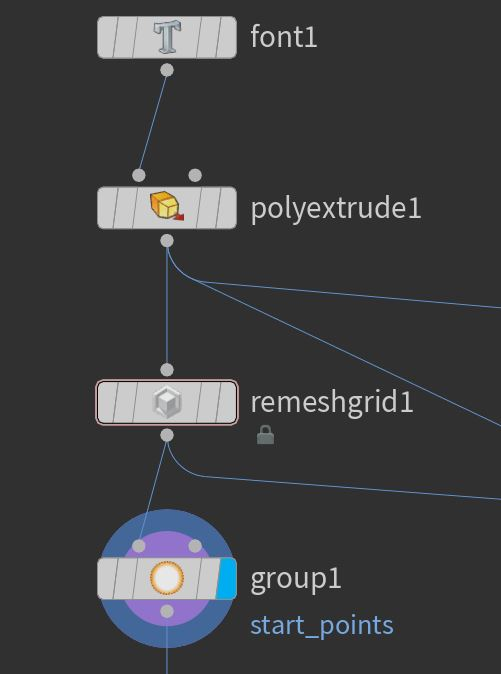

* Set Group type to Points
* Set Group name to "start_points"
* Deselect Base Group
* Select Keep in Bounding Regions
* Position Bounding box to select few points

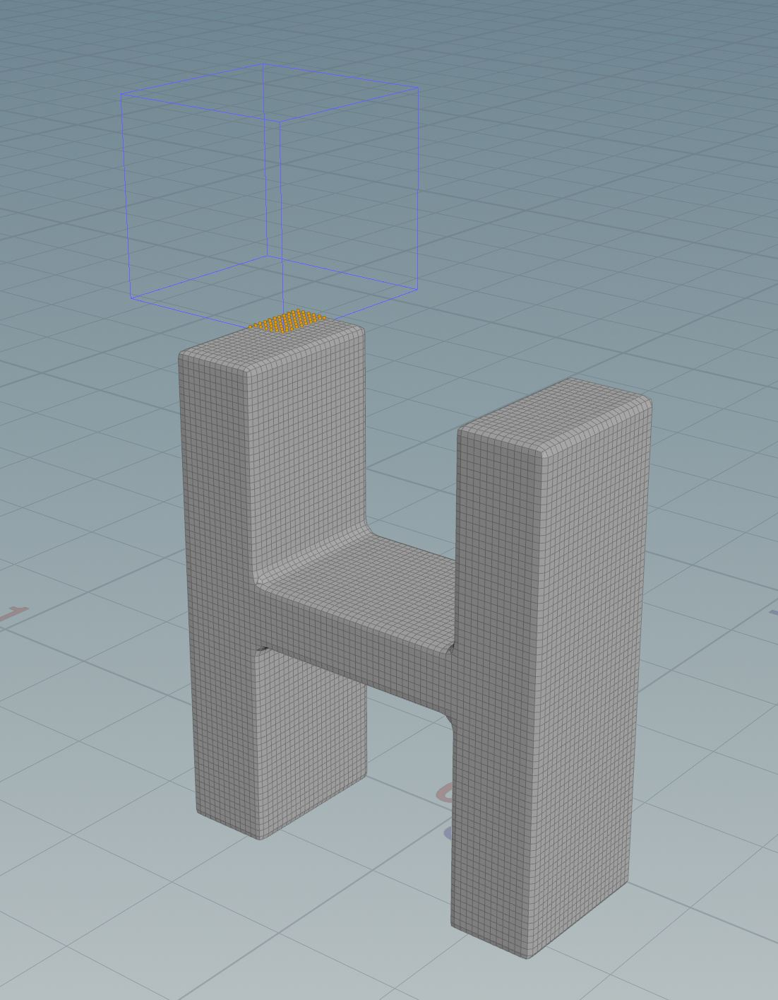

Create Distancy Along Geometry node and connect Group node with it:

* In Start Points set "start_points"

Result: 

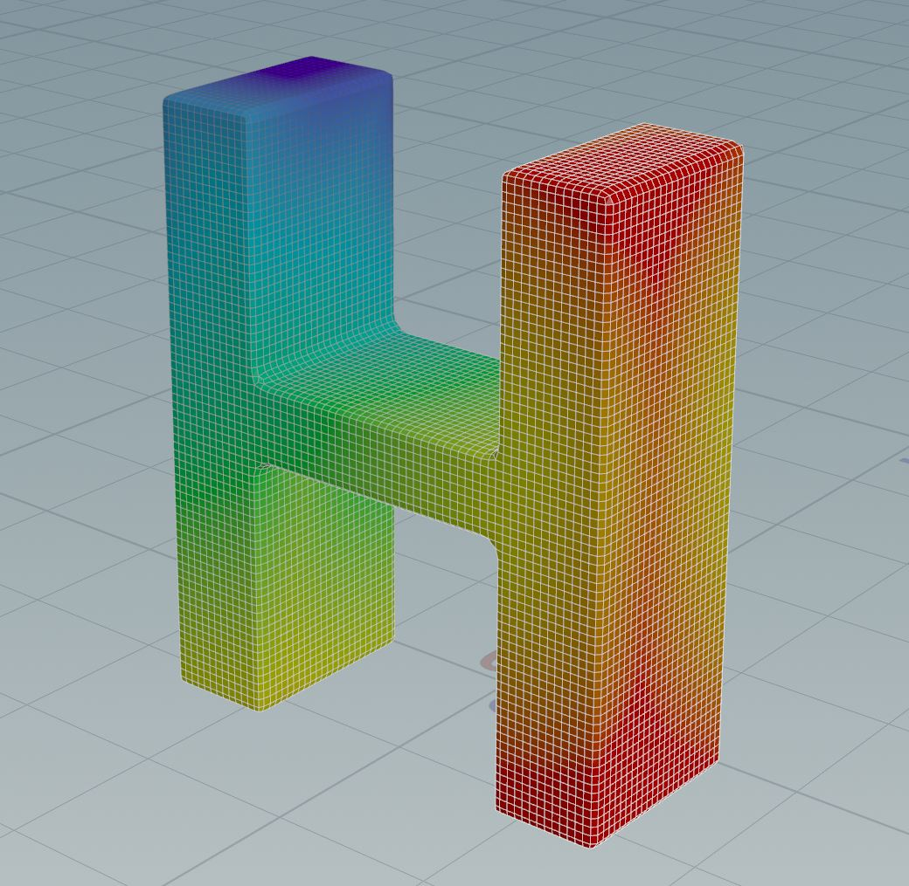

Note: dist attribute is visualized, violet are small values, red are large values.

Create Attribute Remap Node and connect Distancy Along Geometry node to it:

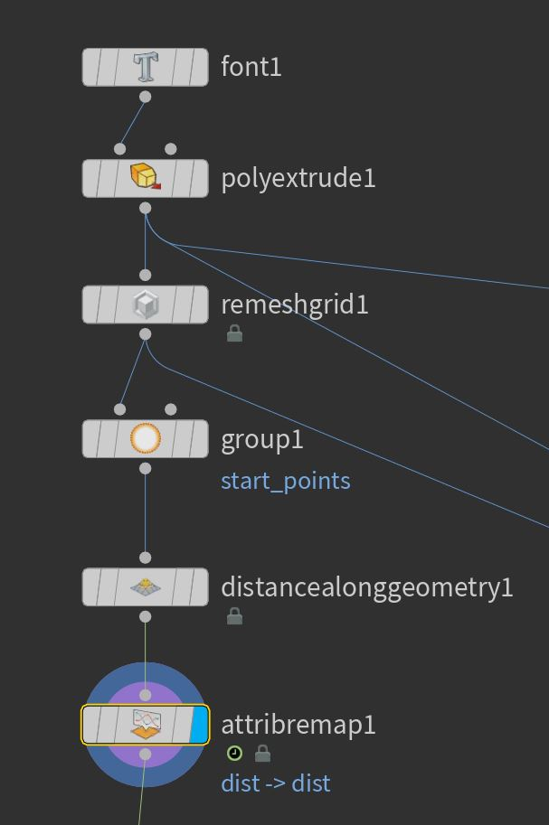

* Set original name to "dist"
* Set new name to "dist"
* Click Compute Range
* Set value of 1st ramp point to 0
* Set value of 2nd ramp point to 1
* Animate position of 2nd ramp point

Create Attribute Noise node and Attribute Wrangle node and connect them as follows:

Inside Attribute Noise node:
* Set Attribute names to Float and noise
* Adjust Amplitude
* Adjust Element size

Inside Attribute Wrangle node:
* type: f@pscale = @dist * @noise;

Create Scatter Node, Normal Node and Attribute transfer node and connect as follows:

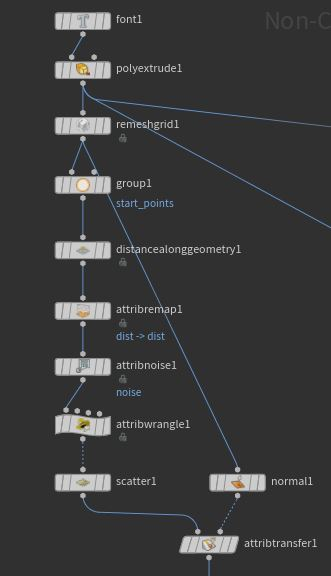

Inside Normal node:
* Ensure: Add Normals to Points 

Result:

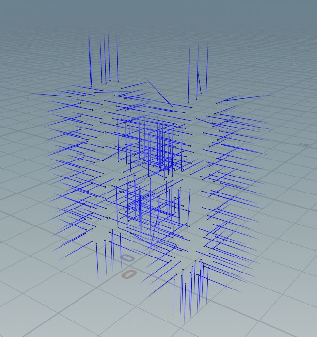

Create Attribute Randomize node and Attribute Adjust Color Node and connect as follows:

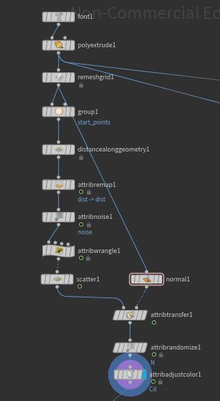

Inside Attribute Randomize Node:
* Set Attribute Name to: "N"
* Set Operation to "Add Value"
* Set Distribution to "Inside Sphere"

Inside Attribute Adjust color Node:
* Set Attribute name to "Cd"
* Set Pattern Type to "Noise"
* Set desired colors in Color Ramp

Result: 

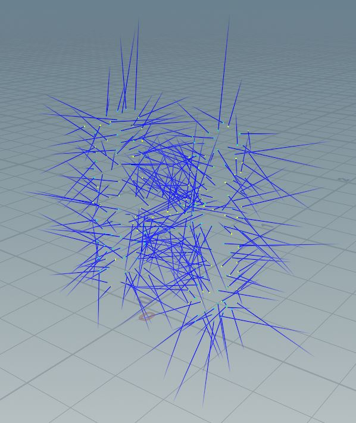

Create GLTF Node, PolyReduce Node, Transform Node and Copy to points Node and connect them as follows:

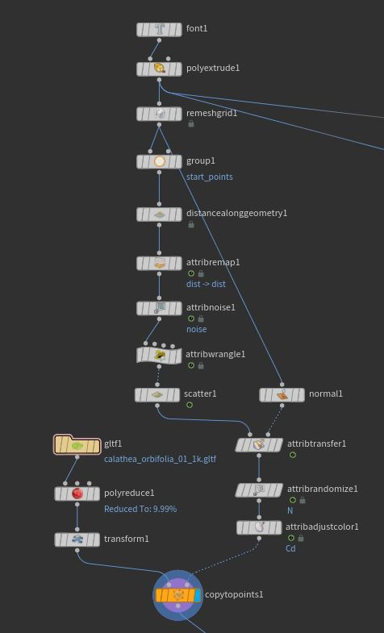

Inside GLTF Node:
* Set desired File Name
* Set Load by Mesh
* Select desired Mesh ID
* Set points merge distance to 0

Inside Poly Reduce node:
* Set percent to keep to 10%

Inside Transform Node:
* Set X Rotation 90deg

Create Merge Node and connect as follows:

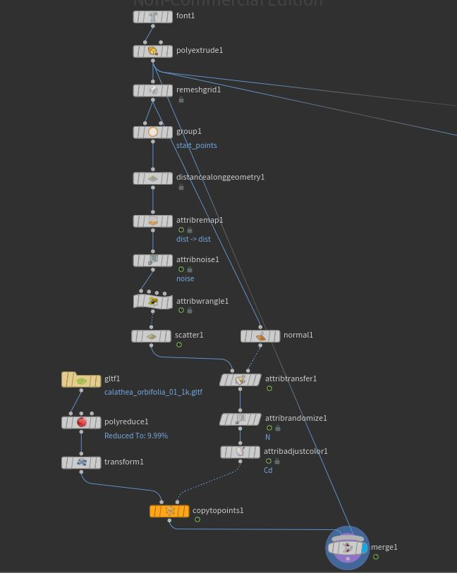

Result:

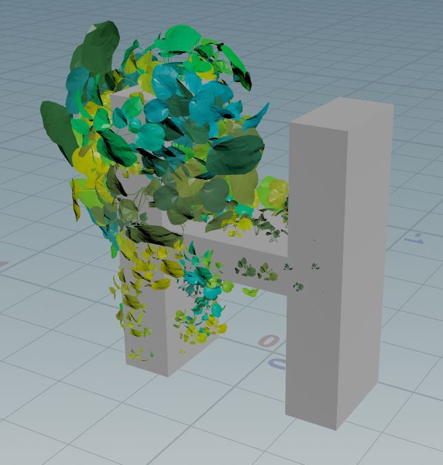

Create VDB From Polygons, Scatter, Connect Adjecent Pieces and Attribute Adjust color as follows:

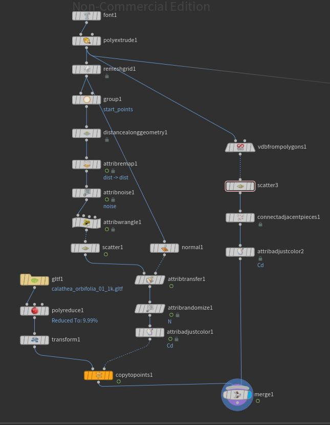

Inside VDB From Polygons Node:
* Deselect Distance VDB
* Select Fog VDB

Inside Connect Adjecent Pieces Node:
* Set Connection Type to Adjecent Points
* Set Max Search Points to 4

Inside Attribute Adjust Color:
* Set Attribute name to "Cd"
* Set Pattern Type to "Noise"
* Set desired colors in Color Ramp

Result:

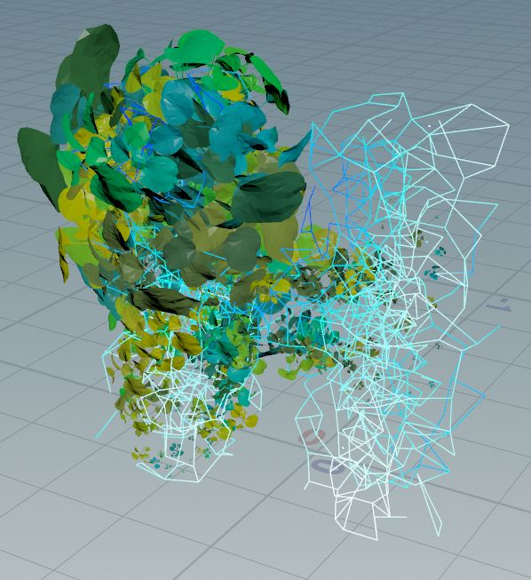

Additional masks are created similarly and used for instancing:

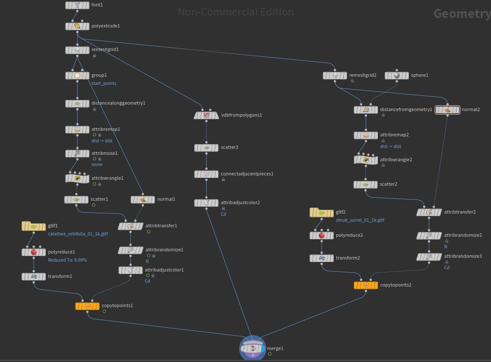

Note similar setup except:
* Here we are using Distance From Geometry with animated sphere as reference geometry

Result:

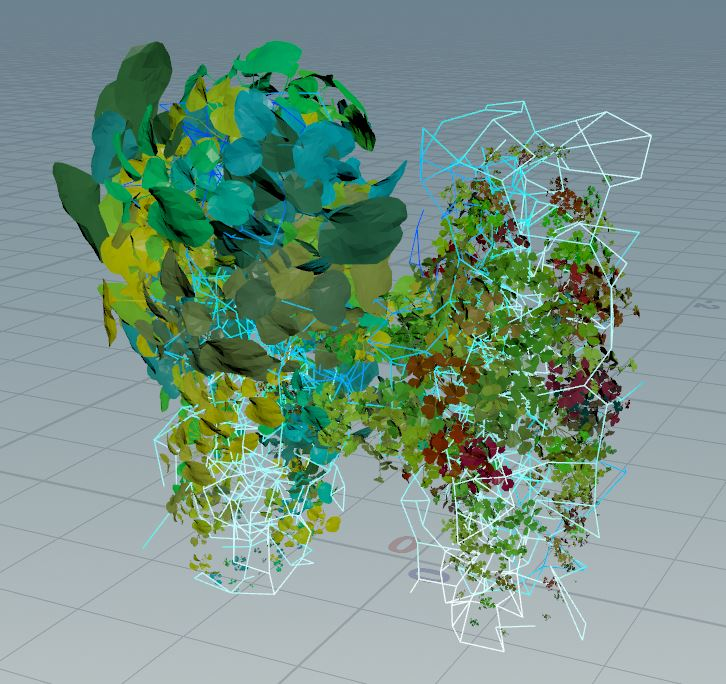