Ensure that current network is obj/.

Create geometry node inside obj/ network.

Enter geometry network.

Create Font node:

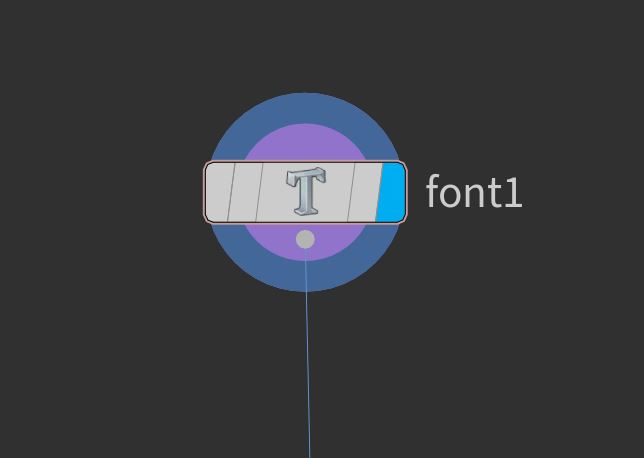

* Inside Text field type "H". CTRL + S to save.
* Set vertical alignment to Bottom.

Result:

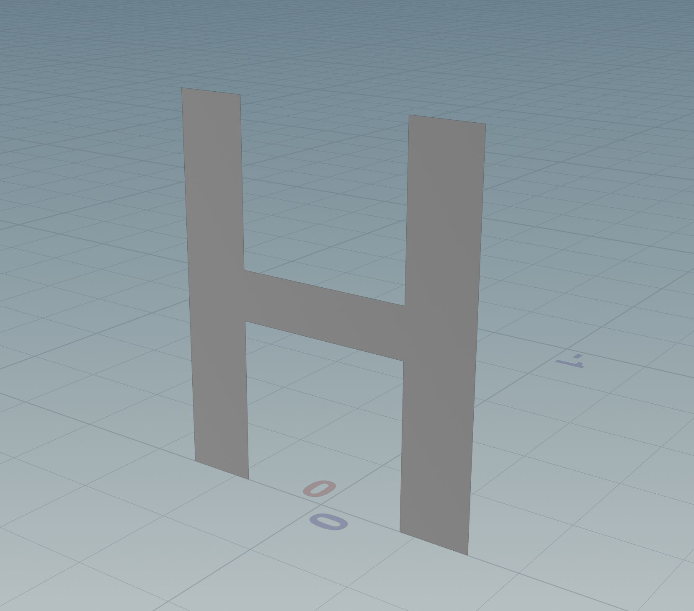

Create Poly Bevel node and connect Font node to it:

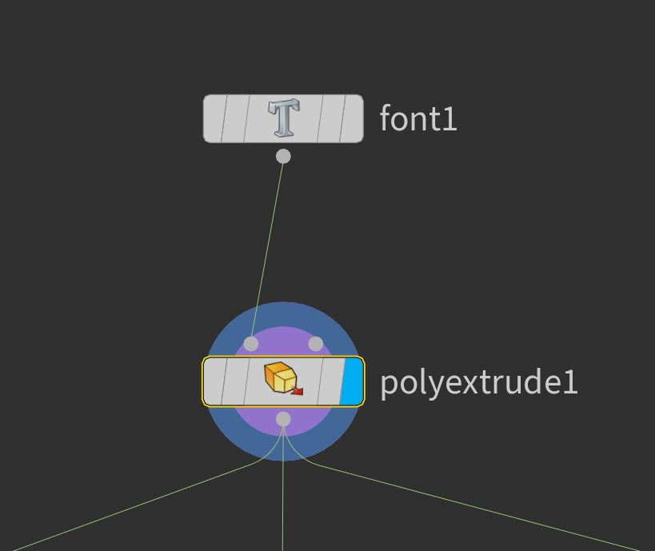

* Set Distance to 0.25
* Set Output Back (Extrusion -> Output Geometry and Group)

Result:

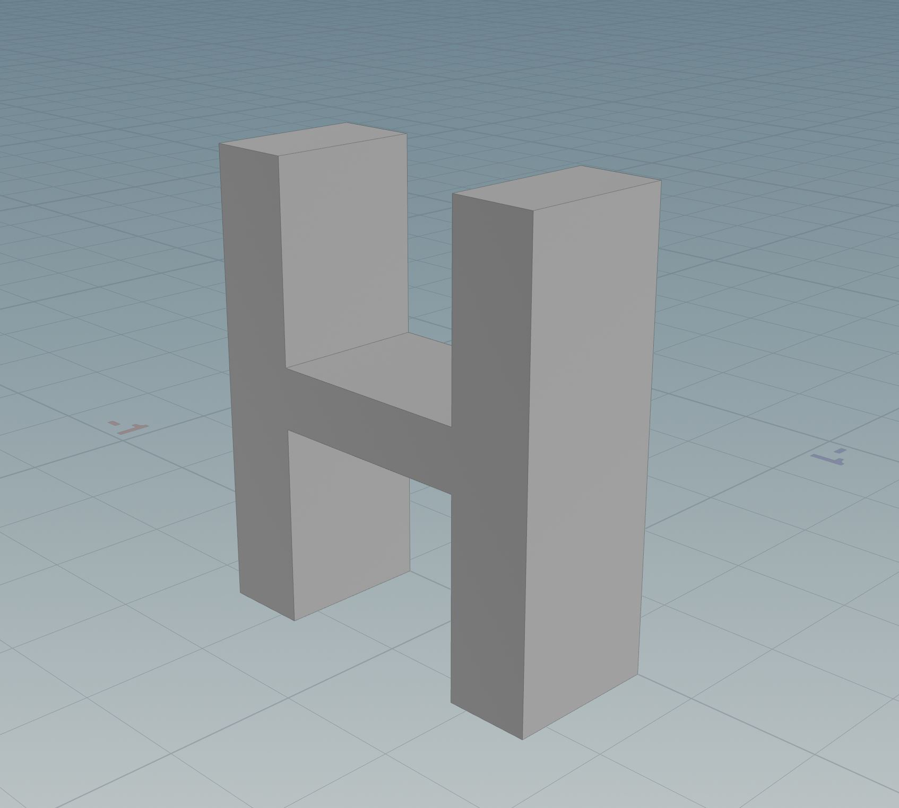

Create Remesh To Grid node and connect Poly Extrude node with it:

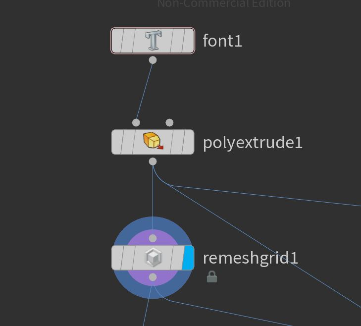

* Set division Size to 0.01

Result:

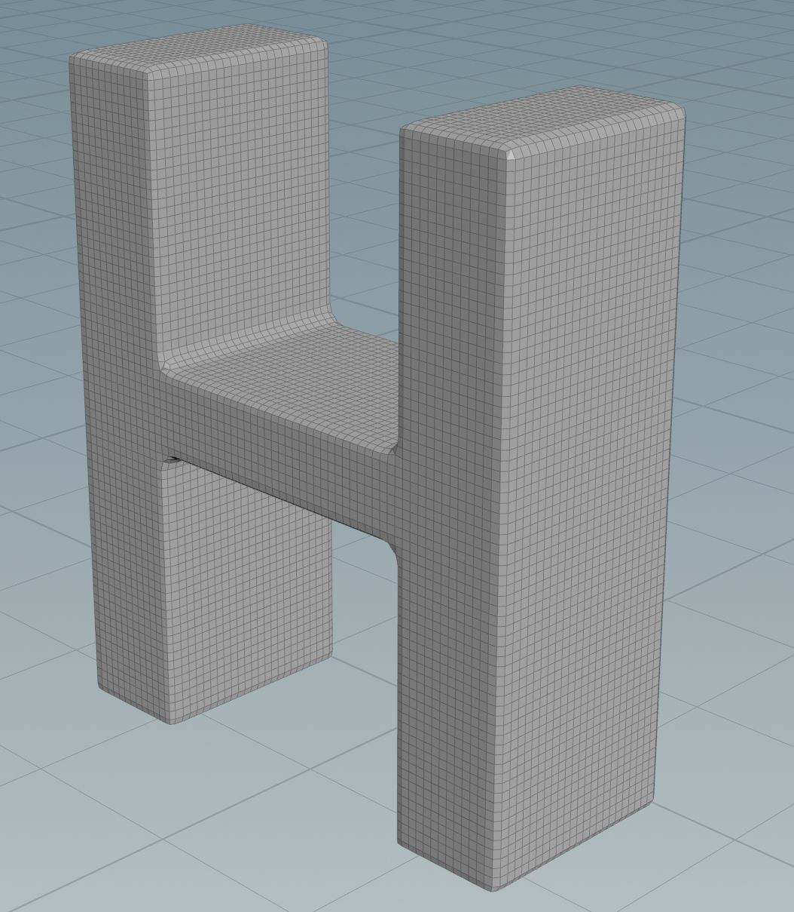

Create Group Node and connect Remesh To Grid node with it:

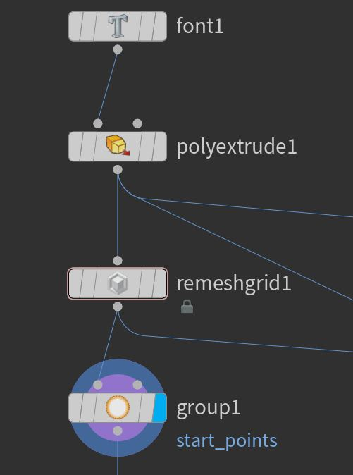

* Set Group type to Points
* Set Group name to "start_points"
* Deselect Base Group
* Select Keep in Bounding Regions
* Position Bounding box to select few points

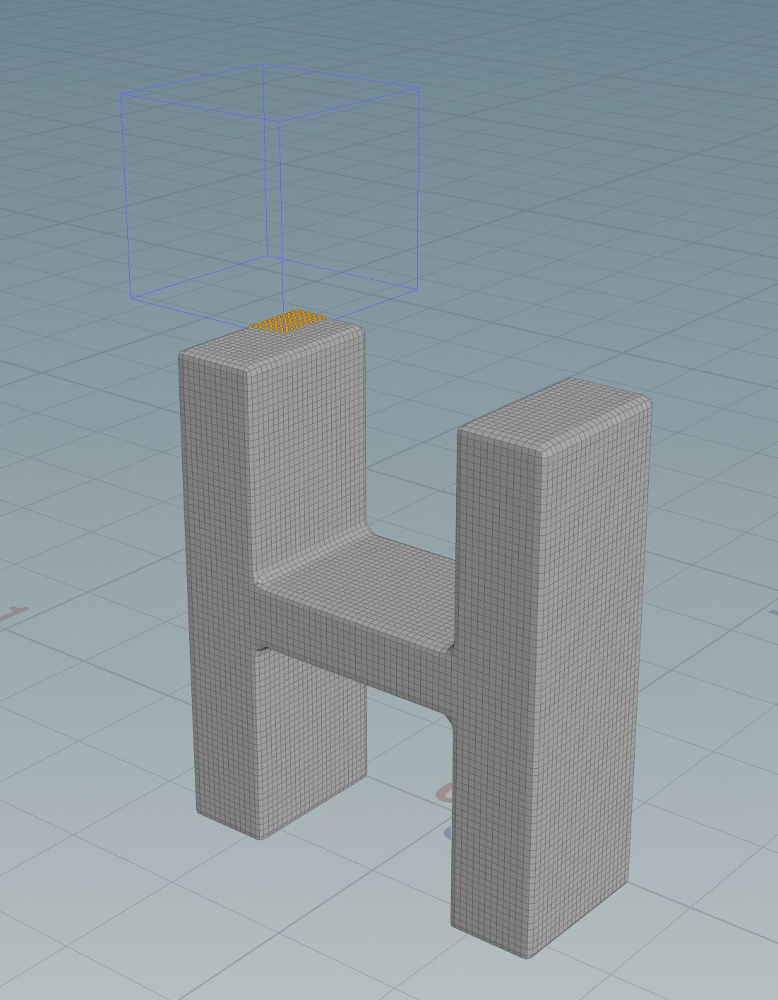

Create Distancy Along Geometry node and connect Group node with it:

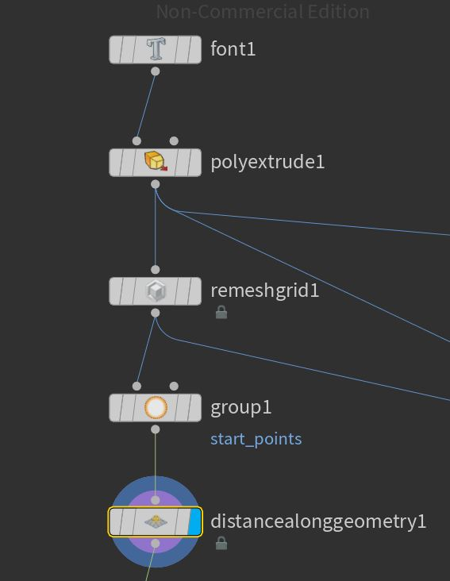

* In Start Points set "start_points"

Result: 

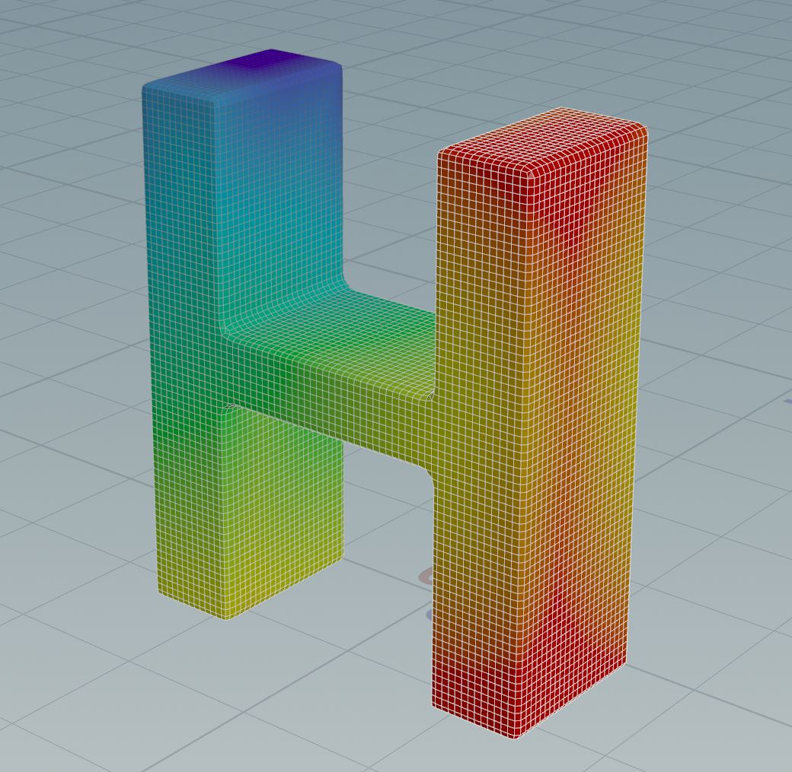

Note: dist attribute is visualized, violet are small values, red are large values.

Create Attribute Remap Node and connect Distancy Along Geometry node to it:

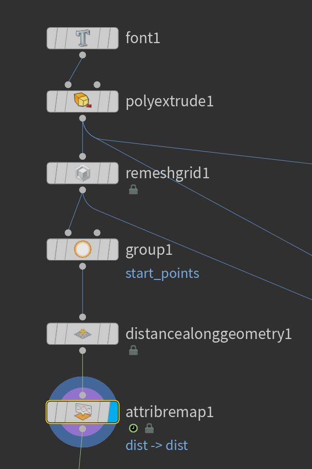

* Set original name to "dist"
* Set new name to "dist"
* Click Compute Range
* Set value of 1st ramp point to 0
* Set value of 2nd ramp point to 1
* Animate position of 2nd ramp point

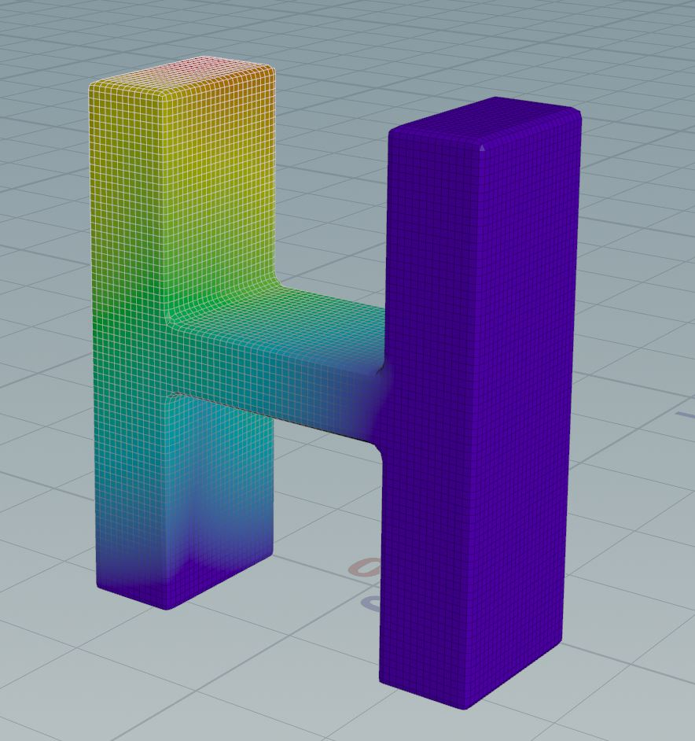

Create Attribute Noise node and Attribute Wrangle node and connect them as follows:

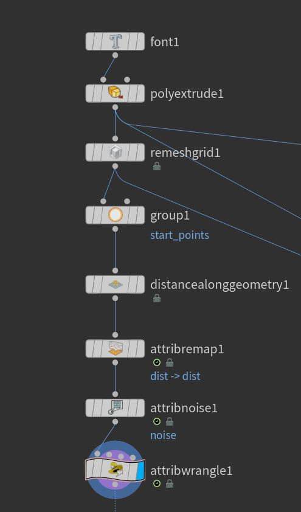

Inside Attribute Noise node:
* Set Attribute names to Float and noise
* Adjust Amplitude
* Adjust Element size

Inside Attribute Wrangle node:
* type: f@pscale = @dist * @noise;

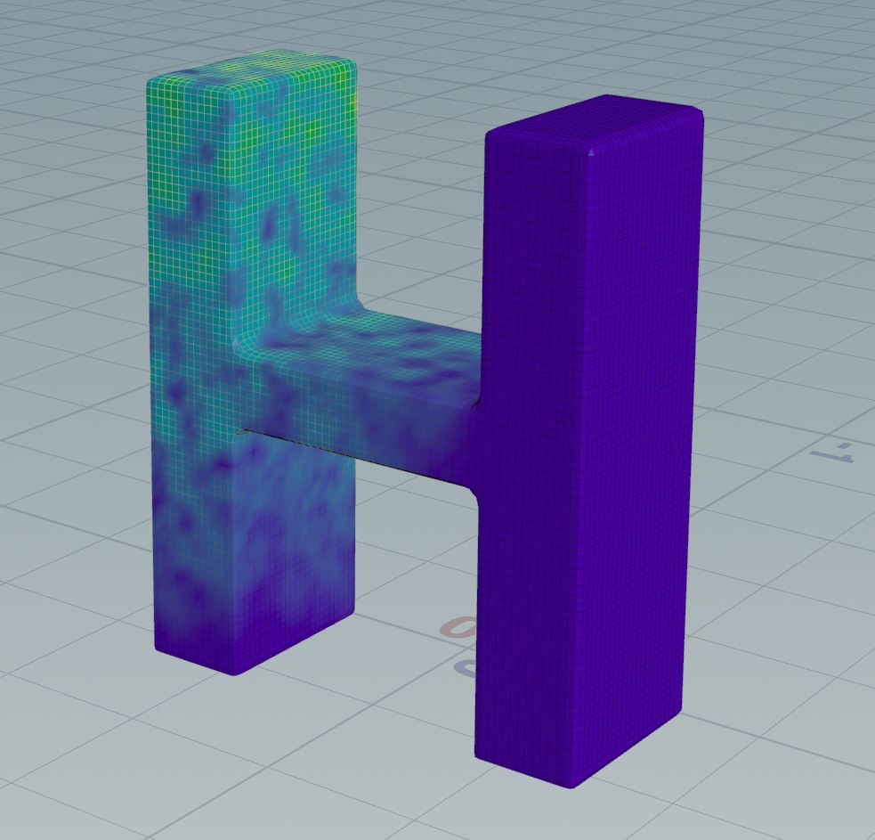

