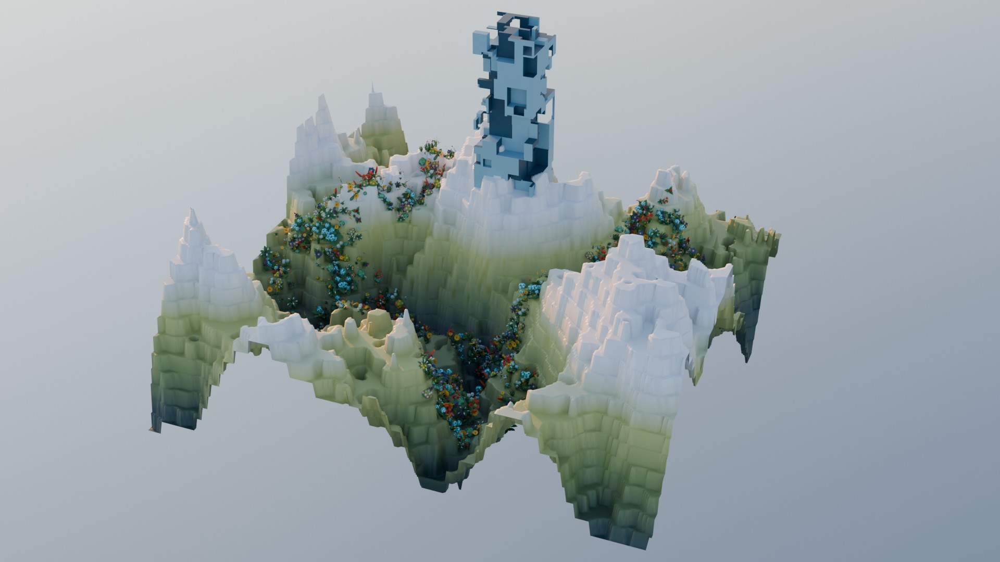
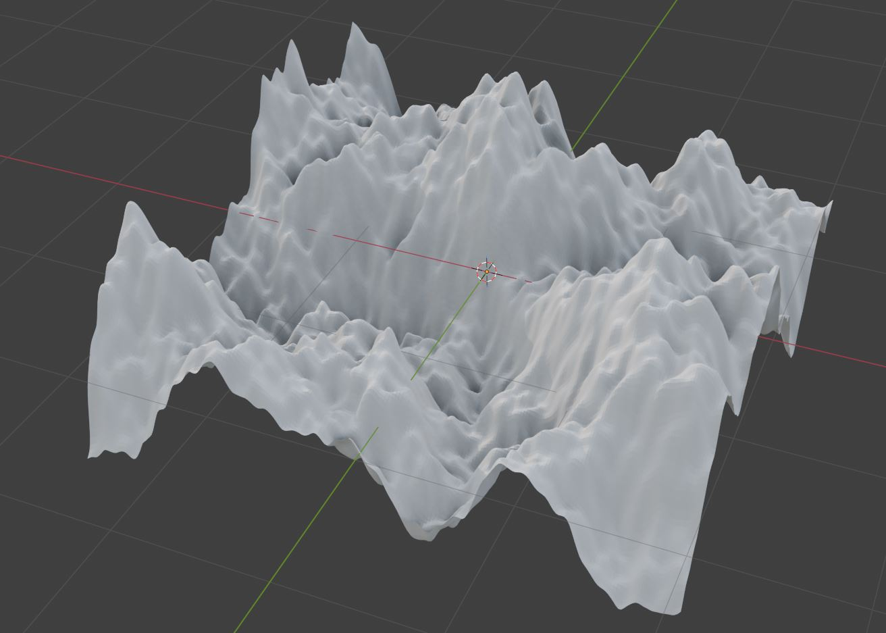
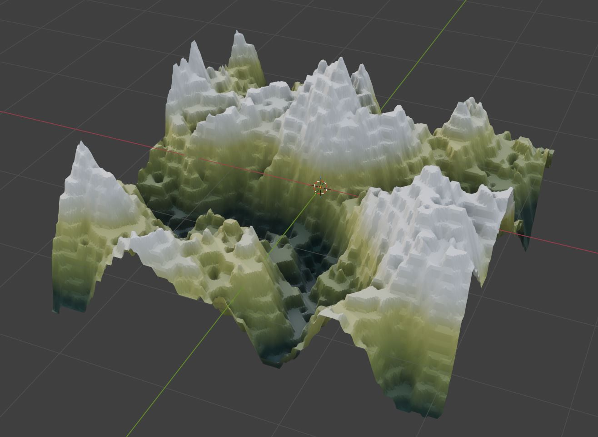
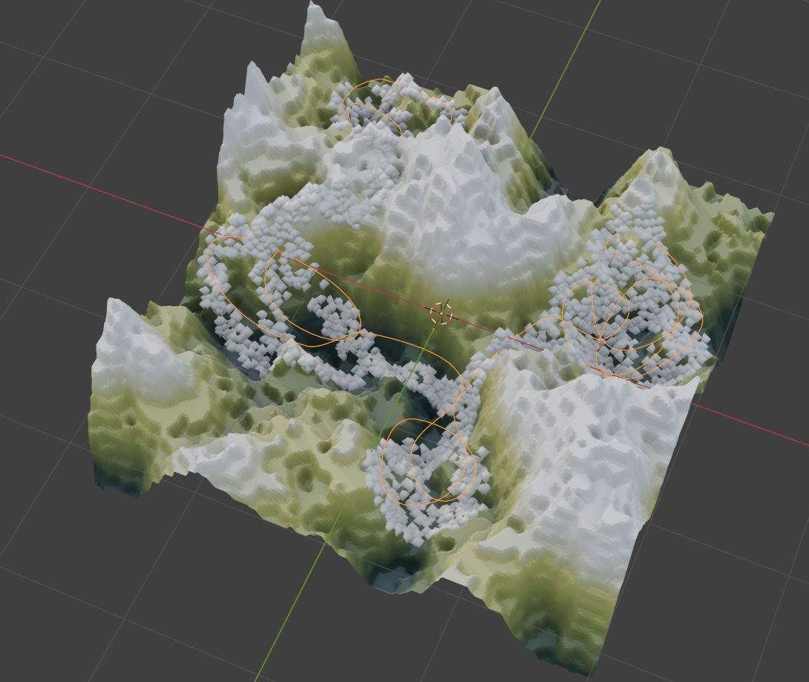
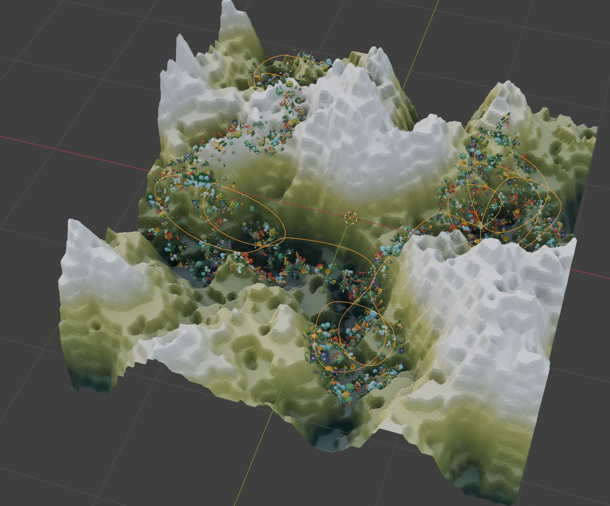
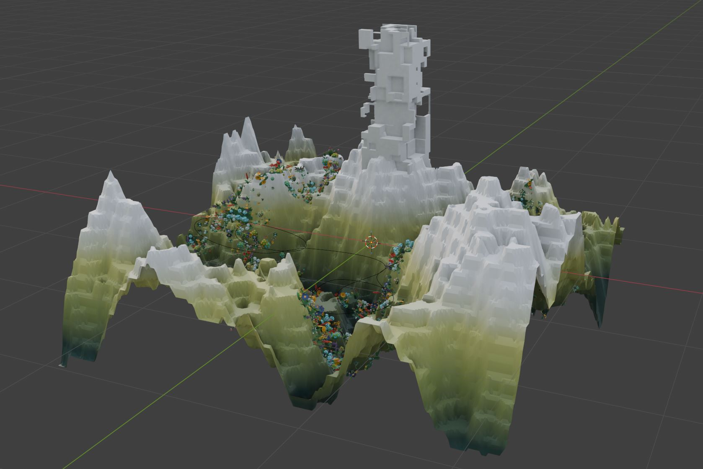
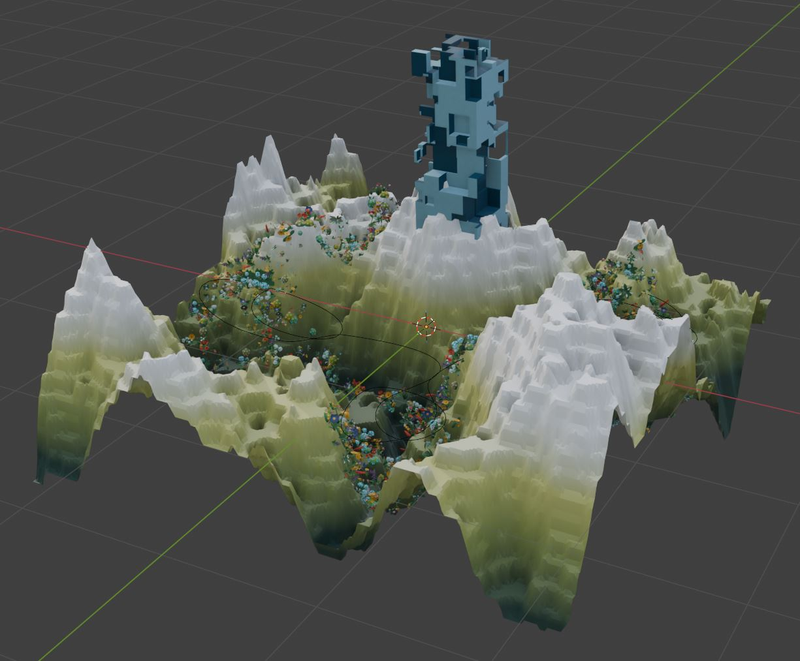

# Group 3: Project Task

# Intro

Notes:
* All tasks in this project have to be solved using Geometry Nodes Editor and Shader Editor in Blender.
* Feel free to experiment with geometry, operators, attributes and parameters as long as your result is meeting concepts described in the task.
* It is encouraged to add additional besides ones required in the task.
* Use Blender version 5.0
* For any questions write to lovrobosnar.work@gmail.com (latest possible consultation until 17.04.2026., 11:00h A.M.)

# Tasks

Create Grid geometry. Displace grid vertices in normal direction using noise. Hints:
* Creating Grid using Geometry Nodes Editor: https://docs.blender.org/manual/en/latest/modeling/geometry_nodes/mesh/primitives/grid.html
* Procedural noise textures (e.g., Voronoi) supported in Geometry Nodes Editor: https://docs.blender.org/manual/en/latest/modeling/geometry_nodes/texture/index.html
* Shape noise using Map Range node: https://docs.blender.org/manual/en/latest/compositing/types/utilities/math/map_range.html
* Shape and combine noise functions using Geometry Nodes Editor Math node (e.g., multiply, add, etc.): https://docs.blender.org/manual/en/3.1/modeling/geometry_nodes/utilities/math.html
* Normal direction can be obtained using Node node: https://docs.blender.org/manual/en/latest/modeling/geometry_nodes/geometry/read/normal.html
* For scaling normal vector to use it for displacement use Vector Math node (e.g., scale): https://docs.blender.org/manual/en/3.3/modeling/geometry_nodes/vector/vector_math.html
* Displacement can be performed using Set Position node: https://docs.blender.org/manual/en/latest/modeling/geometry_nodes/geometry/write/set_position.html

10 Points

Expected result:

Modify displacement noise using by rounding the noise value down to the nearest integer multiple of Increment. Smooth geometry using position attribute blur. Hints:
* Math node (search for "Snap"): https://docs.blender.org/manual/en/3.1/modeling/geometry_nodes/utilities/math.html
* Tutorial to understand smoothing by bluring: https://www.youtube.com/watch?v=pZ3287wBskc
* Blur attribute node: https://docs.blender.org/manual/en/latest/modeling/geometry_nodes/attribute/blur_attribute.html
* Position attribute: https://docs.blender.org/manual/en/latest/modeling/geometry_nodes/geometry/read/position.html
* Setting (blured) position: https://docs.blender.org/manual/en/latest/modeling/geometry_nodes/geometry/write/set_position.html

10 Points

Expected result:

For the displaced grid geometry, store created noise value as attribute per geometry face. Create material using Shader Editor and in Shader Editor use stored noise value attribute to create color. Assign material to the geometry. Hints:
* To store attribute in Geometry Nodes Editor use: https://docs.blender.org/manual/en/latest/modeling/geometry_nodes/attribute/store_named_attribute.html
* Shader editor: https://docs.blender.org/manual/en/latest/editors/shader_editor.html
* To access attributes stored in geometry in Shader Editor use node Attribute: https://docs.blender.org/manual/en/latest/render/shader_nodes/input/attribute.html
* To map attribute (e.g., noise value) to color use color ramp in shader editor: https://docs.blender.org/manual/en/latest/editors/texture_node/types/converter/color_ramp.html
* Help with choosing color: https://color.adobe.com/explore 
* To assign material in Geometry Nodes Editor use Set Material node: https://docs.blender.org/manual/en/latest/modeling/geometry_nodes/geometry/material/set_material.html

10 Points

Expected result:

Add curve object in 3D scene (outside of Geometry Nodes Editor). Draw curve across displaced geometry. Distribute points over displaced geometry. Use curve to control distributed points: only points close to the curve should remain.
* Curve geometry: https://docs.blender.org/manual/en/latest/modeling/curves/index.html
* Drawing curve in viewport: https://docs.blender.org/manual/en/latest/modeling/curves/tools/draw.html
* To compute geometry proximity use Geometry Proximity Node: https://docs.blender.org/manual/en/latest/modeling/geometry_nodes/geometry/sample/geometry_proximity.html
* Curve to mesh operator in Geometry Nodes Editor (required for proximity computation): https://docs.blender.org/manual/en/latest/modeling/geometry_nodes/curve/operations/curve_to_mesh.html
* To use geometry 3D from scene in Geometry Nodes Editor use Object Info node: https://docs.blender.org/manual/en/latest/render/shader_nodes/input/object_info.html
* Distributing points on faces: https://docs.blender.org/manual/en/latest/modeling/geometry_nodes/point/distribute_points_on_faces.html

20 Points.

Expected result:

On distributed points instance at least 3 different foliage geometries. Hints:
* Download existing foliage geometry: https://polyhaven.com/models/nature, https://creativetrio.art/, or any other site with 3D foliage models.
* To use foliage geometry into Geometry Nodes Editor use Collection Info node: https://docs.blender.org/manual/en/latest/modeling/geometry_nodes/input/scene/collection_info.html
* To instance geometry use Instance on Points node: https://docs.blender.org/manual/en/latest/modeling/geometry_nodes/instances/instance_on_points.html

10 Points.

Expected result:

In same Geometry Nodes editor create create cube geometry. Using Mesh Boolean carve this cube geometry. For carving, first instance cubes with various scales (scales should be smaller than this cube which is carved) on surface of this cube which is carved. Then, use instances of smaller cubes and cube to carve as input to Mesh Boolean difference operation. Transform carved cube geometry to be sitting on top of displaced grid. Hints:
* Cube geometry: https://docs.blender.org/manual/en/latest/modeling/geometry_nodes/mesh/primitives/cube.html
* Realize instances (needed for correct Mesh Boolean operations): https://docs.blender.org/manual/en/latest/modeling/geometry_nodes/instances/realize_instances.html
* Mesh Boolean (use difference option for carving): https://docs.blender.org/manual/en/latest/modeling/geometry_nodes/mesh/operations/mesh_boolean.html
* Transform geometry: https://docs.blender.org/manual/en/latest/modeling/geometry_nodes/geometry/operations/transform_geometry.html

30 Points.

Expected result:

In Geometry Nodes Editor, for carved cube geometry, store random value attribute to each face. Create new material using Shader Editor. In Shader Editor, for created material, use stored attribute per face to create color. In Geometry Nodes Editor assign this material to carved cube geometry. Hints: 
* https://docs.blender.org/manual/en/latest/modeling/geometry_nodes/utilities/random_value.html

10 Points.

Expected result:

# Rendering

Add lights and camera to the 3D scene and render your result using at least 3 different camera locations and at least FullHD resolution. Export as JPG file format. Hints:
* Lights: https://docs.blender.org/manual/en/latest/render/lights/light_object.html
* World Output Node in Shader Nodes light: https://docs.blender.org/manual/en/latest/render/shader_nodes/output/world.html
* World Shader Node for HDRI light: https://docs.blender.org/manual/en/latest/render/shader_nodes/textures/environment.html
* HDRI: https://polyhaven.com/hdris, https://freestylized.com/all-skybox/
* Camera: https://docs.blender.org/manual/en/latest/render/cameras.html
* Rendering: https://docs.blender.org/manual/en/latest/render/index.html

# Conceputal one-pager documentation

Write one-pager document of arbitrary format containing conceptual documentation: inspiration, experiments, which methods are used, why, workflow, concepts, implementation, discussion, results. Make sure to write your name and official e-mail address. Export in .PDF file format. 

# Project Submission details

To submit project, upload following and make it available by link:
* Blender source project (.BLEND)
* Onepager with conceptual documentation (.PDF)
* 3 rendered images (.JPG)

Send link to lovrobosnar.work@gmail.com until 19.04.2026.
Recieved project submission will be confirmed by sending e-mail to the owner of the project. Therefore, it you haven't recieved confirmation in 2 days send the link again and notify Professor Gerhards.

All 3 reqired submission elements must be submitted in same time. If something is missing in the submission documentation you will have 2 days from my notice to add missing documents. It is not possible to add missing documents after 19.04.2026.

Note: failing to submit any of 3 required elements results in 0 points.