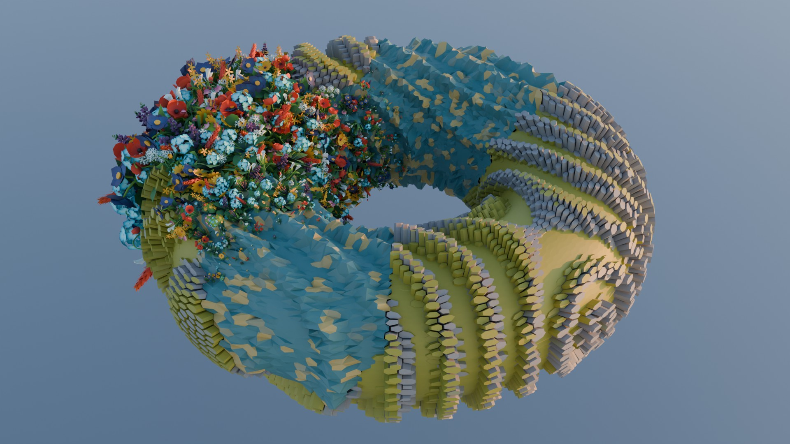
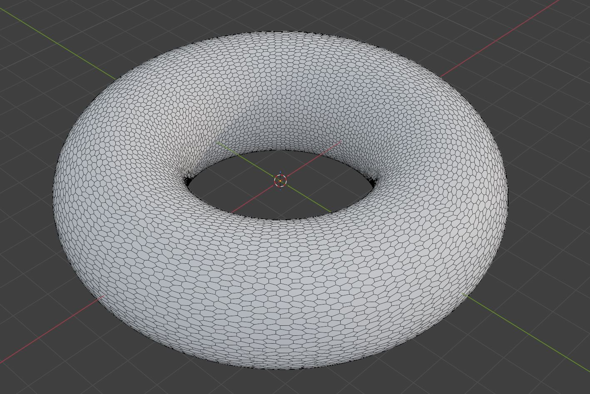
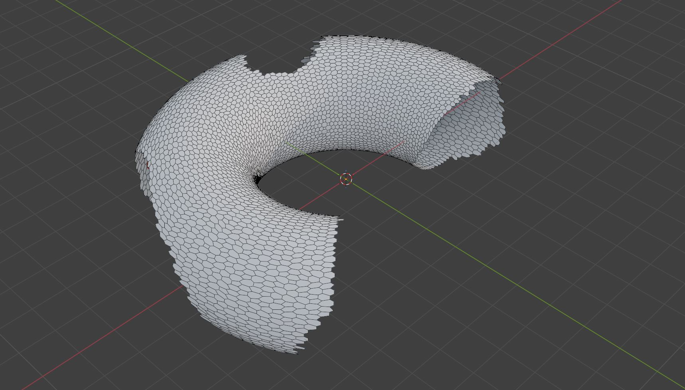
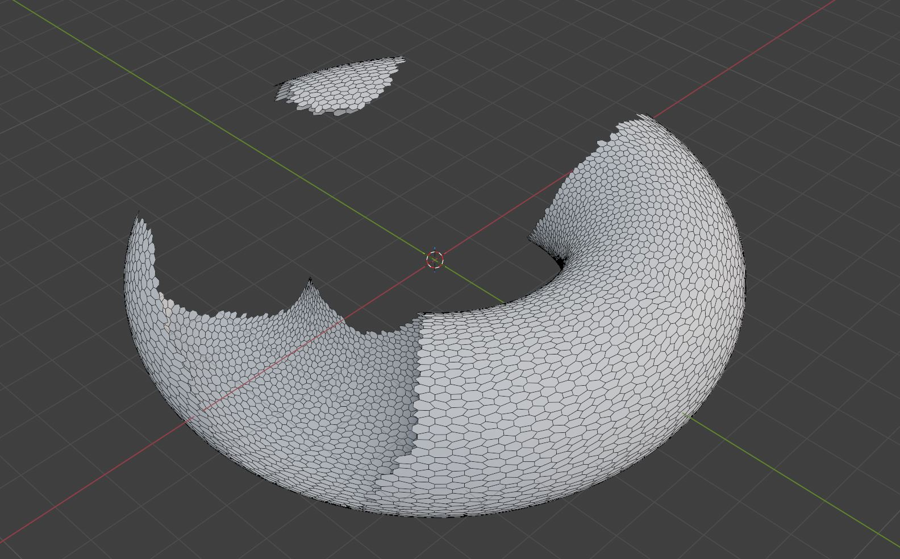
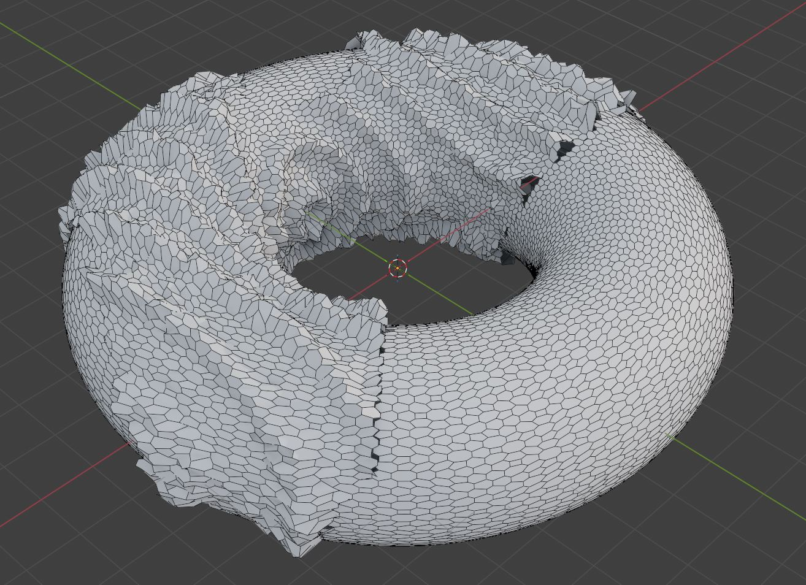
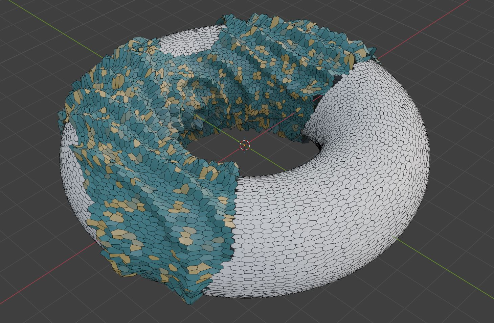
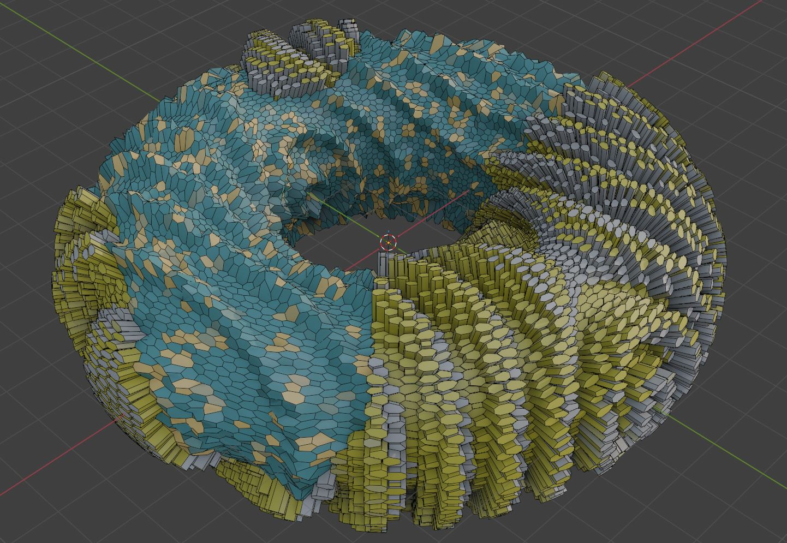
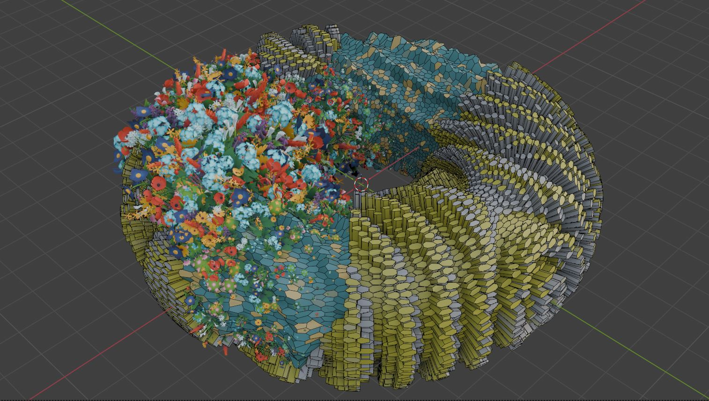

# Group 2: Project Task

# Intro

Notes:
* All tasks in this project have to be solved using Geometry Nodes Editor and Shader Editor in Blender.
* Feel free to experiment with geometry, operators, attributes and parameters as long as your result is meeting concepts described in the task.
* It is encouraged to add additional besides ones required in the task.
* Use Blender version 5.0
* For any questions write to lovrobosnar.work@gmail.com (latest possible consultation until 17.04.2026. at 11:00h A.M.)

# Tasks

Create Simple Torus in Geometry nodes Editor. Hints:
* Curve circle: https://docs.blender.org/manual/en/latest/modeling/geometry_nodes/curve/primitives/curve_circle.html
* Curve to mesh with profile: https://docs.blender.org/manual/en/latest/modeling/geometry_nodes/curve/operations/curve_to_mesh.html

10 points

Make geometry more interesting by converting quad faces to pentagons. Hints:
* https://docs.blender.org/manual/en/latest/modeling/geometry_nodes/mesh/operations/triangulate.html
* https://docs.blender.org/manual/en/3.3/modeling/geometry_nodes/mesh/dual_mesh.html

5 points

Expected result:

Hint: view wireframe by enabling it in viewport: https://docs.blender.org/manual/en/latest/scene_layout/object/properties/display.html

Separate geometry using noise. Hints:
* Separate geometry - experiment with domain (e.g., faces): https://docs.blender.org/manual/en/latest/modeling/geometry_nodes/geometry/operations/separate_geometry.html
* Noise texture - experiment smaller noise scale: https://docs.blender.org/manual/en/latest/modeling/geometry_nodes/texture/noise.html

5 points

Expected result:
One part of geometry:

Second part of geometry:

Join geometries, but apply different operators to each geometry as it will be explained further. To join geometry use: https://docs.blender.org/manual/en/latest/modeling/geometry_nodes/geometry/join_geometry.html

For one part of geometry perform displacement of vertices in normal direction. For displacement use at least two different noise functions. Experiment with noise parameters and combining noises. Hints:
* Pick at least two procedural noise textures supported in Geometry Nodes Editor: https://docs.blender.org/manual/en/latest/modeling/geometry_nodes/texture/index.html
* Shape noise using Map Range node: https://docs.blender.org/manual/en/latest/compositing/types/utilities/math/map_range.html
* Shape and combine noise functions using Geometry Nodes Editor Math node (e.g., multiply, add, etc.): https://docs.blender.org/manual/en/3.1/modeling/geometry_nodes/utilities/math.html
* Normal direction can be obtained using Node node: https://docs.blender.org/manual/en/latest/modeling/geometry_nodes/geometry/read/normal.html
* For scaling normal vector to use it for displacement use Vector Math node (e.g., scale): https://docs.blender.org/manual/en/3.3/modeling/geometry_nodes/vector/vector_math.html
* Displacement can be performed using Set Position node: https://docs.blender.org/manual/en/latest/modeling/geometry_nodes/geometry/write/set_position.html

20 points

Expected result:

For the same part of geometry, store created noise value as attribute per geometry face. Create material using Shader Editor and and in Shader Editor use stored noise value attribute to create color. Assign material to the geometry. Hints:
* To store attribute in Geometry Nodes Editor use: https://docs.blender.org/manual/en/latest/modeling/geometry_nodes/attribute/store_named_attribute.html
* Shader editor: https://docs.blender.org/manual/en/latest/editors/shader_editor.html
* To access attributes stored in geometry in Shader Editor use node Attribute: https://docs.blender.org/manual/en/latest/render/shader_nodes/input/attribute.html
* To map attribute (e.g., noise value) to color use color ramp in shader editor: https://docs.blender.org/manual/en/latest/editors/texture_node/types/converter/color_ramp.html
* Help with choosing color: https://color.adobe.com/explore 
* To assign material in Geometry Nodes Editor use Set Material node: https://docs.blender.org/manual/en/latest/modeling/geometry_nodes/geometry/material/set_material.html

20 points

Expected result:

For the other part of separated geometry, extrude faces by offset scale which is controlled via noise. Experiment with noise parameters. Shape noise using Map Range node and Math node to get desired results. Store created noise value as attribute per geometry face. Create material using Shader Editor and use stored noise value attribute to create color. Assign material to the geometry. Hints:
* To extrude in Geometry Nodes Editor mesh use Extrude Node: https://docs.blender.org/manual/en/latest/modeling/geometry_nodes/mesh/operations/extrude_mesh.html

20 points

Expected result: 

For the one part of geometry instance foliage geometry (at least 3 different foliage geometries) across surface. Enable changing scale of the instanced foliage geometry by using proximity to another object in 3D scene (e.g., sphere). Hints:
* Download existing foliage geometry: https://polyhaven.com/models/nature, https://creativetrio.art/, or any other site with 3D foliage models.
* To use foliage geometry into Geometry Nodes Editor use Collection Info node: https://docs.blender.org/manual/en/latest/modeling/geometry_nodes/input/scene/collection_info.html
* To use geometry 3D from scene in Geometry Nodes Editor use Object Info node: https://docs.blender.org/manual/en/latest/render/shader_nodes/input/object_info.html
* To compute geometry proximity use Geometry Proximity Node: https://docs.blender.org/manual/en/latest/modeling/geometry_nodes/geometry/sample/geometry_proximity.html
* To instance geometry use Instance on Points node: https://docs.blender.org/manual/en/latest/modeling/geometry_nodes/instances/instance_on_points.html
* To distribute points on surface for instancing use Distribute Points on Faces node: https://docs.blender.org/manual/en/latest/modeling/geometry_nodes/point/distribute_points_on_faces.html

20 points

Expected result:

# Rendering

Add lights and camera to the 3D scene and render your result using at least 3 different camera locations and at least FullHD resolution. Export as JPG file format. Hints:
* Lights: https://docs.blender.org/manual/en/latest/render/lights/light_object.html
* World Output Node in Shader Nodes light: https://docs.blender.org/manual/en/latest/render/shader_nodes/output/world.html
* World Shader Node for HDRI light: https://docs.blender.org/manual/en/latest/render/shader_nodes/textures/environment.html
* HDRI: https://polyhaven.com/hdris, https://freestylized.com/all-skybox/
* Camera: https://docs.blender.org/manual/en/latest/render/cameras.html
* Rendering: https://docs.blender.org/manual/en/latest/render/index.html

# Conceputal one-pager documentation

Write one-pager document of arbitrary format containing conceptual documentation: inspiration, experiments, which methods are used, why, workflow, concepts, implementation, discussion, results. Make sure to write your name and official e-mail address. Export in .PDF file format. 

# Project Submission details

To submit project, upload following data and make it available by link:
* Blender source project (.BLEND)
* Onepager with conceptual documentation (.PDF)
* 3 rendered images (.JPG)

Send the link to lovrobosnar.work@gmail.com until 19.04.2026.
Recieved project submission will be confirmed by sending e-mail to the owner of the project. Therefore, it you haven't recieved confirmation in 2 days send the link again and notify Professor Gerhards.

If something is missing in the submission documentation I will notify you with the required documents that are missing.
