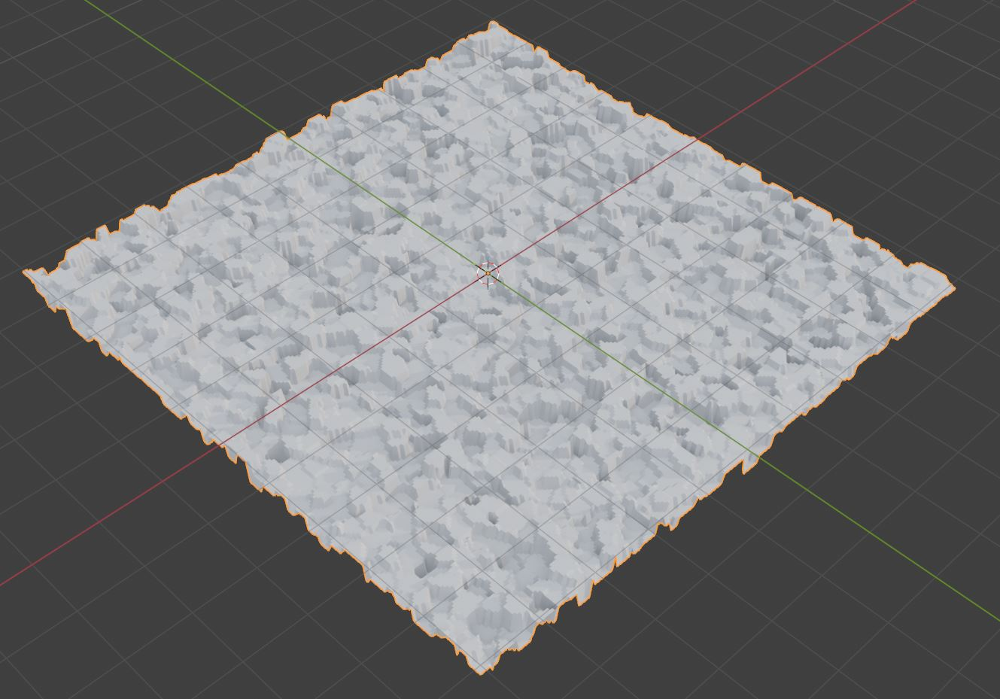
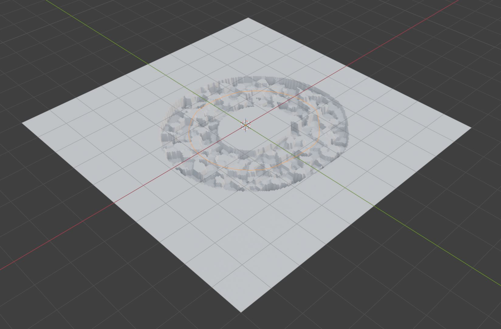
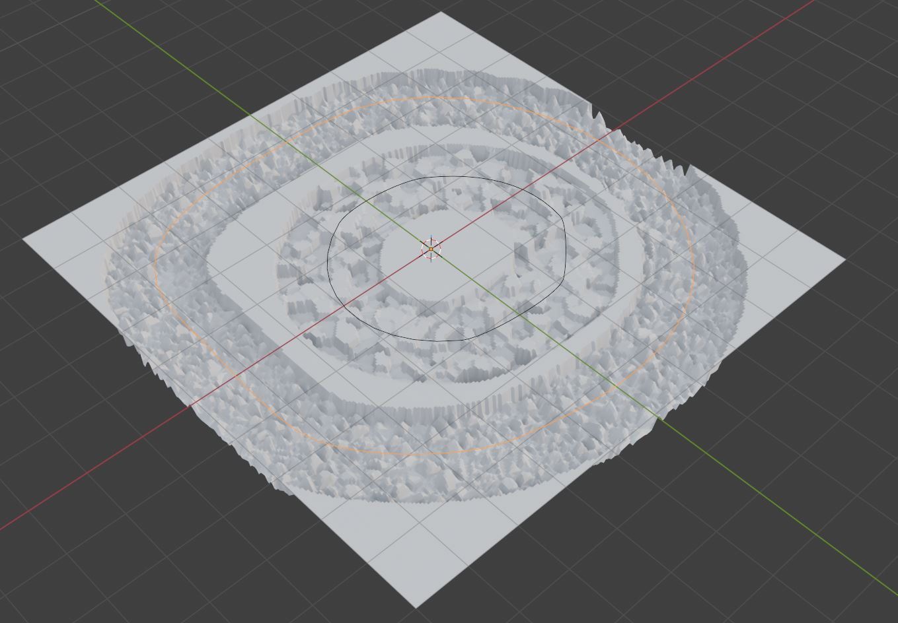
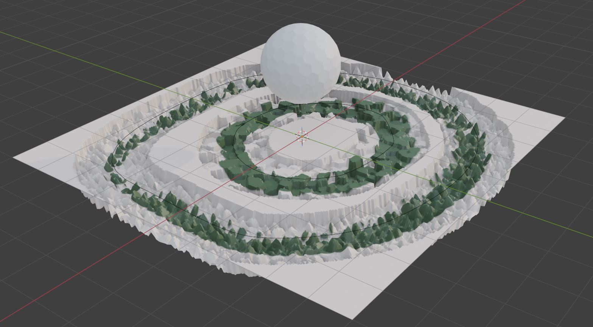
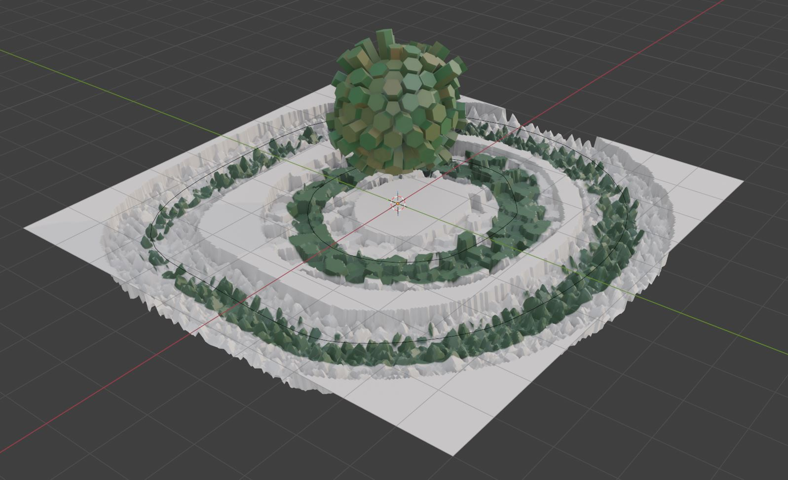
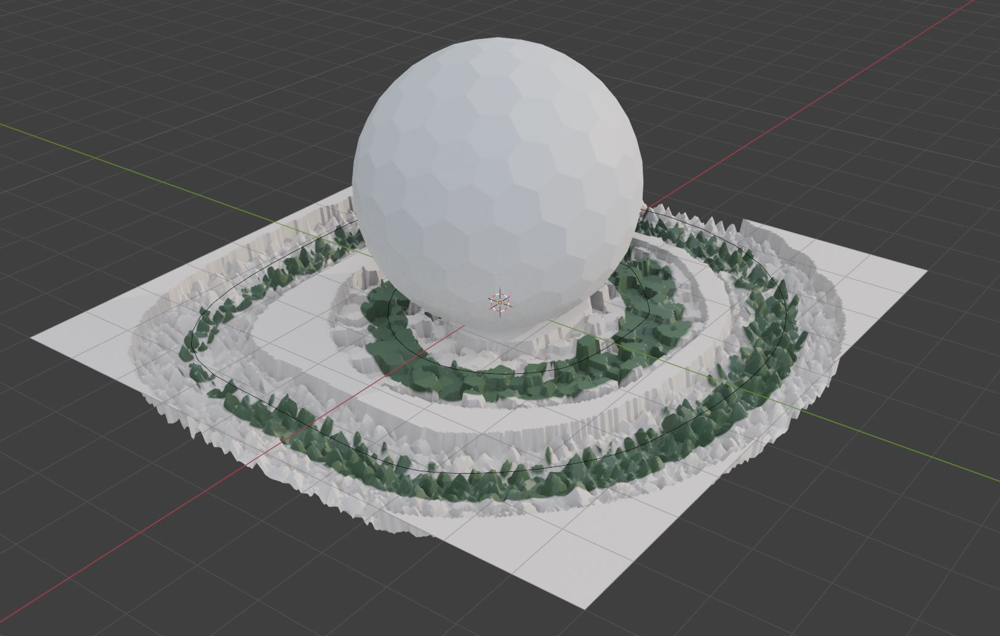
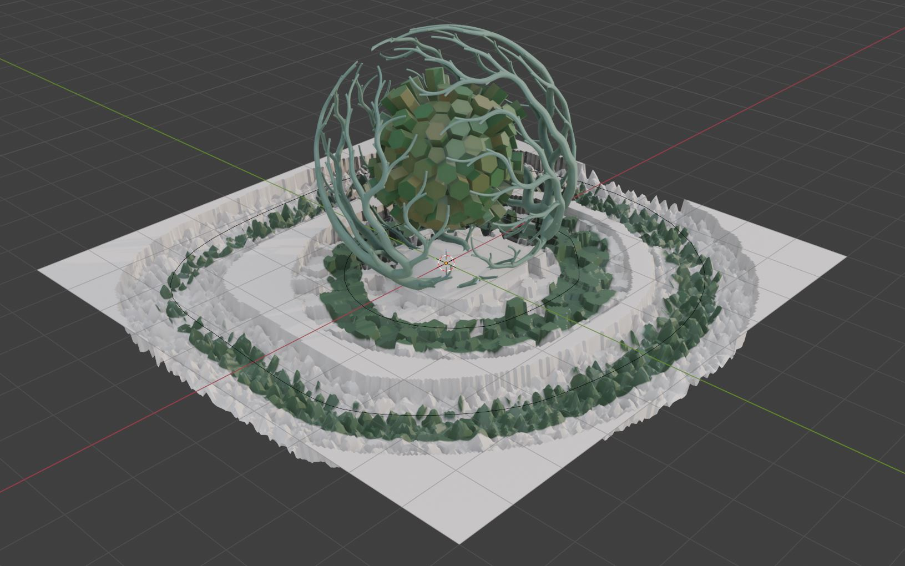

# Group 3: Project Task

# Intro

Notes:
* All tasks in this project have to be solved using Geometry Nodes Editor and Shader Editor in Blender.
* Feel free to experiment with geometry, operators, attributes and parameters as long as your result is meeting concepts described in the task.
* It is encouraged to add additional besides ones required in the task.
* Use Blender version 5.0
* For any questions write to lovrobosnar.work@gmail.com (latest possible consultation until 17.04.2026. at 11:00h A.M.)

# Tasks

Create Grid geometry. Displace grid vertices in normal direction using noise. Hints:
* Creating Grid using Geometry Nodes Editor: https://docs.blender.org/manual/en/latest/modeling/geometry_nodes/mesh/primitives/grid.html
* Procedural noise textures (e.g., Voronoi) supported in Geometry Nodes Editor: https://docs.blender.org/manual/en/latest/modeling/geometry_nodes/texture/index.html
* Shape noise using Map Range node: https://docs.blender.org/manual/en/latest/compositing/types/utilities/math/map_range.html
* Shape and combine noise functions using Geometry Nodes Editor Math node (e.g., multiply, add, etc.): https://docs.blender.org/manual/en/3.1/modeling/geometry_nodes/utilities/math.html
* Normal direction can be obtained using Node node: https://docs.blender.org/manual/en/latest/modeling/geometry_nodes/geometry/read/normal.html
* For scaling normal vector to use it for displacement use Vector Math node (e.g., scale): https://docs.blender.org/manual/en/3.3/modeling/geometry_nodes/vector/vector_math.html
* Displacement can be performed using Set Position node: https://docs.blender.org/manual/en/latest/modeling/geometry_nodes/geometry/write/set_position.html

5 Points.

Expected result:

Add curve in 3D scene and draw a shape (e.g., circle), using curve, across grid geometry. Modify grid displacement so it occurs only in certain distance from curve. Hints: 
* Curve geometry: https://docs.blender.org/manual/en/latest/modeling/curves/index.html
* Drawing curve in viewport: https://docs.blender.org/manual/en/latest/modeling/curves/tools/draw.html
* To compute geometry proximity use Geometry Proximity Node: https://docs.blender.org/manual/en/latest/modeling/geometry_nodes/geometry/sample/geometry_proximity.html
* Curve to mesh operator in Geometry Nodes Editor (required for proximity computation): https://docs.blender.org/manual/en/latest/modeling/geometry_nodes/curve/operations/curve_to_mesh.html
* To use geometry 3D from scene in Geometry Nodes Editor use Object Info node: https://docs.blender.org/manual/en/latest/render/shader_nodes/input/object_info.html

20 Points

Expected result:

Add another curve in 3D scene (while keeping the 1st curve) and draw another shape (e.g., circle), using this new curve, across grid geometry. Perform grid displacement only from certain distance from this 2nd curve. use different noise function from displacement. Hints:
* Use same concepts (nodes) as in previous step, but duplicate them and create another Set Position node for displacement with different noise texture.

10 Points.

Expected result:

Store distance values computed using Geometry Proximity Nodes as geometry face attributes in Geometry Nodes Editor (2 values should be stored, therefore, 2 different attributes have to be created). Using Shader Editor, create material and use stored distance attributes to compute color. Assign material to geometry in Geometry Nodes Editor. Hints:
* To store attribute in Geometry Nodes Editor use: https://docs.blender.org/manual/en/latest/modeling/geometry_nodes/attribute/store_named_attribute.html
* Shader Editor: https://docs.blender.org/manual/en/latest/editors/shader_editor.html
* To access attributes stored in geometry in Shader Editor use node Attribute: https://docs.blender.org/manual/en/latest/render/shader_nodes/input/attribute.html
* To map attribute (e.g., noise value) to color use color ramp in shader editor: https://docs.blender.org/manual/en/latest/editors/texture_node/types/converter/color_ramp.html
* Help with choosing color: https://color.adobe.com/explore 
* Combining color in Shader Editor: https://docs.blender.org/manual/en/latest/render/shader_nodes/color/mix.html
* To assign material in Geometry Nodes Editor use Set Material node: https://docs.blender.org/manual/en/latest/modeling/geometry_nodes/geometry/material/set_material.html

5 Points.

Expected result:

Create Sphere geometry in same Geometry Nodes Editor and make its faces more interesting by converting faces to pentagons. Join created geometry with displaced grid. Transform (translate) sphere geometry above grid geometry. Hints:
* Icosphere geometry: https://docs.blender.org/manual/en/2.93/modeling/geometry_nodes/mesh_primitives/icosphere.html
* Triangulation: https://docs.blender.org/manual/en/latest/modeling/geometry_nodes/mesh/operations/triangulate.html
* Dual mesh (dual mesh from triangle is pentagon): https://docs.blender.org/manual/en/3.3/modeling/geometry_nodes/mesh/dual_mesh.html
* Join Geometry Node: https://docs.blender.org/manual/en/latest/modeling/geometry_nodes/geometry/join_geometry.html
* Transform Geometry Node: https://docs.blender.org/manual/en/latest/modeling/geometry_nodes/geometry/operations/transform_geometry.html

5 Points.

Expected Result:

Perform face extrusion operator on sphere geometry. Set extrude offset scale using noise function. Store noise values used for extrusion as geometry face attributes in Geometry Nodes Editor. Using Shader Editor, create material and use stored noise attribute to compute color. Assign material to geometry in Geometry Nodes Editor. Hints:
* To extrude in Geometry Nodes Editor mesh use Extrude Node: https://docs.blender.org/manual/en/latest/modeling/geometry_nodes/mesh/operations/extrude_mesh.html

5 Points.

Expected Result:

Add another sphere geometry in same Geometry Nodes Editor and convert its faces to pentagon. Transform (translate) this sphere so that its center is at center of previous sphere. Scale this new sphere uniformly so it is larger than previous sphere. 

5 Points.

Expected Result:

For the second sphere, compute shortest edge paths from random sphere vertex to other random sphere vertices. For edge cost for shortest path use noise function. Note: computed shortest path is curve/spline. Set computed shortest path curve/spline to type of NURBS. Convert curve to mesh with using circle profile. Scale mesh circle profile using spline parameter "Length". Finally, assign new material with uniform color to this geometry. Hints: 
* Tutorial explaining concepts: https://www.youtube.com/watch?v=3N8ZvG1_MLc
* Shortest Edge Paths Node: https://docs.blender.org/manual/en/latest/modeling/geometry_nodes/mesh/read/shortest_edge_paths.html
* Edge paths to curves: https://docs.blender.org/manual/en/latest/modeling/geometry_nodes/mesh/operations/edge_paths_to_curves.html
* Random value node: https://docs.blender.org/manual/en/latest/modeling/geometry_nodes/utilities/random_value.html
* Vertex index: https://docs.blender.org/manual/en/latest/modeling/geometry_nodes/geometry/read/input_index.html
* Math (for comparing vertex id): https://docs.blender.org/manual/en/3.1/modeling/geometry_nodes/utilities/math.html
* Set Spline Type: https://docs.blender.org/manual/en/latest/modeling/geometry_nodes/curve/write/set_spline_type.html
* Spline parameter Node (e.g., Length): https://docs.blender.org/manual/en/latest/modeling/geometry_nodes/curve/read/spline_parameter.html
* Curve to mesh Node: https://docs.blender.org/manual/en/latest/modeling/geometry_nodes/curve/operations/curve_to_mesh.html
* Curve circle Node: https://docs.blender.org/manual/en/latest/modeling/geometry_nodes/curve/primitives/curve_circle.html

45 Points.

Expected Result:

# Rendering

Add lights and camera to the 3D scene and render your result using at least 3 different camera locations and at least FullHD resolution. Export as JPG file format. Hints:
* Lights: https://docs.blender.org/manual/en/latest/render/lights/light_object.html
* World Output Node in Shader Nodes light: https://docs.blender.org/manual/en/latest/render/shader_nodes/output/world.html
* World Shader Node for HDRI light: https://docs.blender.org/manual/en/latest/render/shader_nodes/textures/environment.html
* HDRI: https://polyhaven.com/hdris, https://freestylized.com/all-skybox/
* Camera: https://docs.blender.org/manual/en/latest/render/cameras.html
* Rendering: https://docs.blender.org/manual/en/latest/render/index.html

# Conceputal one-pager documentation

Write one-pager document of arbitrary format containing conceptual documentation: inspiration, experiments, which methods are used, why, workflow, concepts, implementation, discussion, results. Make sure to write your name and official e-mail address. Export in .PDF file format. 

# Project Submission details

To submit project, upload following data and make it available by link:
* Blender source project (.BLEND)
* Onepager with conceptual documentation (.PDF)
* 3 rendered images (.JPG)

Send the link to lovrobosnar.work@gmail.com until 19.04.2026.
Recieved project submission will be confirmed by sending e-mail to the owner of the project. Therefore, it you haven't recieved confirmation in 2 days send the link again and notify Professor Gerhards.

If something is missing in the submission documentation I will notify you with the required documents that are missing.
