# Group 4: Project Task

# Intro

Notes:
* This project is for made to be solved by 2 students.
* All tasks in this project have to be solved using Geometry Nodes Editor and Shader Editor in Blender.
* Feel free to experiment with geometry, operators, attributes and parameters as long as your result is meeting concepts described in the task.
* It is encouraged to add additional elements besides ones required in the task.
* Use Blender version 5.0
* For any questions write to lovrobosnar.work@gmail.com (latest possible consultation until 17.04.2026. at 11:00h A.M.)

# Tasks

Create grid. Use surface subdivision to (1) make corners of grid round and to (1) increase number of vertices/faces. Hints:
* Grid node: https://docs.blender.org/manual/en/latest/modeling/geometry_nodes/mesh/primitives/grid.html (Hint: decrease number of vertices to 2 before applying subdivision surface)
* Subdivision surface node: https://docs.blender.org/manual/en/latest/modeling/geometry_nodes/mesh/operations/subdivision_surface.html (Hint: use larger subdivision level than at least 5)

Expected result (I have enabled wireframe so that faces are visible):
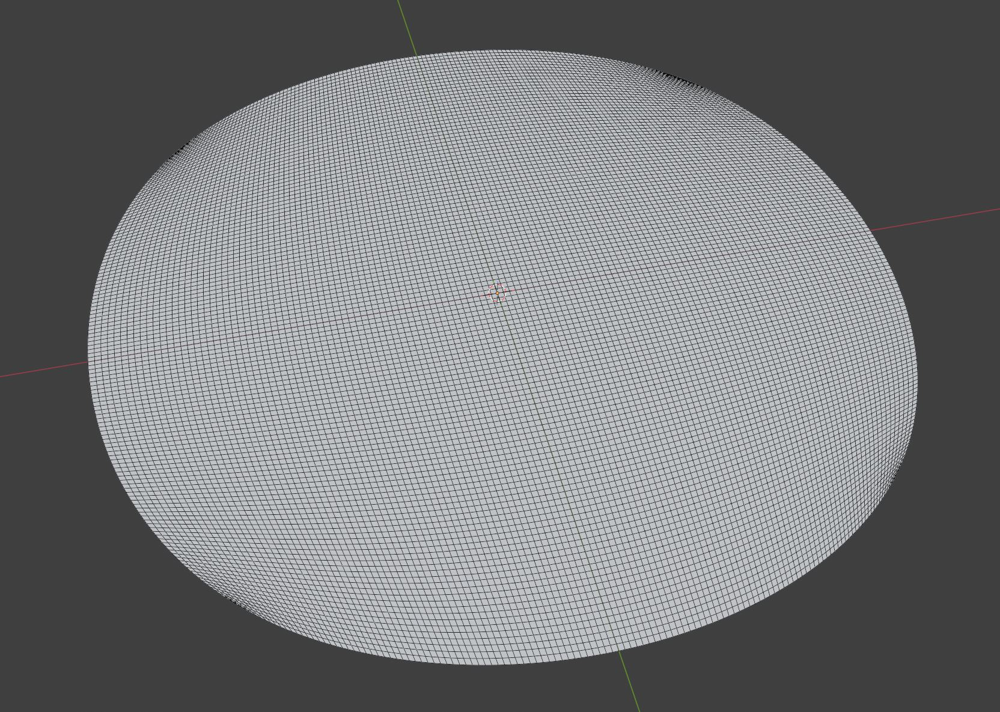

Create Spiral (curve). Configure spiral transformation and shape to lay on the same plane as grid and that its size is similar to the size of grid. Convert spiral (curve) to mesh. Hints:
* Spiral node: https://docs.blender.org/manual/en/latest/modeling/geometry_nodes/curve/primitives/curve_spiral.html
* Curve to mesh node: https://docs.blender.org/manual/en/latest/modeling/geometry_nodes/curve/operations/curve_to_mesh.html

Expected result:
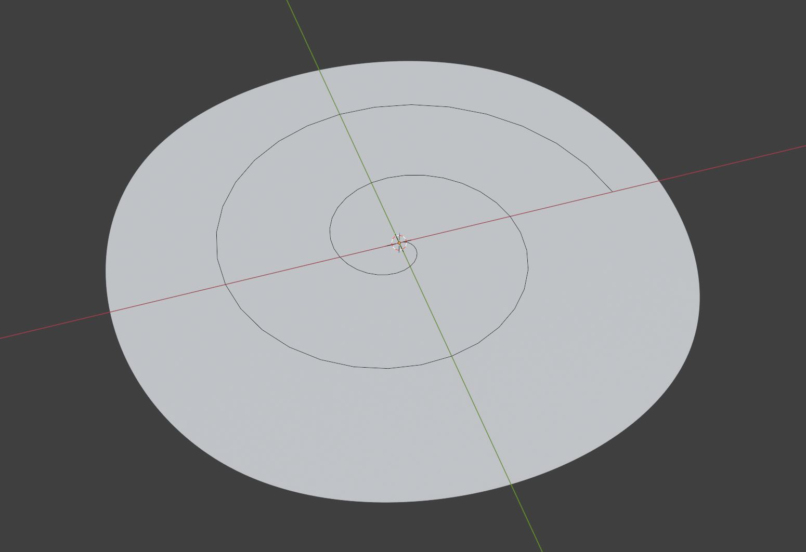

Score: 5 points.

Create cube, scale it in height and transform it to lie on the grid. Hints: 
* Cube node: https://docs.blender.org/manual/en/latest/modeling/geometry_nodes/mesh/primitives/cube.html
* Transform geometry node: https://docs.blender.org/manual/en/latest/modeling/geometry_nodes/geometry/operations/transform_geometry.html

Expected result:
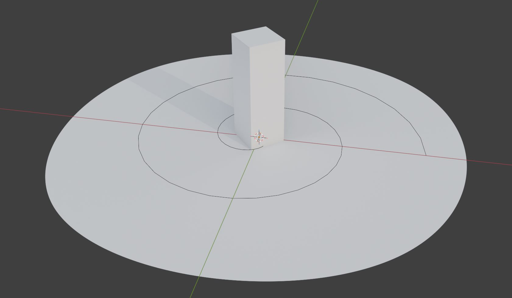

Carve the cube from previous step by using Boolean Difference and multiple smaller cubes (at least 15). Smaller cubes for carving should be created by distributing points on face of cube to be carved and instancing on those points. Ensure that instanced smaller cubes used for carving has randomized scale. Hints:
* Mesh Boolean node: https://docs.blender.org/manual/en/latest/modeling/geometry_nodes/mesh/operations/mesh_boolean.html
* Instance on points node: https://docs.blender.org/manual/en/latest/modeling/geometry_nodes/instances/instance_on_points.html
* Distribute points on faces node: https://docs.blender.org/manual/en/latest/modeling/geometry_nodes/point/distribute_points_on_faces.html
* Random value node: https://docs.blender.org/manual/en/latest/modeling/geometry_nodes/utilities/random_value.html

Score: 10 points.

Expected result:
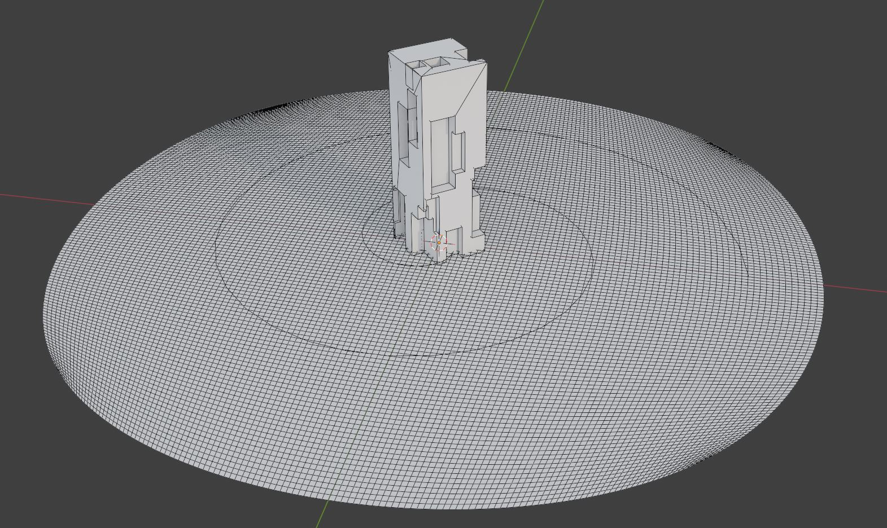

Use Shader Nodes to create material for the carved cube. Assign this material to carved cube using Geometry Nodes. Store random value attribute to the faces of carved cube using Geometry nodes. Use this attribute in Shader Nodes to create color. To create color use Color Ramp node in Shader Nodes. Crate at least 3 different colors using Color Ramp. Hints:
* Store named attribute Geometry node: https://docs.blender.org/manual/en/latest/modeling/geometry_nodes/attribute/store_named_attribute.html (make sure to use "Face")
* Random value Geometry node: https://docs.blender.org/manual/en/latest/modeling/geometry_nodes/utilities/random_value.html
* Set material Geometry node: https://docs.blender.org/manual/en/latest/modeling/geometry_nodes/geometry/material/set_material.html
* Attribute shader node: https://docs.blender.org/manual/en/latest/render/shader_nodes/input/attribute.html
* Color ramp shader node: https://docs.blender.org/manual/en/latest/editors/texture_node/types/converter/color_ramp.html
* Help for choosing color: https://color.adobe.com/create/color-wheel

Expected result:
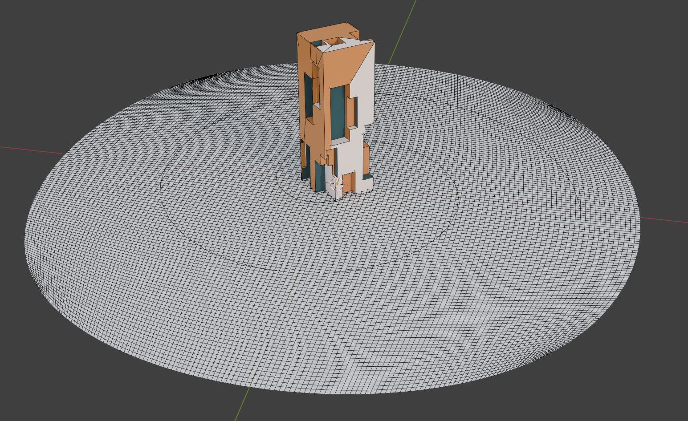

Score: 5 points.

Distribute points on the grid created in the first step. Use proximity from the created spiral to grid to distribute only points close to the spiral. Hints:
* Geometry proximity node: https://docs.blender.org/manual/en/latest/modeling/geometry_nodes/geometry/sample/geometry_proximity.html
* Math: https://docs.blender.org/manual/en/3.1/modeling/geometry_nodes/utilities/math.html (contains useful comparison functions such as "Less Than").
* Distribute points on faces node: https://docs.blender.org/manual/en/latest/modeling/geometry_nodes/point/distribute_points_on_faces.html (use "Selection" for distributing only points which are close to the spiral)
* Merge by distance node: https://docs.blender.org/manual/en/latest/modeling/geometry_nodes/geometry/operations/merge_by_distance.html (to remove distributed points which are too close to each other, merge by distance can be used).

Score: 5 Points. 

Expected result:

Instance created carved cube on distributed points from previous step. Make sure to randomize rotation (Z axis) for each instance. Make sure to randomize scale of each instance. Join geometry of initial carved cube and instanced carved cubes so that both is visible. Hints: 
* Distribute points on faces node: https://docs.blender.org/manual/en/latest/modeling/geometry_nodes/point/distribute_points_on_faces.html (make sure to use "Rotation" and "Scale" inputs)
* Random value Geometry node: https://docs.blender.org/manual/en/latest/modeling/geometry_nodes/utilities/random_value.html
* Join Geometry node: https://docs.blender.org/manual/en/latest/modeling/geometry_nodes/geometry/join_geometry.html

Expected result:
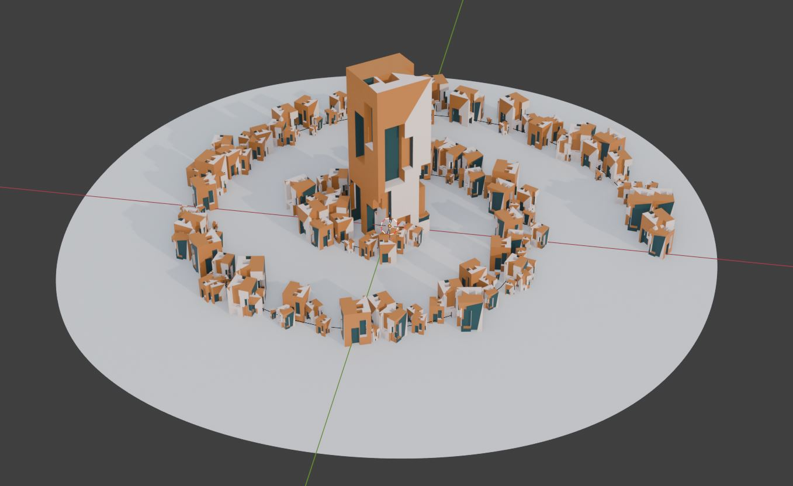

Score: 5 Points. 

Displace the ground grid by displacing vertices in normal vector direction. Displace only those vertices which are from certain distance from the spiral. For displacing vertices combine at least two noise functions. Hints:
* Displacement can be performed using Set Position node: https://docs.blender.org/manual/en/latest/modeling/geometry_nodes/geometry/write/set_position.html (if displacing by normal use "Offset" socket).
* Normal direction can be obtained using Node node: https://docs.blender.org/manual/en/latest/modeling/geometry_nodes/geometry/read/normal.html
* For scaling normal vector with noise to use it for displacement use Vector Math node (e.g., scale): https://docs.blender.org/manual/en/3.3/modeling/geometry_nodes/vector/vector_math.html
* Procedural noise textures (e.g., Voronoi) supported in Geometry Nodes Editor: https://docs.blender.org/manual/en/latest/modeling/geometry_nodes/texture/index.html
* Shape and combine noise functions using Geometry Nodes Editor Math node (e.g., multiply, add, etc.): https://docs.blender.org/manual/en/3.1/modeling/geometry_nodes/utilities/math.html
* Noise value can be mapped using Map Range node: https://docs.blender.org/manual/en/latest/compositing/types/utilities/math/map_range.html

Expected result:
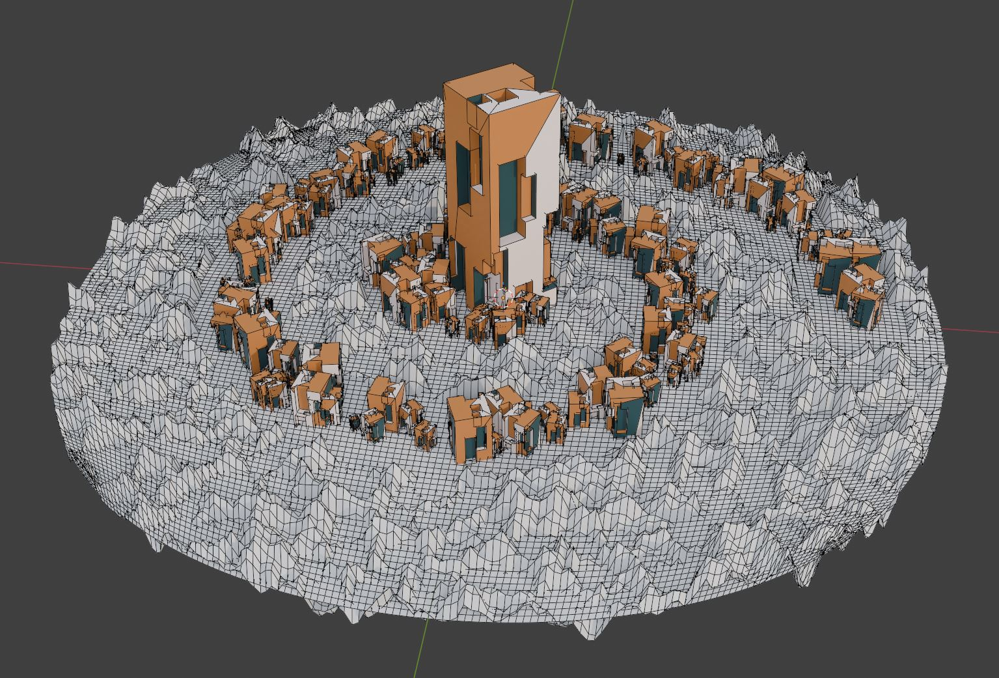

Score: 10 points.

Use Shader nodes to create material for the displaced ground grid. Assign this material to the displaced grid using Geometry nodes. Store distance from spiral to grid as face attribute of the grid geometry using Geometry nodes. Use this attribute in Shader Nodes to create color; use color ramp node to map this attribute to at least 2 colors.
* Store named attribute Geometry node: https://docs.blender.org/manual/en/latest/modeling/geometry_nodes/attribute/store_named_attribute.html (make sure to use "Face")
* Random value Geometry node: https://docs.blender.org/manual/en/latest/modeling/geometry_nodes/utilities/random_value.html
* Set material Geometry node: https://docs.blender.org/manual/en/latest/modeling/geometry_nodes/geometry/material/set_material.html
* Attribute shader node: https://docs.blender.org/manual/en/latest/render/shader_nodes/input/attribute.html
* Color ramp shader node: https://docs.blender.org/manual/en/latest/editors/texture_node/types/converter/color_ramp.html
* Help for choosing color: https://color.adobe.com/create/color-wheel

Expected result:
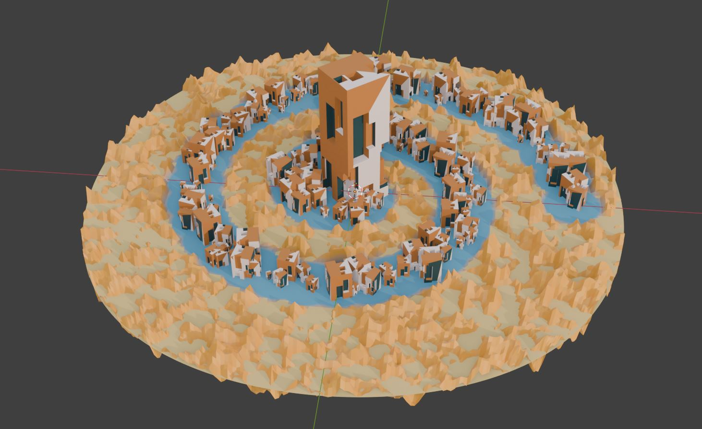

Score: 5 points.

Create large sphere completly enclosing the grid. Hints:
* Sphere node: https://docs.blender.org/manual/en/latest/modeling/geometry_nodes/mesh/primitives/uv_sphere.html

Expected Result:
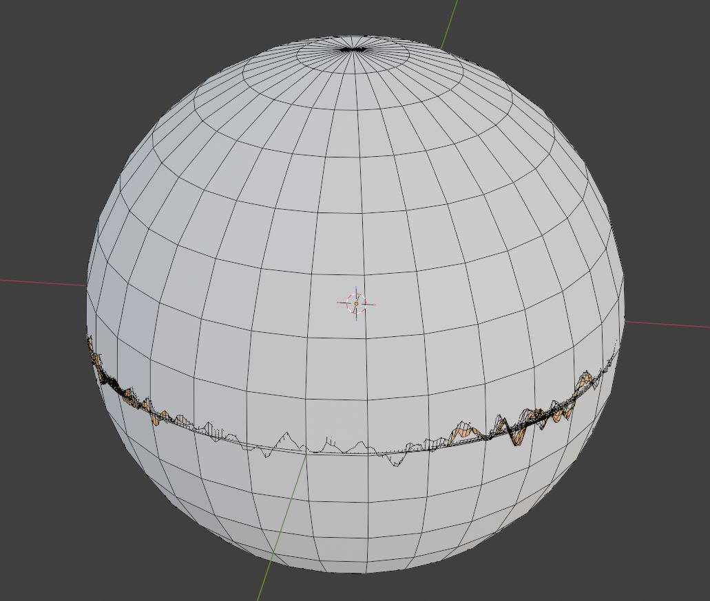

Remove bottom half of the created sphere. Make its faces more interesting by converting them to dual mesh. Hints:
* Delete geometry node: https://docs.blender.org/manual/en/latest/modeling/geometry_nodes/geometry/operations/delete_geometry.html
* Math: https://docs.blender.org/manual/en/3.1/modeling/geometry_nodes/utilities/math.html (contains useful comparison functions such as "Less Than").
* Position node: https://docs.blender.org/manual/en/latest/modeling/geometry_nodes/geometry/read/position.html (it can be used for comparison while deletion)
* Triangulate node: https://docs.blender.org/manual/en/latest/modeling/geometry_nodes/mesh/operations/triangulate.html (apply before dual mesh node)
* Dual mesh node: https://docs.blender.org/manual/en/3.1/modeling/geometry_nodes/mesh/dual_mesh.html

Expected Result:
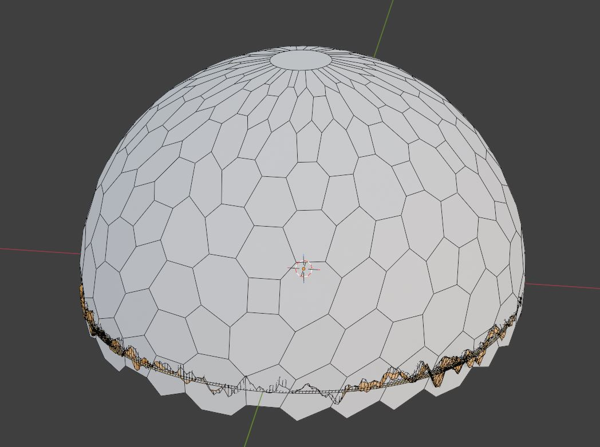

Score: 10 points.

On the resulting geometry of half sphere created in the previous step, compute shortest path from random vertex to other random vertices. Store this shorest path as curve. Convert curve to mesh with profile. Apply simple material with uniform color to the resulting mesh. Hints:
* Tutorial explaining shortest path concepts: https://www.youtube.com/watch?v=3N8ZvG1_MLc
* Shortest Edge Paths Node: https://docs.blender.org/manual/en/latest/modeling/geometry_nodes/mesh/read/shortest_edge_paths.html
* Edge paths to curves: https://docs.blender.org/manual/en/latest/modeling/geometry_nodes/mesh/operations/edge_paths_to_curves.html
* Random value node: https://docs.blender.org/manual/en/latest/modeling/geometry_nodes/utilities/random_value.html
* Vertex index: https://docs.blender.org/manual/en/latest/modeling/geometry_nodes/geometry/read/input_index.html
* Math (for comparing vertex id): https://docs.blender.org/manual/en/3.1/modeling/geometry_nodes/utilities/math.html
* Set Spline Type: https://docs.blender.org/manual/en/latest/modeling/geometry_nodes/curve/write/set_spline_type.html
* Spline parameter Node (e.g., Length): https://docs.blender.org/manual/en/latest/modeling/geometry_nodes/curve/read/spline_parameter.html
* Curve to mesh Node: https://docs.blender.org/manual/en/latest/modeling/geometry_nodes/curve/operations/curve_to_mesh.html
* Curve circle Node (useful for defining a profile in curve to mesh conversion): https://docs.blender.org/manual/en/latest/modeling/geometry_nodes/curve/primitives/curve_circle.html
* Float curve node for shaping curve to mesh profile: https://docs.blender.org/manual/en/3.1/modeling/geometry_nodes/utilities/float_curve.html

Expected Result:
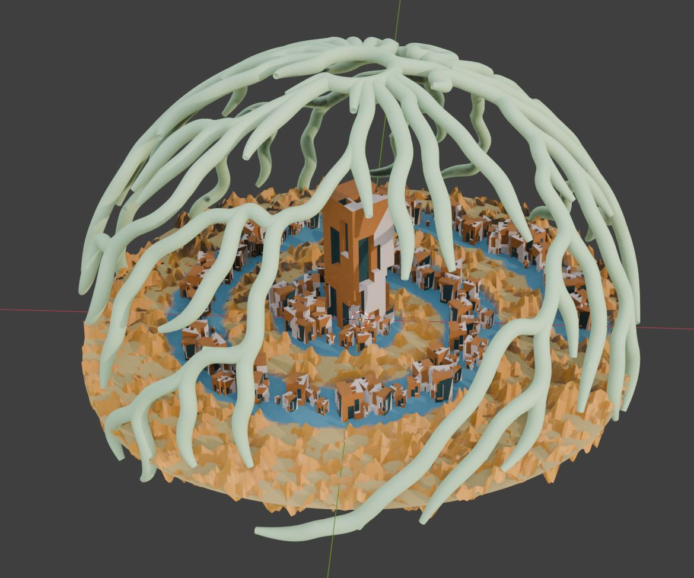

Score: 20 points.

Distribute points on the resulting shortes path mesh from previous step. Hints:
* Distribute points on faces node: https://docs.blender.org/manual/en/latest/modeling/geometry_nodes/point/distribute_points_on_faces.html

Expected Result:
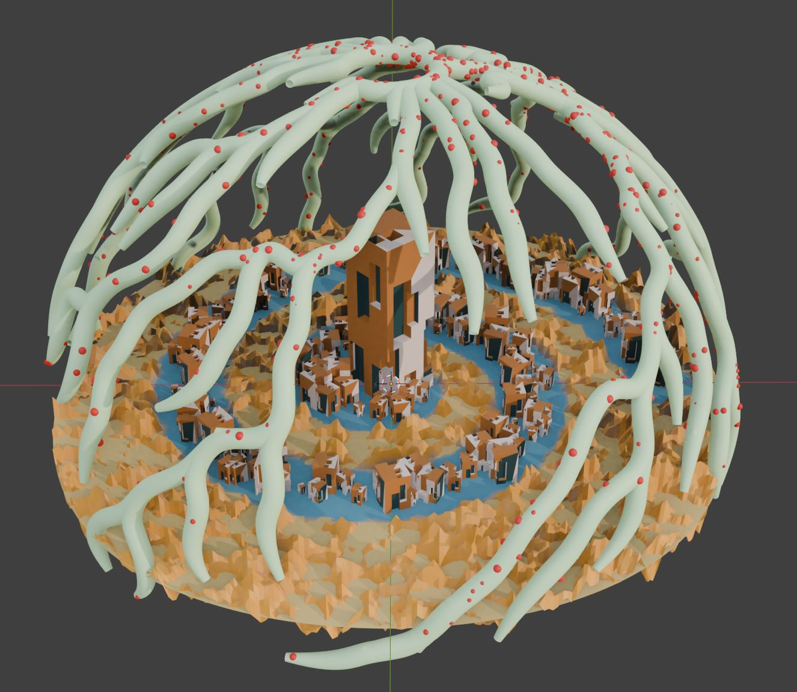

Score: 5 points.

Create or download at least three different meshes representing foliage (e.g., flowers). Instance all three meshes on the points distributed in the previous step. Make sure to randomize scale of instances. Make sure to randomize rotation of instances. Ensure that rotation of instances is following surface normal direction. Hints:
* Existing foliage geometry assets: https://polyhaven.com/models/nature, https://creativetrio.art/, or any other site with 3D foliage models.
* To use foliage geometry in Geometry Nodes Editor use Collection Info node: https://docs.blender.org/manual/en/latest/modeling/geometry_nodes/input/scene/collection_info.html
* To instance geometry use Instance on Points node: https://docs.blender.org/manual/en/latest/modeling/geometry_nodes/instances/instance_on_points.html
* To distribute points on surface for instancing use Distribute Points on Faces node: https://docs.blender.org/manual/en/latest/modeling/geometry_nodes/point/distribute_points_on_faces.html

Expected Result:
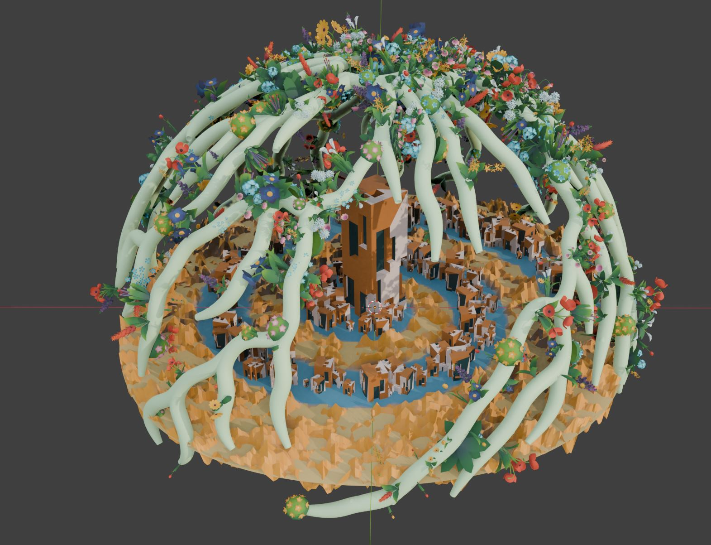

Score: 20 points.

# Rendering

Add lights and camera to the 3D scene and render your result using at least 3 different camera locations and at least FullHD resolution. Export as JPG file format. Hints:
* Lights: https://docs.blender.org/manual/en/latest/render/lights/light_object.html
* World Output Node in Shader Nodes light: https://docs.blender.org/manual/en/latest/render/shader_nodes/output/world.html
* World Shader Node for HDRI light: https://docs.blender.org/manual/en/latest/render/shader_nodes/textures/environment.html
* HDRI: https://polyhaven.com/hdris, https://freestylized.com/all-skybox/
* Camera: https://docs.blender.org/manual/en/latest/render/cameras.html
* Rendering: https://docs.blender.org/manual/en/latest/render/index.html

# Conceputal one-pager documentation

Write one-pager document of arbitrary format containing conceptual documentation: inspiration, experiments, which methods are used, why, workflow, concepts, implementation, discussion, results. Make sure to write your name and official e-mail address. Export in .PDF file format. 

# Project Submission details

To submit project, upload following data and make it available by link:
* Blender source project (.BLEND)
* Onepager with conceptual documentation (.PDF)
* 3 rendered images (.JPG)

Send the link to lovrobosnar.work@gmail.com until 19.04.2026.
Recieved project submission will be confirmed by sending e-mail to the owner of the project. Therefore, it you haven't recieved confirmation in 2 days send the link again and notify Professor Gerhards.

If something is missing in the submission documentation I will notify you with the required documents that are missing.
