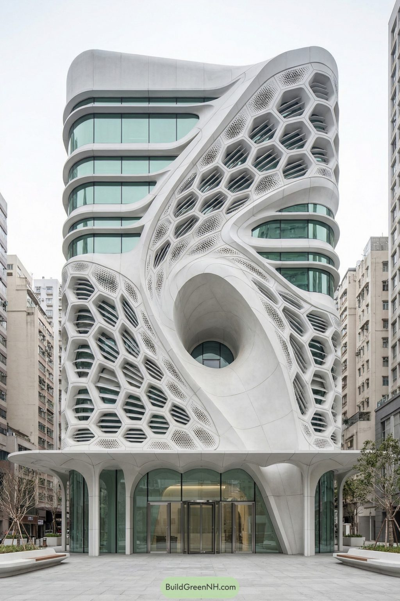
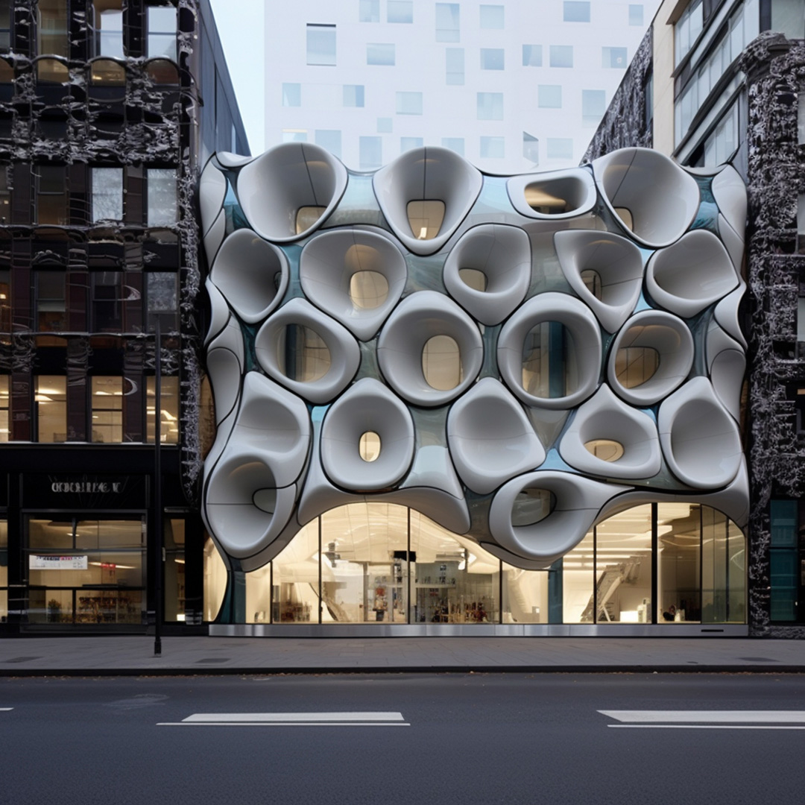
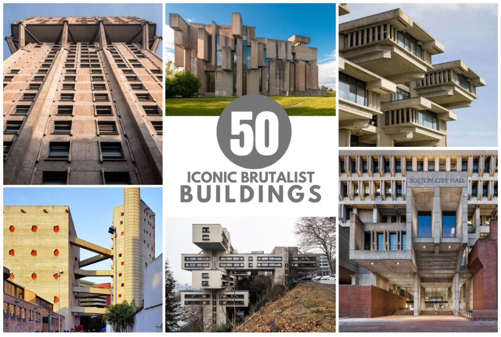
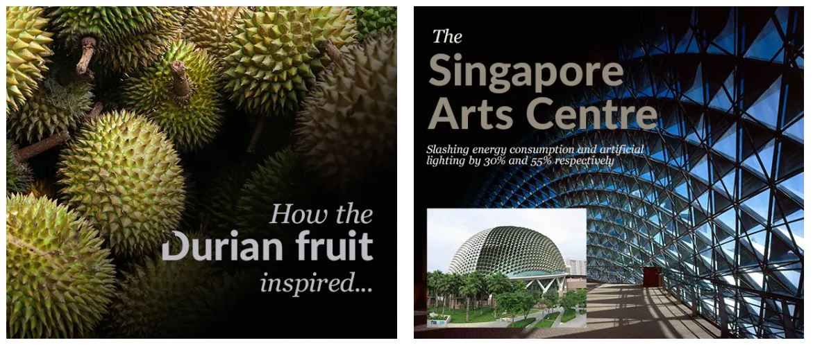

# Arhitecture interpolating bioinspired and artificial shapes

In this project, a building interpolating (1) organic, bioinspired shape and (2) artificial, human made shapes will be modeled. The amount (interpolation) of organic and artificial will be approx. equal. For example, every even floor can exhibit organic shapes while every odd floor can exhibit artificial shapes. Another example is that one half of the building exhibits artificial and other half of the building exibits organic shapes. Only exterior of the building is modeled. Resulting building will be a parametric 3D model, i.e., model will controllable by a set of parameters. The resulting parametric building model will be used to create a small town.

1            | 2
:-------------------------:|:-------------------------:
  |  

### Milestone 1

In the first milestone, parametric "artificial" part(s) of the building will be created. Artificial part of the building consists of flat surfaces and sharp corners. These elements of the building are considered to be "human made". An example of such buildings can be seen in brutalist arhitecture (https://thearchitectsdiary.com/brutalist-architecture/). In order to create such elements of the building, procedural hard-surface modeling techniques will be used. That is, base shapes such as cubes will be used to create general shape. After that, details and complexity will be added using instancing and constructive solid geometry. These parts of the building will be controllable by a set of parameters (parametric model).

Useful Houdini tutorials:
* https://www.youtube.com/watch?v=PTVal-t9g1k
* https://www.youtube.com/watch?v=uIe97023sDk
* https://www.youtube.com/watch?v=SDy0A323lfs

### Milestone 2

In the second milestone, parametric "organic" part(s) of the building will be created. These elements are considered to be bioinspired, that is smooth and natural shapes will be used. An example of such shapes can be seen in bioinspired arhitecture (https://www.learnbiomimicry.com/blog/top-10-biomimicry-examples-architecture). In order to create such elements of the building, procedural organic, bioinspired, graph and noise modeling techniques will be used. Using these techniques smooth, curved and/or branching structures and shapes will be created. These parts of the building will be controllable by a set of parameters (parametric model).

Useful Houdini tutorials:
* https://entagma.com/houdini-boolean-volume-denting/
* https://entagma.com/quicktip-abstract-shapes/
* https://entagma.com/quick-tip-organic-voronoi-patterns/
* https://entagma.com/no-vex-houdini-my-firstish-setup-abstract-sails/

### Milestone 3

In the third milestone, resulting parametric model of the building will be used to create a small town. That is, several instances of parametric building model with various fixed parameters will be created and placed in same 3D scene forming a small town. 

