# Procedural Modeling Lectures

Lectures in procedural modeling for both **tech** and **art** students (AKA STEAM lectures).

Lecture notes are written using [`Obsidian v1.6.7`](https://obsidian.md/).

**Lectures aim:**
* Provide a map of the procedural modeling field
* Theoretical and practical tools for procedural modeling
* Conceptual understanding of procedural modeling techniques

**Learning approach used in this lectures:**
* Learning by doing: concepts, approaches, methods and techniques
  * Project-based learning: practical lectures and homework
* Primary DCC software: Houdini (https://www.sidefx.com/)
* Exemplary concepts for Blender (https://www.blender.org/) and Unity (https://unity.com/)

**Lecture applications:**
* Game development
* Animated film
* VFX
* Motion graphics
* Generative/algorithmical Art
* Scientific visualization
* AR/VR environments
* Arhitecture
* Algorithmic design

# Lectures

### Lecture 1: Intro

* Let's build something quickly AKA Houdini intuition
* Introduction, motivation: why procedural modeling?
* Big picture: procedural modeling, generative art, generative design, algorithmic art, etc.
* Procedural modeling in computer graphics and animation
* Lectures overview

## Part 1: Procedural Modeling

### Lecture 2: Procedural Building

Lecture notes: https://github.com/lorentzo/ProceduralModelingLectures/tree/main/LectureNotes/1_ProceduralBuilding

Lecture data: https://github.com/lorentzo/ProceduralModelingLectures/tree/main/LectureExamples/2_ProceduralTerrain/LectureExample

Procedural building 1.1             |  Procedural building 1.2
:-------------------------:|:-------------------------:
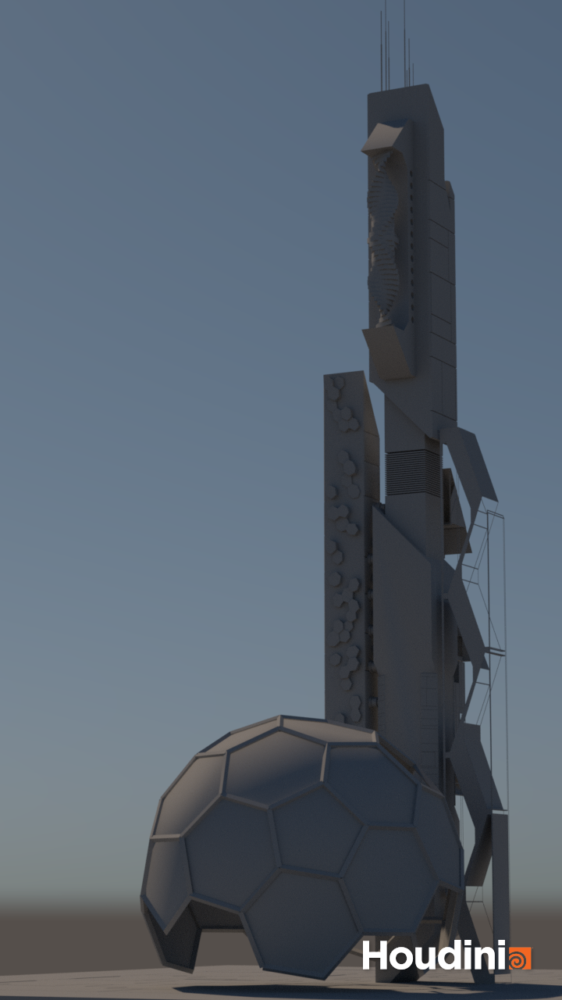  |  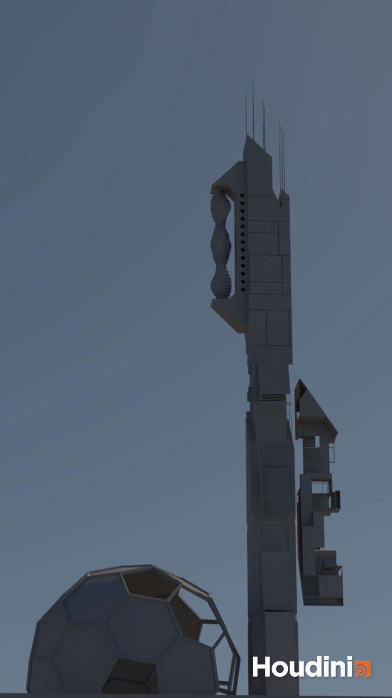

Procedural building 1.3             |  Procedural building 1.4
:-------------------------:|:-------------------------:
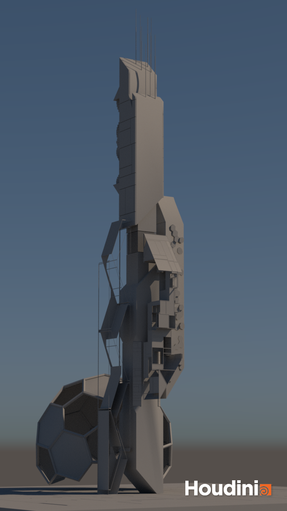  |  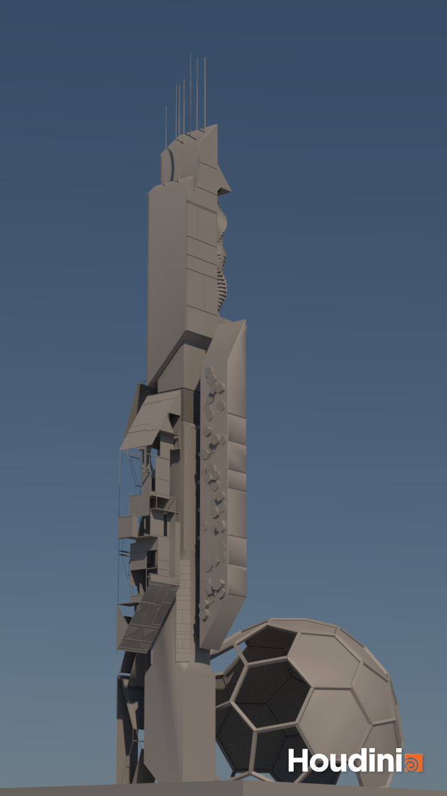

Topics and concepts:
* Procedural modeling of hard-surface (man made) shapes 
* Procedural mesh-based (surface) geometry manipulation: vertices, edges, faces and points
* Tools for geometry manipulation
* Structured proceduralism and scattering
* Props placement
* Interactive parameters; parameterized geometry

### Lecture 3: Procedural Terrain

Topics and concepts:
* Noise and noise types (Perlin, Worley, flow and other derivations)
* Noise layering (fractal sum, fbm) and warping
* Noise and geometric displacement
* Geometry attributes for instancing and materials
* Masking and sampling
* Instancing and transformations (rotations, scaling, translation)
* Heightfields
* Surface and volume generation
* World building

Lecture notes: https://github.com/lorentzo/ProceduralModelingLectures/tree/main/LectureNotes/2_ProceduralTerrain

Lecture data: https://github.com/lorentzo/ProceduralModelingLectures/tree/main/LectureExamples/2_ProceduralTerrain/LectureExample

Heightfield from NASA topo 1.1             |  Heightfield from NASA topo 1.2
:-------------------------:|:-------------------------:
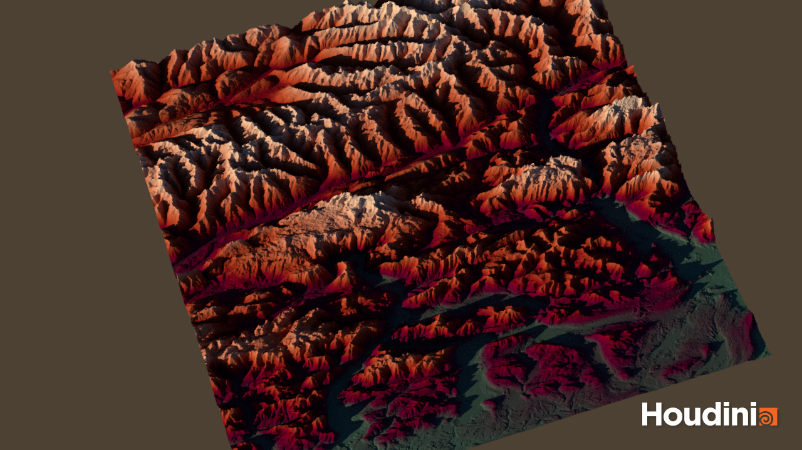  |  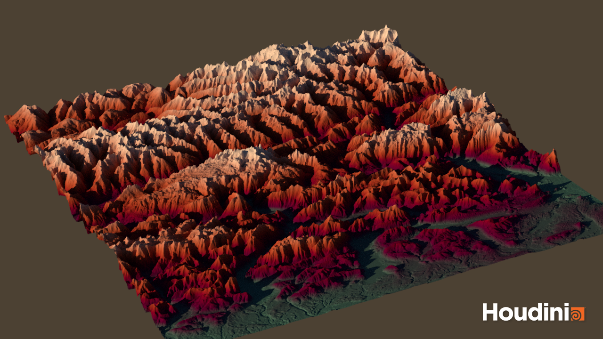

Heightfield using noise 2.1             |  Heightfield using noise 2.2
:-------------------------:|:-------------------------:
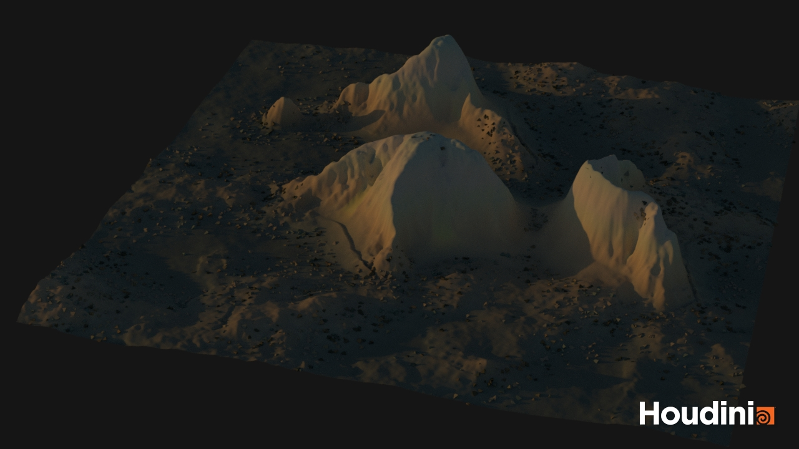  |  

Mesh using noise 2.1            |  Mesh using noise 2.2
:-------------------------:|:-------------------------:
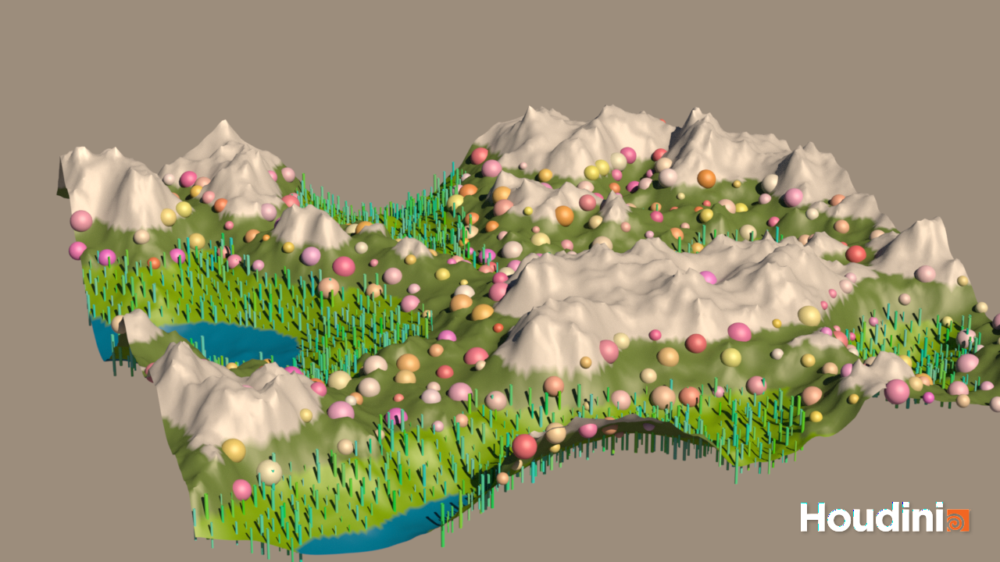  |  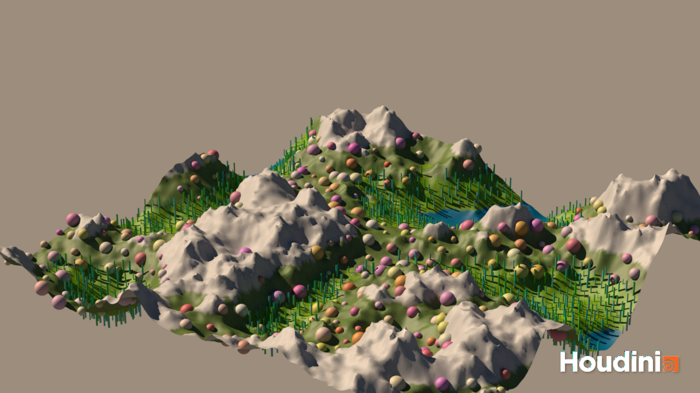

### Lecture 4: Volumes and particles: abstract organic structures

Topics:
* Particles and trails/lines
* Procedural animation
* Particles and animated vector fields
* Animated noise as vector field
* Volume and particles motion
* Volume and particles coupling
* Guiding particles via vector fields and volume
* Instancing on particles
* Geometry from volume displacement
* Attribute transfer and animated geo attributes
* Procedural abstract growth and organic modeling
* Morphing: transformations and generation of geometry
* Iterative systems

Example of growth 1             |  Example of growth 1.1
:-------------------------:|:-------------------------:
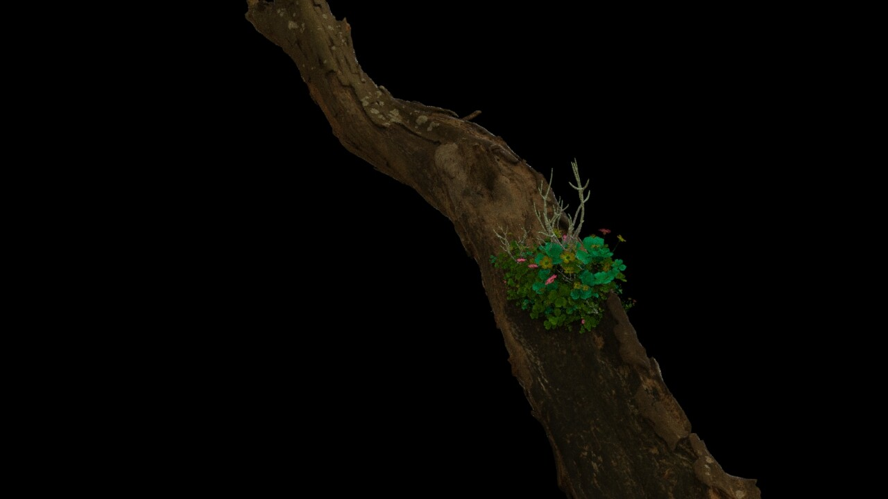  |  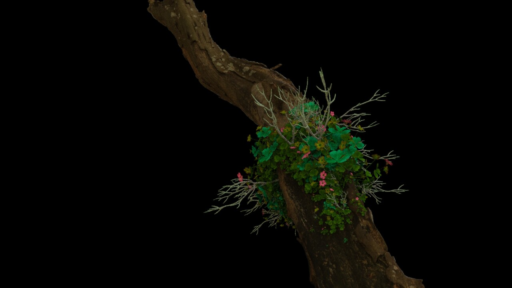

Example of growth 2.1             |  Example of growth 2.2
:-------------------------:|:-------------------------:
  |  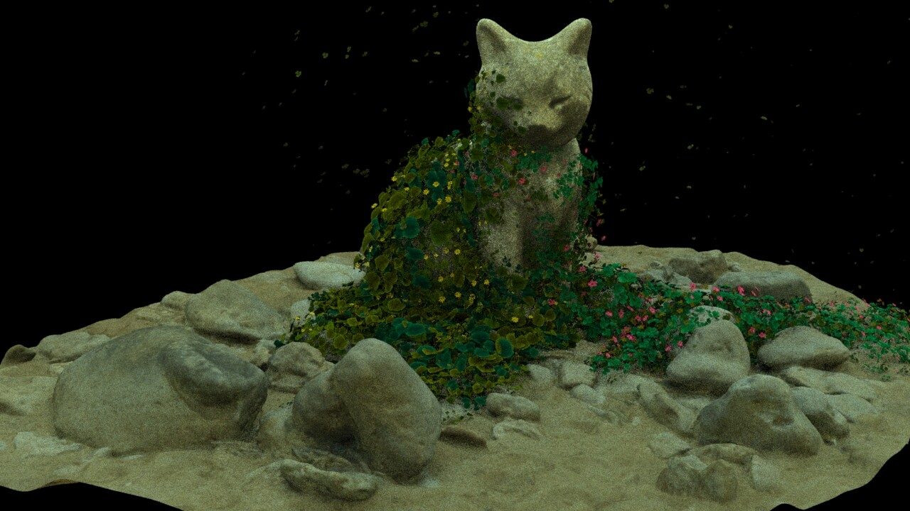

My work: 
* https://github.com/lorentzo/HoudiniAnimation?tab=readme-ov-file#treewind
* https://www.artstation.com/artwork/LRwEoA
* https://www.artstation.com/artwork/lRdzAJ
* https://github.com/lorentzo/HoudiniAnimation?tab=readme-ov-file#morph

R&D:
* https://inconvergent.net/2016/shepherding-random-growth/
* Digital morphogenesis: https://en.wikipedia.org/wiki/Digital_morphogenesis
  * Complex shape development
  * Biology, Geology, Geomorphology and arhitecture

Practical:
* https://www.sidefx.com/learn/collections/applied-houdini-particles/
* https://entagma.com/tag/growth/

### Lecture 5: procedural foliage; growth and spread

Topics:
* Natural and branching shapes/structures
* Procedural animation
* surface and volume vegetation spread
* Instancing and attributes
* Foliage growth
* Theoretical principles: SCA, Eden, L-Systems, DLA
* Animated surface with instances

Example of volumes and particles 1.1             |  Example of growth 1.2
:-------------------------:|:-------------------------:
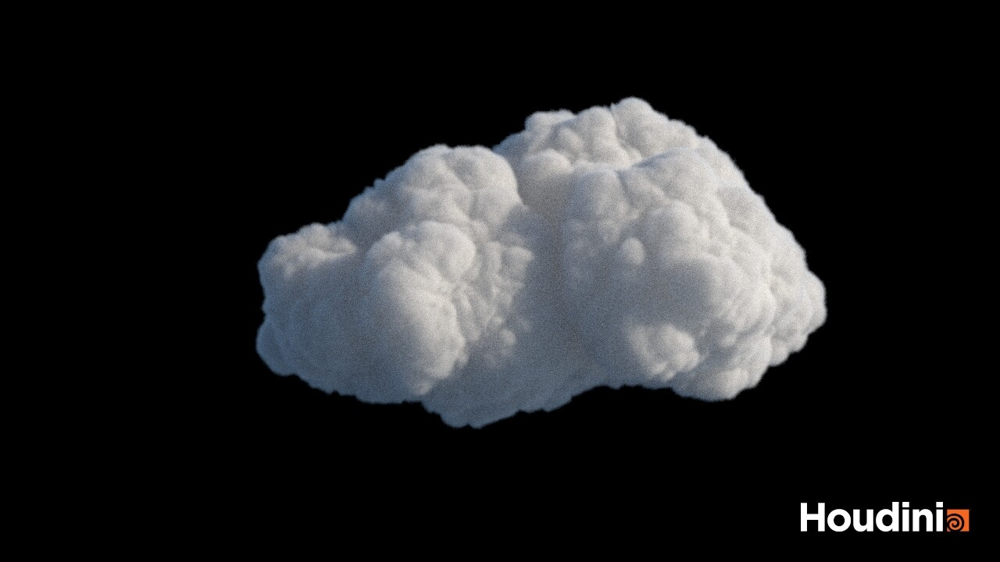  |  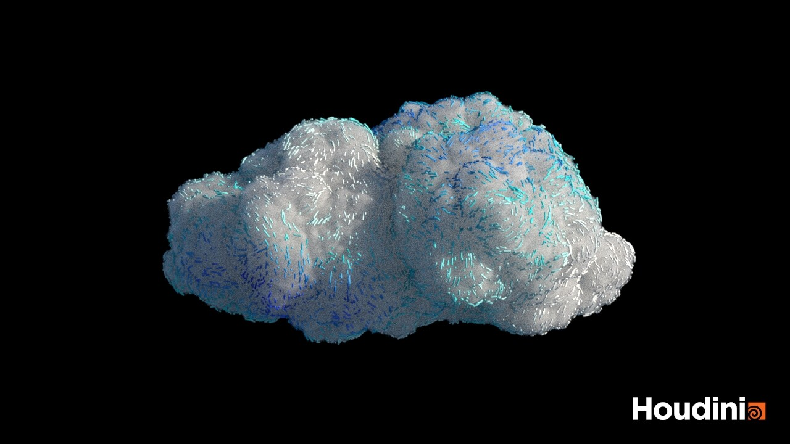

Example of volumes and particles 2.1             |  Example of growth 2.2
:-------------------------:|:-------------------------:
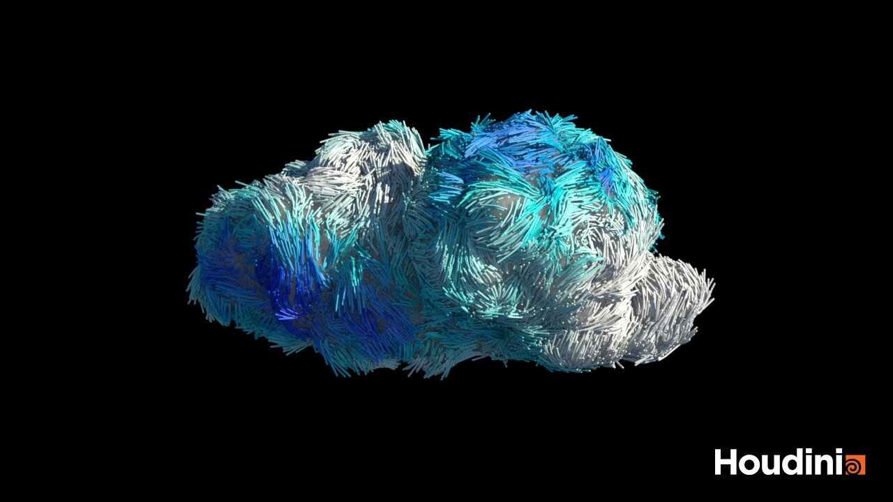  |  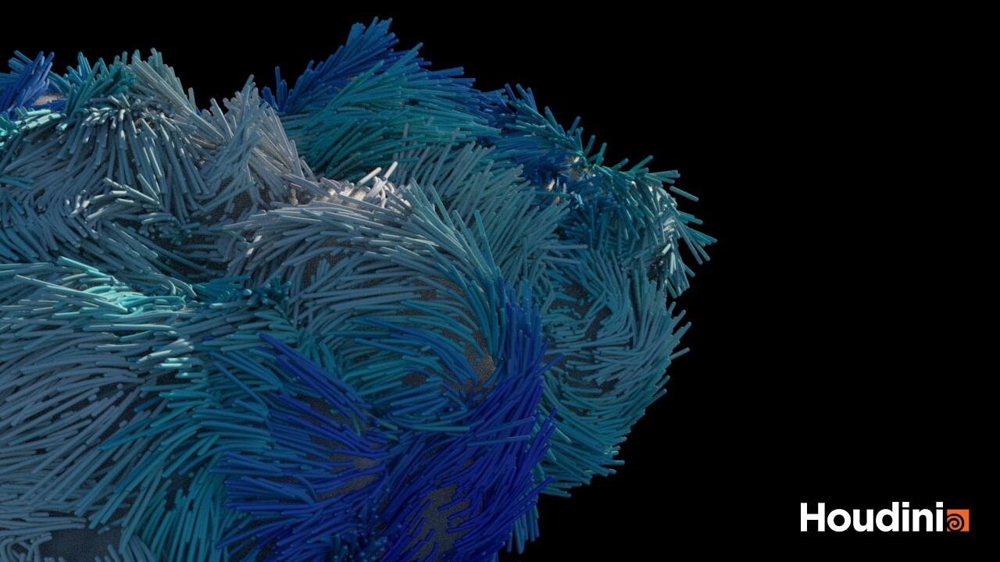

My work: 
* https://www.artstation.com/artwork/8wYyYm
* https://www.artstation.com/artwork/EvNkaK
* https://github.com/lorentzo/HoudiniAnimation?tab=readme-ov-file#spreadgrowth

R&D:
* http://algorithmicbotany.org/papers/colonization.egwnp2007.pdf
* https://graphics.pixar.com/library/ElementalEarth/paper.pdf
* https://docs.blender.org/manual/en/latest/addons/mesh/tissue.html

Practical:
* https://www.sidefx.com/docs/houdini/nodes/sop/lsystem
* https://www.youtube.com/watch?v=0vE8GiXhOWM
* https://www.youtube.com/watch?v=CgxTCpUqp5Q
* https://www.youtube.com/watch?v=b-DDdGcvBaI

## Part 2: Proceduralism and Dynamics

Feedback loop and simulation

### Lecture 2.1: rigid bodies and fracture

Topics:
* Cracking of solid objects
* Motion of solid objects before and after cracking
* Cracking caused by fall or hit

Introduced concepts:
* procedurally guided physically-based dynamics
* Procedural cracking
* RBD solvers

R&D:
* https://docs.blender.org/manual/en/latest/addons/object/cell_fracture.html
* https://dl.acm.org/doi/pdf/10.1145/2556700.2556713?casa_token=9i_sM2Dud3wAAAAA:N5XFUTjcGkPoqWebxFAOwVgOPiLx8l8qJ6QcPNzaGgYC-nmH-8mtR9Z2qF9yTnMn4Tu68DTGvTc

Practical:
* https://www.youtube.com/watch?v=IHYelaEFmr8
* https://www.sidefx.com/tutorials/smashing-wine-glass/

### Lecture 2.2: soft bodies

Topics:
* Balloons simulation and interaction
* Using Solid body for interacting with balloons
* Proceduralism as driving force

Introduced concepts:
* Soft bodies simulation
* Proceduralism as driving force applied on soft bodies

My work:
* NA

R&D:
* https://matthias-research.github.io/pages/publications/posBasedDyn.pdf

Practicals:
* https://www.sidefx.com/docs/houdini/vellum/index.html

### Lecture 2.3: fluids: liquids

Topics:
* Turbilend water simulation 
* Procedural solid body manipulation causing turbulence

Introduced concepts:
* Physically-based liquid simulation
* Proceduralism as driving force

My work:
* NA

R&D:
* https://mmacklin.com/pbf_sig_preprint.pdf
* https://graphics.pixar.com/library/ElementalWater/paper.pdf

Practicals:
* https://entagma.com/tag/fluid/

### Lecture 2.4: fluids: fire and smoke 

Topics:
* Fire simulation and spread
* Smoke (gas and volume) simulation 
* Procedural driving forces

Introduced concepts:
* Physically-based gas solvers
* Proceduralism as force
* Procedural constraints and forces and physically-based solvers

My work:
* NA

R&D:
* https://graphics.pixar.com/library/ElementalAir/paper.pdf

Practicals:
* https://entagma.com/tag/fluid/
* https://graphics.pixar.com/library/ElementalFire/paper.pdf
* https://www.youtube.com/watch?v=zyIJQHlFQs0

## Part 3: Proceduralism and Character FX

### Lecture 3.1 Hair and Fur
TODO

### Lexture 3.2 Cloth
TODO

### Crowds
TODO

# Inspiration for potential lectures
* RBD and growth: https://www.youtube.com/watch?v=xdC7k_LslgA&t=405s

# Covered concepts

Types of modeled phenomena:
* Abstract vs regular/structured
* Nature vs human-made
* Organic vs hard-surface

Procedural animation methods:
* Physically-based approaches
  * classical mechanics, forces and constraints
    * fluids: gases and liquids
    * solids: rigid bodies and soft bodies
* Biological simulation
  * Surface/Volume Growth
  * Surface/Volume Spread modeling
  * Branching (recursion)
    * Trees
    * Roots
  * Reaction, Reaction-diffusion
  * Digital Morphogenesis
  * Phenomenological simulation
* Mathematics:
  * Iterative systems and chaos
  * Cells and automation
* Empirical CG
  * Procedural noise, layering and warping
  * L-Systems
  * Boids 
  * Geometric instancing (including arraying)
  * Particles and force fields

CG methods:
* 3D scene: lights, cameras, materials and shapes (meshes, voxles, curves, etc.)
* Rendering: GPU raster, CPU path-tracing
* Post-processing

Literature:
* [STANFORDANIM] D. James: http://graphics.stanford.edu/courses/cs348c/
* [PROCMODEL] Ebert: Texturing and modeling: procedural approach
* [HORIKAWA] J. Horikawa: https://www.youtube.com/watch?app=desktop&v=rj0dEEVU1Ek&ab_channel=Houdini
  * https://jhorikawa.gumroad.com/l/GOZFw
* [NATUREOFCODE] https://natureofcode.com/
* [PIXAR] https://graphics.pixar.com/library/

