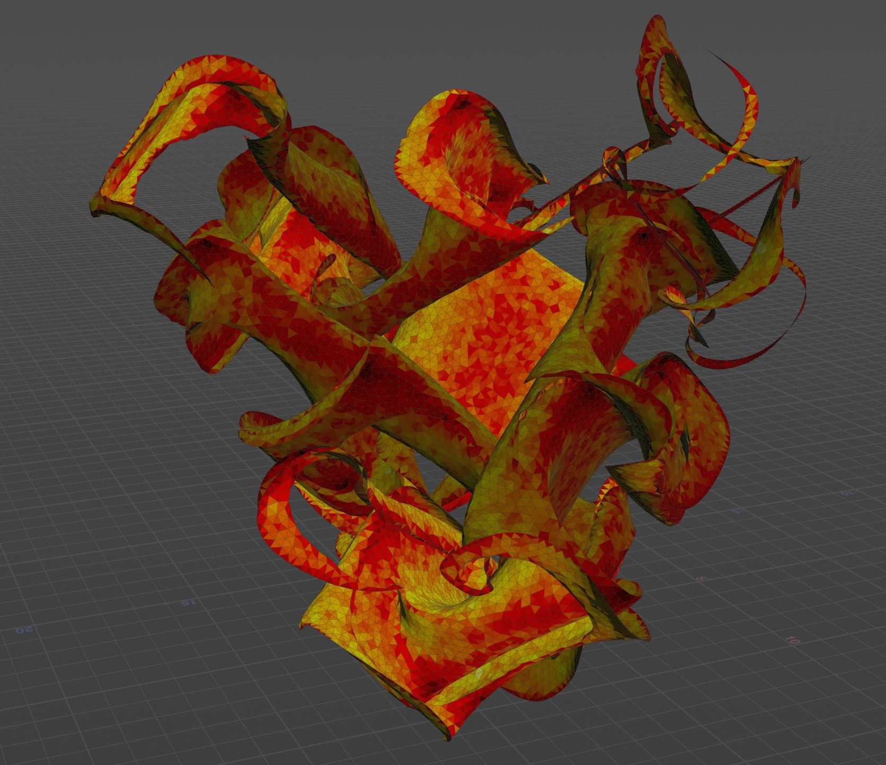

# Procedural Modeling Lectures

Procedural modeling = modeling algorithmically!

Procedural modeling lectures for both **tech** and **art** students (AKA STEAM lectures).

Lecture notes are written using [Obsidian](https://obsidian.md/).

**Lectures aim:**
* Provide a map of the procedural modeling field
* Theoretical knowledge and practical tools for procedural modeling and animation
* Focus on geometrical modeling

**Learning by doing:**
* Learning theory and concepts by working on practical examples
* Project-based learning: practical lectures and project work
* Software: 
    * Houdini (https://www.sidefx.com/)
    * Blender (https://www.blender.org/) 
    * Unity (https://unity.com/)
    * Touch Designer (https://derivative.ca/)

**Lecture applications:**
* Animated film, VFX, motion graphics, game development
* Scientific visualization, simulations
* Generative/algorithmical design and arhitecture
* Additive and subtractive mnufacturing: 3D printing, CNC machining

# Lecture Syllabus

## Introduction

* About lectures, syllabus and overview
* Big picture: about procedural modeling and Houdini workflow intuition
* Applications of procedural modeling

## Overview

* What is Procedural modeling, why and for what it is used?
* Structuring procedural content generation methods
* Broad overview of procedural modeling techniques and concepts
* Follow-up practical examples

1             |  2
:-------------------------:|:-------------------------:
  |  

## Procedural Hard Surface Modeling

Topics and concepts:
* Understanding hard surface modeling and difference to soft surface (organic) modeling
* Typical procedural hard surface modeling workflow: concept, design and implementation
* Procedural hard-surface (human made, artificial, industrial) modeling techniques, data structures and methods
* Parameterized hard surface model as a result of procedural modeling

1            | 2
:-------------------------:|:-------------------------:
  |  

## Procedural noise modeling: function and texture

Topics and concepts:
* Noise for procedural texture modeling: frequency, amplitude, warping, layering
* Understanding elements of virtual terrains: topology, color, props, etc.
* Terrain topology and color (material) modeling approaches
* Terrain modeling datastructures and sources of data (e.g., NASA heightmaps)
* Mesh-based (surface) terrain modeling using noise and geometric displacement
* Heightfield-based (surface) terrain modeling using height maps
* Heightfield-based (surface) terrain modeling using noise and heightfield layering
* 3D (volume) terrain modeling using noise
* Importance of noise and noise layering/warping for terrain modeling
* Attributes, dataflow and geometrical instancing
* Masking, samling (scattering) and instancing
* World building workflow: concept, design and implementation

1             |  2
:-------------------------:|:-------------------------:
  |  

## Procedural Fuzzy modeling: particles and volume

Topics and concepts:
* Modeling fuzzy objects
* Points, particles, trails, volumes
* Animated volume and surface vector and scalar fields
* Particle guides: curves
* Morphing: transformations and generation of geometry

1            |  2
:-------------------------:|:-------------------------:
 | 

## Procedural modeling with graphs

Topics and concepts:
* Branching structures
* Graph algorithms: shortest path
* Natural branching: trees, roots
* Theoretical principles: space colonization algorithm

1             |  2
:-------------------------:|:-------------------------:
 | 

## Procedural organic modeling

Topics and concepts:
* Organic modeling techniques
* Modeling surface and volume growth and spread
* Growth and digital morphogenesis
* Iterative models
* Natural and biological systems
* Theoretical principles: Eden, L-Systems, DLA, reaction-diffusion, iteration, recursion, CA

1          |  2
:-------------------------:|:-------------------------:
  |  

## Procedural modeling: systems

Topics and concepts:
* Visual patterns of dynamical and complex systems
* Feedback loop
* Chaos, phase space, attractors
* Fractals
* Artificial life: boids, cellular automata

Lines from curve guide             |  Lines from shape
:-------------------------:|:-------------------------:
  | 

## Procedural material modeling

Topics and concepts:
* Material geometrical structure
* Material texture
* Material optical and mechanical properties
* Surface and volume materials
* Material scales and observation distance: micro, meso and macro
* Material modeling decomposition in practice: scattering equation and texture
* Material scales in practice: scattering equation, texture and geometry
* Procedural texture: a function
* Procedural textures: surface vs volume
* Procedural textures for material surface or volume variation
* Procedural natural materials: fur, feather, scales, porous, foliage
* Procedural industrial materials: textile, glass

1             |  2
:-------------------------:|:-------------------------:
  | 

## Procedural modeling: tessellation

* Space division/covering
* Tiling
* Tessellationn methods

1             |  2
:-------------------------:|:-------------------------:
  | 

## Procedural modeling: space transformations

* Domain transformations
* Domain warping
* Transformation between spaces: time, frequency, geometry
* Sound and signal to geometry

1             |  2
:-------------------------:|:-------------------------:
  | 

## Procedural modeling with dynamics 1

Topics and concepts:
* Forces, velocities, positions and constraints
* Physically-based, classical mechanics methods for CG
* Physics-based simulation methods for modeling shape and motion
* Rigid body collisions and contact
* Rigid body fracture and animation via simulation
* Procedurally guided physically-based dynamics
* Soft body deformation using external forces and collisions
* Procedural vector field as external force field
* Soft bodies simulation
* Deformation on collision and contact

1             |  2
:-------------------------:|:-------------------------:
 | 

## Procedural modeling with dynamics 2

Procedural modeling and physical simulation:
* Procedural modeling of initial parameters, constraints and guides for simulation
* Use results of physicals simulation for procedural modeling
* Physics-based simulation methods for modeling shape and motion
* Physically-based liquid simulation and solvers
* External procedural vector fields and collisions
* Fire simulation and spread
* Smoke (gas and volume) simulation 
* Procedural external forces and vector fields
* Physically-based gas solvers
* Procedural constraints and forces and physically-based solvers

1             |  2
:-------------------------:|:-------------------------:
 | 

# Resources 

* SideFX; Houdini: https://www.sidefx.com/learn/getting_started/, https://www.sidefx.com/docs/houdini/
* Blender: https://docs.blender.org/
* Entagma: https://entagma.com/
* Stanford CS 348C: Computer Graphics: Animation and Simulation: http://graphics.stanford.edu/courses/cs348c/
* Ebert: Texturing and modeling: procedural approach
* J. Horikawa: https://www.youtube.com/watch?app=desktop&v=rj0dEEVU1Ek&ab_channel=Houdini
* Nature of code: https://natureofcode.com/
* Pixar: https://graphics.pixar.com/library/
* My work: https://www.artstation.com/lovro
* Konstantin Magnus: https://procegen.konstantinmagnus.de/
* Pragmatic VFX: https://pragmatic-vfx.com/
* Houdini Kitchen: https://www.houdinikitchen.net/
* EPC: https://www.everythingprocedural.com/

# Possible Future lectures:
* Procedural animation using sound
* Procedural reactive systems (reaction to sound, collision or interaction)
* Procedural interactive models
* Advanced physically-based simulation of material mechanical properties:
  * Other solid material types: snow, soil, mud, concrete, metal, jello, rubber, water, honey, and sand
  * Other material types: https://en.wikipedia.org/wiki/Continuum_mechanics
  * Additional dynamics: https://en.wikipedia.org/wiki/Classical_mechanics
* Advanced particle systems:
  * boids
* Procedural modeling and computational design
* Proceduralism and virtual characters 
  * CFX
  * Procedural crowds modeling
* 3D fractals and attractors, chaos and complex systems
* Procedural compositing and image processing
* Isosurfaces, metaballs, meta shapes, implicit surfaces, SDFs, etc.
* Parametric surfaces (NURBS)
* Photogrammetry and Gaussian Splatting