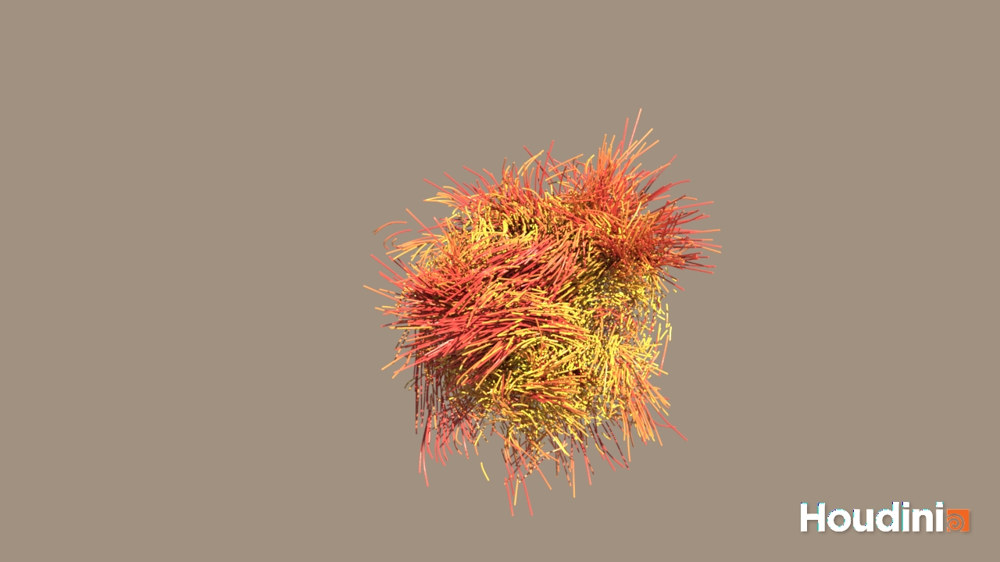
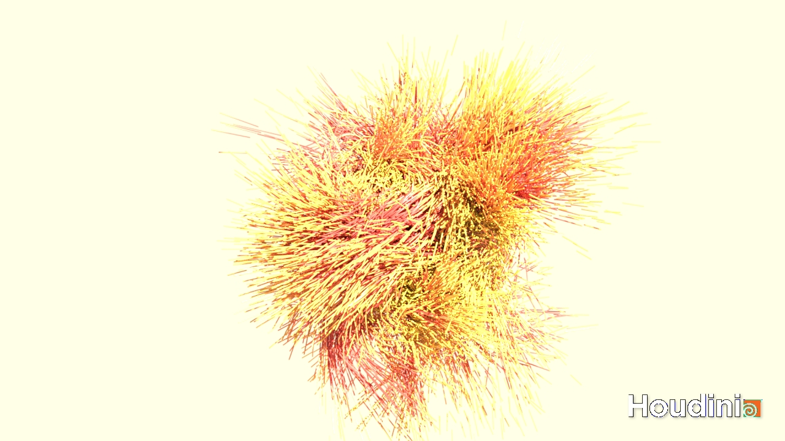

# Procedural Modeling Lectures

Lectures in procedural modeling for both **tech** and **art** students (AKA STEAM lectures).

Lecture notes are written using [`Obsidian v1.6.7`](https://obsidian.md/).

**Lectures aim:**
* Provide a map of the procedural modeling field
* Theoretical and practical tools for procedural modeling
* Conceptual understanding of procedural modeling techniques

**Learning approach used in this lectures:**
* Learning by doing: concepts, approaches, methods and techniques
* Project-based learning: practical lectures and project work
* Primary software: Houdini (https://www.sidefx.com/)
* Complementary software: Blender (https://www.blender.org/) and Unity (https://unity.com/)

**Lecture applications:**
* Animated film
* Motion graphics
* VFX
* Game development
* Scientific visualization
* AR/VR environments
* Computational design
* Generative/algorithmical Art
* Arhitecture

# Lectures

## Introduction

###  Introduction to Lectures and Procedural Modeling

* About lectures, syllabus and overview
* Big picture: about procedural modeling and Houdini workflow intuition
* Applications of procedural modeling

### Overview of Procedural Modeling

* Broad overview of procedural modeling techniques and concepts
* Follow-up practical examples

## Part 1: Procedural Modeling

### Lecture 1.1: Procedural Hard Surface Modeling

Topics and concepts:
* Procedural modeling of hard-surface (human made) shapes 
* Procedural geometry, mesh-based (surface) manipulation: vertices, edges, faces and points
* Structured proceduralism and scattering
* Props placement
* Interactive parameters; parameterized geometry

Lecture notes: https://github.com/lorentzo/ProceduralModelingLectures/tree/main/LectureNotes/1_ProceduralBuilding

Practical examples: https://github.com/lorentzo/ProceduralModelingLectures/tree/main/Lectures/1_ProceduralBuilding/Examples

Procedural building 1.1             |  Procedural building 1.2
:-------------------------:|:-------------------------:
  |  

Procedural building 1.3             |  Procedural building 1.4
:-------------------------:|:-------------------------:
  |  

Procedural building 2.1 & 2.2

### Lecture 1.2: Procedural Terrain Modeling

Topics and concepts:
* Noise and noise types (Perlin, Worley, flow and other derivations)
* Noise layering (fractal sum, fbm) and warping
* Noise and geometric displacement
* Geometry attributes for instancing and materials
* Masking and sampling
* Instancing and transformations (rotations, scaling, translation)
* Heightfields
* Surface and volume generation
* World building
* Clouds and seas

Lecture notes: https://github.com/lorentzo/ProceduralModelingLectures/tree/main/LectureNotes/2_ProceduralTerrain

Lecture data: https://github.com/lorentzo/ProceduralModelingLectures/tree/main/LectureExamples/2_ProceduralTerrain/LectureExample

Heightfield from NASA topo 1.1             |  Heightfield from NASA topo 1.2
:-------------------------:|:-------------------------:
  |  

Heightfield using noise 2.1             |  Heightfield using noise 2.2
:-------------------------:|:-------------------------:
  |  

Mesh using noise 2.1            |  Mesh using noise 2.2
:-------------------------:|:-------------------------:
  |  

### Lecture 1.3: Procedural Organic Shapes and Natural Phenomena using Volume-based Modeling

Topics and concepts:
* Procedural animation/motion using volumes
* Volume from points and surface
* Animated vector field for volume displacement
* Attribute transfer and animated geo attributes
* Procedural organic and natural phenomena modeling
* Morphing: transformations and generation of geometry
* Iterative systems and chaos

R&D:
* https://inconvergent.net/2016/shepherding-random-growth/
* Digital morphogenesis: https://en.wikipedia.org/wiki/Digital_morphogenesis
  * Complex shape development
  * Biology, Geology, Geomorphology and arhitecture

Practical:
* https://www.sidefx.com/learn/collections/applied-houdini-particles/
* https://entagma.com/tag/growth/

### Lecture 1.4: Procedural Abstract Shapes and Natural Phenomena using Particle-based Modeling

Topics and concepts:
* Procedural animation/motion using particles
* Guiding particles via vector fields and volumes
* Particles and animated vector (force or velocity) fields using noise
* Guiding particles via vector fields 
* Instancing on particles and trails/lines
* Geometry from particles
* Attribute transfer and animated geo attributes
* Procedural abstract and natural phenomena modeling
* Iterative systems and chaos
* Boids

### Lecture 1.5: Procedural Growth and Spread Modeling on Foliage 

Topics and concepts:
* Natural and biological systems
* branching shapes/structures (iterative and recursive; e.g., trees, roots)
* Procedural animation
* surface and volume foliage spread and growth
* Geometrical instancing and geo attributes
* Foliage growth
* Theoretical principles: SCA, Eden, L-Systems, DLA, reaction-diffusion
* Animated surface with instances
* Digital Morphogenesis
* Cells and automation

Example of foliage growth and spread 1.1             |  Example of foliage growth and spread 1.2
:-------------------------:|:-------------------------:
  |  

Example of foliage growth and spread 2.1             |  Example of foliage growth and spread 2.2
:-------------------------:|:-------------------------:
  |  

R&D:
* http://algorithmicbotany.org/papers/colonization.egwnp2007.pdf
* https://graphics.pixar.com/library/ElementalEarth/paper.pdf
* https://docs.blender.org/manual/en/latest/addons/mesh/tissue.html

Practical:
* https://www.sidefx.com/docs/houdini/nodes/sop/lsystem
* https://www.youtube.com/watch?v=0vE8GiXhOWM
* https://www.youtube.com/watch?v=CgxTCpUqp5Q
* https://www.youtube.com/watch?v=b-DDdGcvBaI

## Part 2: Proceduralism and Dynamics

Combining procedural modeling (Phenomenological approach) with feedback loop, simulation, forces, velocities, positions and constraints (physically-based, classical mechanics methods for CG).

### Lecture 2.1: Proceduralism and Rigid Body

Topics and concepts:
* Rigid body collisions
* Rigid body fracture and animation via simulation
* Procedurally guided physically-based dynamics
* RBD solvers

R&D:
* https://docs.blender.org/manual/en/latest/addons/object/cell_fracture.html
* https://dl.acm.org/doi/pdf/10.1145/2556700.2556713?casa_token=9i_sM2Dud3wAAAAA:N5XFUTjcGkPoqWebxFAOwVgOPiLx8l8qJ6QcPNzaGgYC-nmH-8mtR9Z2qF9yTnMn4Tu68DTGvTc

Practical:
* https://www.youtube.com/watch?v=IHYelaEFmr8
* https://www.sidefx.com/tutorials/smashing-wine-glass/

### Lecture 2.2: Proceduralism and Soft Body

Topics and concepts:
* Soft body deformation using external forces and collisions
* Procedural vector field as external force field
* Soft bodies simulation

R&D:
* https://matthias-research.github.io/pages/publications/posBasedDyn.pdf

Practicals:
* https://www.sidefx.com/docs/houdini/vellum/index.html

### Lecture 2.3: Proceduralism and Fluids: Liquid

Topics and concepts:
* Turbulent water simulation 
* Physically-based liquid simulation and solvers
* External procedural vector fields and collisions

R&D:
* https://mmacklin.com/pbf_sig_preprint.pdf
* https://graphics.pixar.com/library/ElementalWater/paper.pdf

Practicals:
* https://entagma.com/tag/fluid/

### Lecture 2.4: Proceduralism and Fluids: Gases phenomena

Topics and concepts:
* Fire simulation and spread
* Smoke (gas and volume) simulation 
* Procedural external forces and vector fields
* Physically-based gas solvers
* Procedural constraints and forces and physically-based solvers

R&D:
* https://graphics.pixar.com/library/ElementalAir/paper.pdf

Practicals:
* https://entagma.com/tag/fluid/
* https://graphics.pixar.com/library/ElementalFire/paper.pdf
* https://www.youtube.com/watch?v=zyIJQHlFQs0

## Part 3: Proceduralism and Character VFX

Applying procedural modeling and dynamics for character VFX.

### Lecture 3.1 Proceduralism with Hair and Fur Modeling
TODO

### Lecture 3.2 Proceduralism and Cloth Modeling
TODO

### Lecture 3.3 Proceduralism and Crowds Modeling
TODO

# Resources 

* SideFX; Houdini: https://www.sidefx.com/learn/getting_started/
* Entagma: https://entagma.com/
* Stanford; D. James: http://graphics.stanford.edu/courses/cs348c/
* Ebert: Texturing and modeling: procedural approach
* J. Horikawa: https://www.youtube.com/watch?app=desktop&v=rj0dEEVU1Ek&ab_channel=Houdini
* Nature of code: https://natureofcode.com/
* Pixar: https://graphics.pixar.com/library/
* My work: https://www.artstation.com/lovro
