# Procedural Modeling Lectures

Procedural modeling = modeling algorithmically!

Procedural modeling lectures for both **tech** and **art** students (AKA STEAM lectures).

Lecture notes are written using [Obsidian](https://obsidian.md/).

**Lectures aim:**
* Provide a map of the procedural modeling field
* Theoretical knowledge and practical tools for procedural modeling and animation

**Learning by doing:**
* Learning theory and concepts by working on practical examples
* Project-based learning: practical lectures and project work
* Software: 
    * Houdini (https://www.sidefx.com/)
    * Blender (https://www.blender.org/) 
    * Unity (https://unity.com/)
    * Touch Designer (https://derivative.ca/)

**Lecture applications:**
* Animated film
* Motion graphics
* VFX
* Game development
* Scientific visualization
* AR/VR
* Generative/algorithmical Art
* Computational arhitecture and design

# Lecture Syllabus

## Introduction

### Introduction to Lectures and Procedural Modeling

* About lectures, syllabus and overview
* Big picture: about procedural modeling and Houdini workflow intuition
* Applications of procedural modeling

### Overview of Procedural Modeling

* Explaining why using procedural modeling for content generation
* Explaining what can be generated procedurally
* Structuring procedural content generation methods
* Broad overview of procedural modeling techniques and concepts
* Follow-up practical examples
* Evaluating procedurally generated content
* Future learning

Noise surface modeling 1             |  Noise surface modeling 2
:-------------------------:|:-------------------------:
  |  

## Part 1: Procedural Modeling

### Lecture 1.1: Procedural Hard Surface Modeling

Topics and concepts:
* Understanding hard surface modeling and difference to soft surface (organic) modeling
* Typical procedural hard surface modeling workflow: concept, design and implementation
* Procedural hard-surface (human made, artificial, industrial) modeling techniques, datastructures and methods
* Parameterized hard surface model

Lecture notes and practical examples: https://github.com/lorentzo/ProceduralModelingLectures/tree/main/Lectures/1_HardSurfaceModeling

Procedural building (Houdini)             |  Procedural building (Blender)
:-------------------------:|:-------------------------:
  |  

Procedural building 2.1 & 2.2

Hard surface panels (Blender)            |  Procedural building (Houdini)
:-------------------------:|:-------------------------:
  |  

### Lecture 1.2: Procedural Terrain Modeling

Topics and concepts:
* Understanding elements of virtual terrains: topology, color, props, etc.
* Terrain topology and color (material) modeling approaches
* Terrain modeling datastructures and sources of data (e.g., NASA heightmaps)
* Mesh-based (surface) terrain modeling using noise and geometric displacement
* Heightfield-based (surface) terrain modeling using height maps
* Heightfield-based (surface) terrain modeling using noise and heightfield layering
* 3D (volume) terrain modeling using noise
* Importance of noise and noise layering/warping for terrain modeling
* Attributes, dataflow and geometrical instancing
* Masking, samling (scattering) and instancing
* World building workflow: concept, design and implementation

Lecture notes and practical examples: https://github.com/lorentzo/ProceduralModelingLectures/tree/main/Lectures/2_ProceduralTerrain

Heightfield-based terrain using noise (Houdini)             |  Heightfield-based terrain using NASA topo (Houdini)
:-------------------------:|:-------------------------:
  |  

Mesh-based terrain using noise (Blender)           |  Mesh-based terrain using noise (Houdini)
:-------------------------:|:-------------------------:
  |  

### Lecture 1.3: Procedural Particles and trails (Abstract and FX)

Topics and concepts:

* Guiding particles via animated noise vector fields
* Particles from surface geometry and attribute inheriance/transfer
* Surface flow
* Collisions and collision detection
* Guiding curves
---
* Trails from particles
* Instancing on particles
---
* Iterative, feedback loop systems 
* Complex systems, chaos and strange attractors 

Vector field guide and sourcing            |  Curve guide and collisions
:-------------------------:|:-------------------------:
 | 

Surface flow 1             |  Surface flow 2
:-------------------------:|:-------------------------:
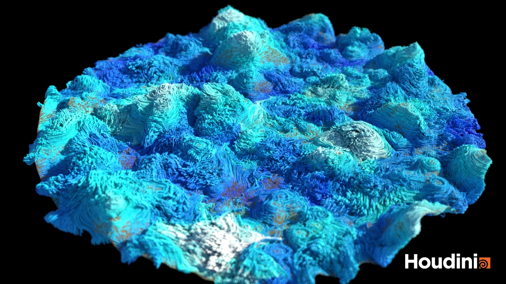 | 

Blender particle system             |  Unity VFX Graph
:-------------------------:|:-------------------------:
 | 

### Lecture 1.4: Procedural Volume-based Modeling: Organic and Natural Phenomena

Topics and concepts:
* Volumetric representation (voxels and SDF) vs other representations (mesh, particles, points, etc.)
* Organic modeling techniques
* Complex natural phenomena and shapes: clouds, rocks, biology, geology, geomorphology and arhitecture
* Volume from points, surface and SDF
* Animated vector field for volume displacement
* Attribute transfer and animated geo attributes
* Morphing: transformations and generation of geometry
* Iterative systems and chaos

Starting volume cloud shape             |  Particle dynamics for simulating volume cloud advection
:-------------------------:|:-------------------------:
 | 

Starting volume cloud shape             |  Morphed cloud shape
:-------------------------:|:-------------------------:
 | 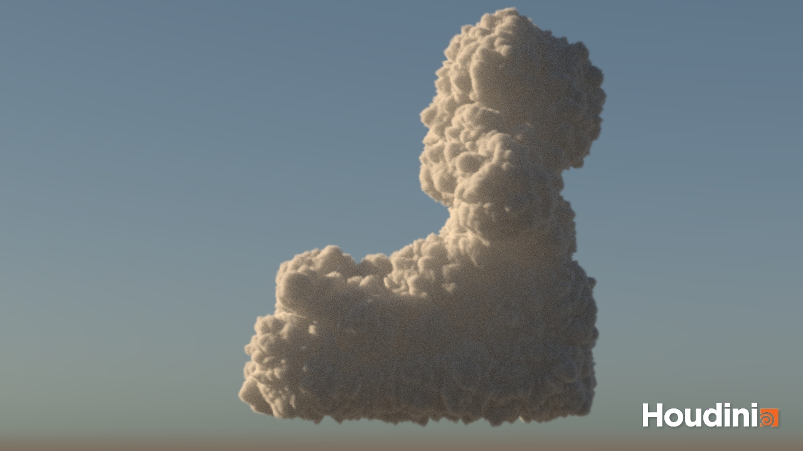

Particle advection using volume vector field             |  Particle advection using volume vector field
:-------------------------:|:-------------------------:
 | 

Volumetric solid modeling            |  Volumetric solid modeling
:-------------------------:|:-------------------------:
 | 

### Lecture 1.5: Procedural Foliage, Growth and Spread

Topics and concepts:
* Branching shapes/structures (e.g., trees, branches roots, etc.)
* Modeling surface and volume growth
* Modeling surface and volume spread
* Growth and digital morphogenesis
* Modeling and animating macro plant: flower bloom
* Natural and biological systems
* Procedural animation
* Geometrical instancing and geo attributes
* Theoretical principles: SCA, Eden, L-Systems, DLA, reaction-diffusion, iteration, recursion, CA
* Geometry distance and instancing

Branching structure volume growth (Houdini):          |  Branching structure surface growth (Blender):
:-------------------------:|:-------------------------:
  |  

Surface spread (Blender):          |  Surface spread (Houdini):
:-------------------------:|:-------------------------:
  |  

Growth (Houdini)          |  Growth (Houdini)
:-------------------------:|:-------------------------:
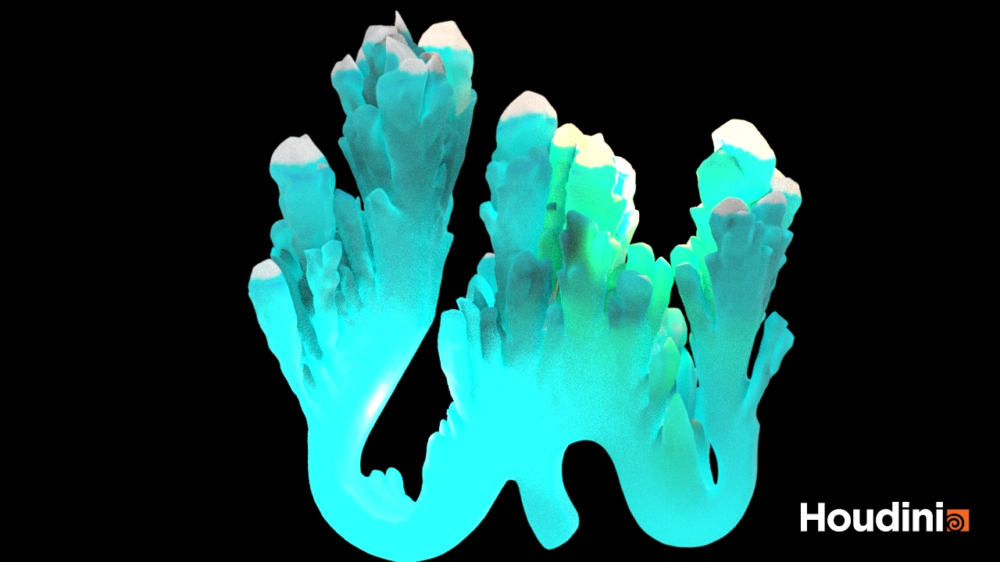  |  

### Lecture 1.6. Procedural lines and curves

Topics and concepts:
* Procedural curves and lines generation (from scratch and from shape)
* Vector graphics
* Design and development of UI graphics; using base shapes and adding complexity
* Animated UI graphics and UI FX
* 3D procedural modeling for 2D motion graphics

Lines from curve guide             |  Lines from shape
:-------------------------:|:-------------------------:
  | 

Lines from point cloud | Attractor
:-------------------------:|:-------------------------:
  | 

### Lecture 1.7. Procedural material modeling

Topics and concepts:
* Material as optical property (e.g., diffuse) and mechanical property (e.g., soft body)
* Optical material properties modeling and theory
* Mechanical material properties modeling and theory
* Surface materials vs volume materials
* Material scales and observation distance: micro, meso and macro
* Material vs geometry
* Material modeling decomposition in practice: scattering equation and texture
* Material scales in practice: scattering equation, texture and geometry
* Material and light in theory and practice
* Procedural texture: a function
* Procedural textures: surface vs volume
* Procedural textures for material surface or volume variation
* Noise for procedural texture modeling: frequency, amplitude, warping, layering
* Procedural natural materials:
  * Procedural fur and hair
  * Procedural feathers (e.g., bird feather)
  * Procedural scales (e.g., fish scales)
  * Procedural porous materials (e.g., sponge)
  * Foliage patterns
* Procedural industrial materials:
  * Procedural textile (e.g., cloth)
  * Procedural glass (e.g., frosted glass)

Surface materials - stone             |  Surface materials - metal and glass
:-------------------------:|:-------------------------:
  | 

Surface material - fabric/textile | Surface material - fabric/textile
:-------------------------:|:-------------------------:
  | 

Geometrical details             |  Displacement and SSS
:-------------------------:|:-------------------------:
  | 

Hair and fur material             |  Hair and fur material
:-------------------------:|:-------------------------:
  | 

Volume material             |  Volume material
:-------------------------:|:-------------------------:
 | 

## Part 2: Procedural Modeling and Dynamics (WIP)

Procedural geometrical and material mechanics modeling using:
* feedback loop, simulation(Phenomenological approach)
* forces, velocities, positions and constraints
* physically-based, classical mechanics methods for CG

Procedural modeling and physical simulation:
* Procedurally define parameters and initial state of simulation
* Use results of physicals simulation for procedural modeling

### Lecture 2.1: Procedural Modeling and Rigid Body Simulation

Topics and concepts:
* Physics-based simulation methods for modeling shape and motion
* Rigid body collisions and contact
* Rigid body fracture and animation via simulation
* Procedurally guided physically-based dynamics
* RBD solvers: Bullet, Open Dynamics Engine, built-in

Space filling RBD             |  Space filling RBD
:-------------------------:|:-------------------------:
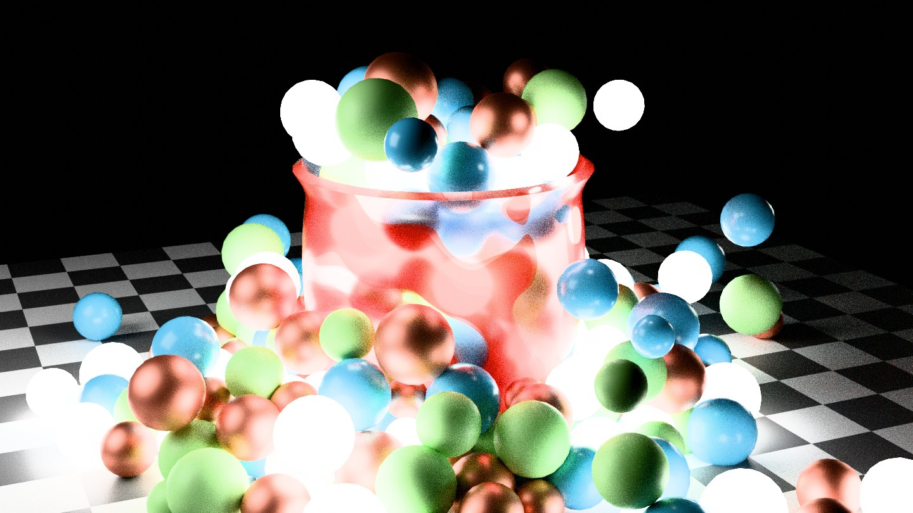 | 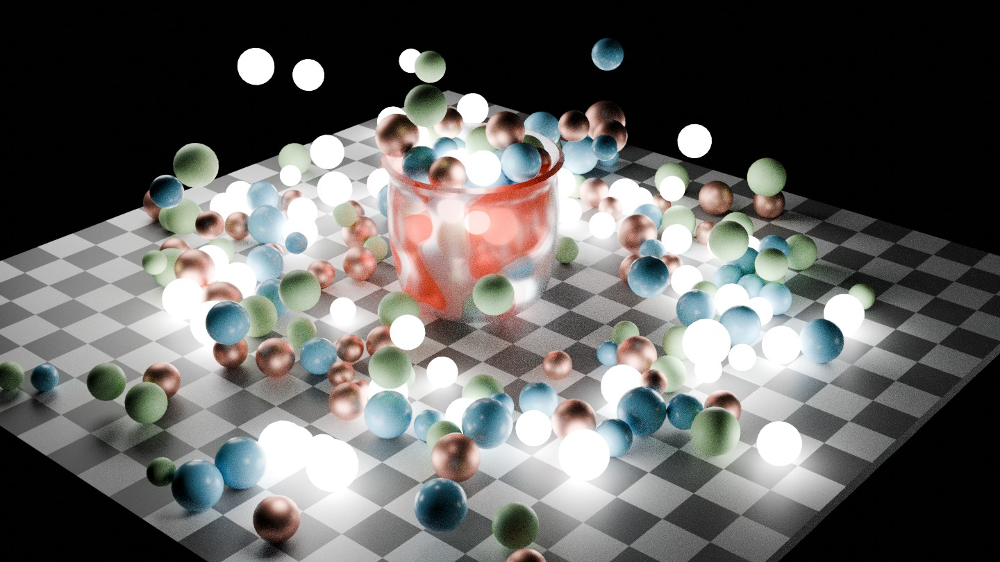

Force Field RBD             |  Force Field RBD
:-------------------------:|:-------------------------:
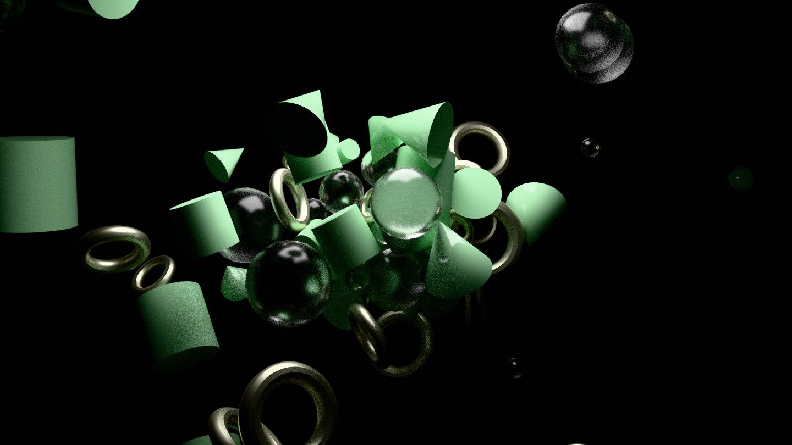 | 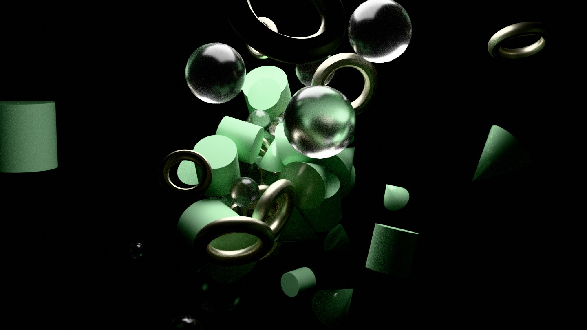

### Lecture 2.2: Procedural Modeling and Soft (Deformable) Body Simulation

Topics and concepts:
* Physics-based simulation methods for modeling shape and motion
* Soft body deformation using external forces and collisions
* Procedural vector field as external force field
* Soft bodies simulation
* Deformation on collision and contact
* Soft body solvers: finite elements methods, position based dynamics

Vellum Balloon Collisions             |  Vellum Balloon Collisions
:-------------------------:|:-------------------------:
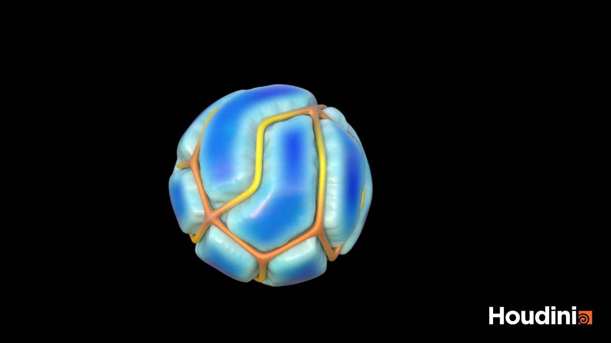 | 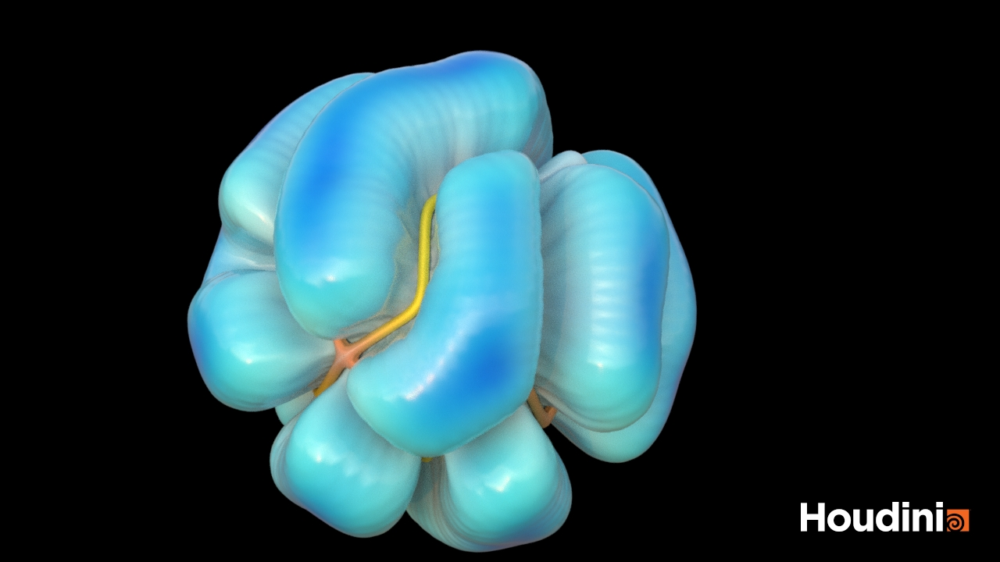

### Lecture 2.3: Procedural Modeling and Fluids: Liquid Simulation

Topics and concepts:
* Physics-based simulation methods for modeling shape and motion
* Turbulent water simulation 
* Physically-based liquid simulation and solvers
* External procedural vector fields and collisions

FLIP + RBD             |  FLIP + RBD
:-------------------------:|:-------------------------:
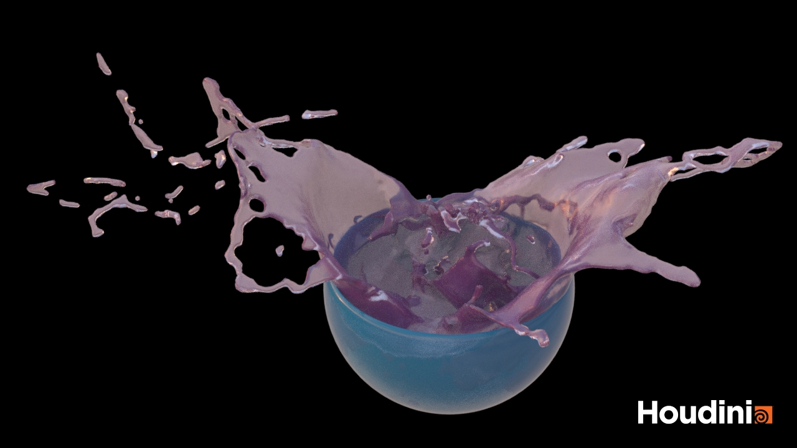 | 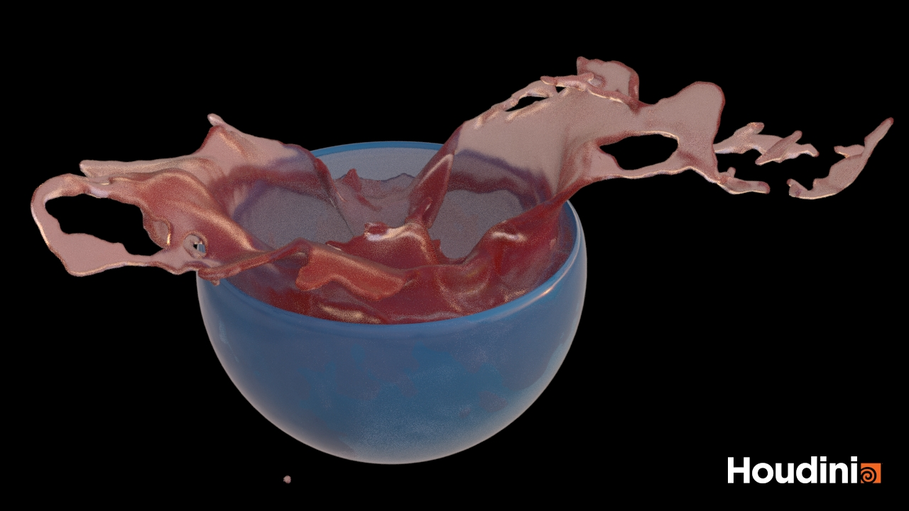

### Lecture 2.4: Procedural Modeling and Fluids: Gas Simulation

Topics and concepts:
* Physics-based simulation methods for modeling shape and motion
* Fire simulation and spread
* Smoke (gas and volume) simulation 
* Procedural external forces and vector fields
* Physically-based gas solvers
* Procedural constraints and forces and physically-based solvers

Gas simulation             |  Gas simulation
:-------------------------:|:-------------------------:
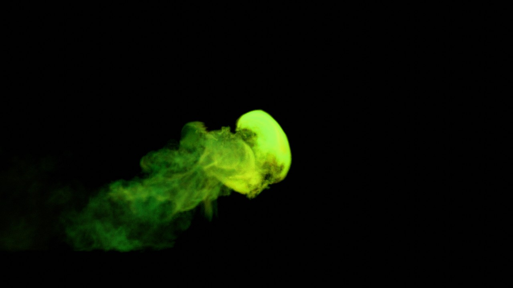 | 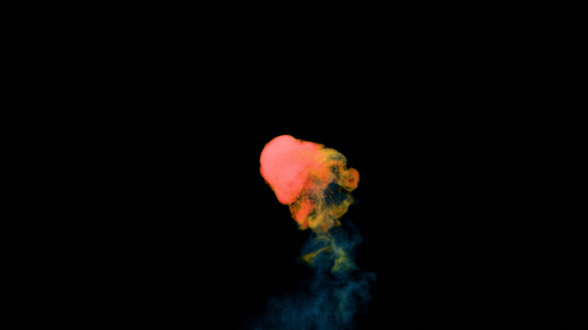

# Resources 

* SideFX; Houdini: https://www.sidefx.com/learn/getting_started/, https://www.sidefx.com/docs/houdini/
* Blender: https://docs.blender.org/
* Entagma: https://entagma.com/
* Stanford CS 348C: Computer Graphics: Animation and Simulation: http://graphics.stanford.edu/courses/cs348c/
* Ebert: Texturing and modeling: procedural approach
* J. Horikawa: https://www.youtube.com/watch?app=desktop&v=rj0dEEVU1Ek&ab_channel=Houdini
* Nature of code: https://natureofcode.com/
* Pixar: https://graphics.pixar.com/library/
* My work: https://www.artstation.com/lovro
* Konstantin Magnus: https://procegen.konstantinmagnus.de/
* Pragmatic VFX: https://pragmatic-vfx.com/
* Houdini Kitchen: https://www.houdinikitchen.net/
* EPC: https://www.everythingprocedural.com/

# Possible Future lectures:
* Procedural animation using sound
* Procedural reactive systems (reaction to sound, collision or interaction)
* Procedural interactive models
* Advanced physically-based simulation of material mechanical properties:
  * Other solid material types: snow, soil, mud, concrete, metal, jello, rubber, water, honey, and sand
  * Other material types: https://en.wikipedia.org/wiki/Continuum_mechanics
  * Additional dynamics: https://en.wikipedia.org/wiki/Classical_mechanics
* Advanced particle systems:
  * boids
* Procedural modeling and computational design
* Proceduralism and virtual characters 
  * CFX
  * Procedural crowds modeling
* 3D fractals and attractors, chaos and complex systems
* Procedural compositing and image processing
* Isosurfaces, metaballs, meta shapes, implicit surfaces, SDFs, etc.
* Parametric surfaces (NURBS)
* Photogrammetry and Gaussian Splatting