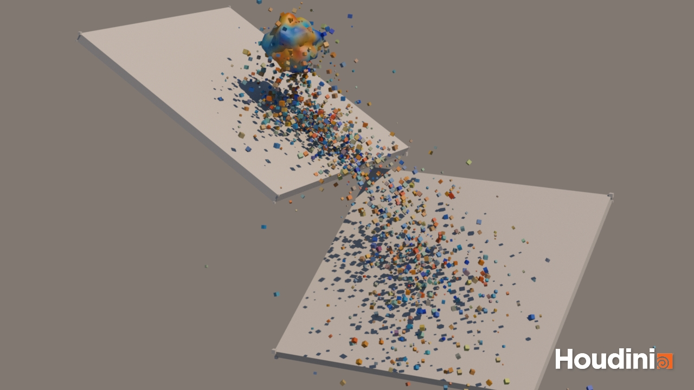

# Procedural Modeling Lectures

Procedural modeling lectures for both **tech** and **art** students (AKA STEAM lectures).

Lecture notes are written using [`Obsidian v1.6.7`](https://obsidian.md/).

**Lectures aim:**
* Provide a map of the procedural modeling field
* Theoretical and practical tools for procedural modeling and animation
* Conceptual understanding of procedural modeling techniques

**Learning approach used in this lectures:**
* Learning by doing: concepts, approaches, methods and techniques
* Project-based learning: practical lectures and project work
* Primary software: Houdini (https://www.sidefx.com/)
* Complementary software: Blender (https://www.blender.org/) and Unity (https://unity.com/)

**Lecture applications:**
* Animated film
* Motion graphics
* VFX
* Game development
* Scientific visualization
* AR/VR environments
* Computational design
* Generative/algorithmical Art
* Arhitecture

# Lecture Syllabus

## Introduction

###  Introduction to Lectures and Procedural Modeling

* About lectures, syllabus and overview
* Big picture: about procedural modeling and Houdini workflow intuition
* Applications of procedural modeling

### Overview of Procedural Modeling

* Explaining why using procedural modeling for content generation
* Explaining what can be generated procedurally
* Structuring procedural content generation methods
* Broad overview of procedural modeling techniques and concepts
* Follow-up practical examples
* Evaluating procedurally generated content
* Future learning

## Part 1: Procedural Modeling

### Lecture 1.1: Procedural Hard Surface Modeling

Topics and concepts:
* Understanding hard surface modeling and difference to soft surface (organic) modeling
* Typical procedural hard surface modeling workflow: concept, design and implementation
* Procedural hard-surface (human made, artificial, industrial) modeling techniques, datastructures and methods
* Parameterized hard surface model

Lecture notes and practical examples: https://github.com/lorentzo/ProceduralModelingLectures/tree/main/Lectures/1_HardSurfaceModeling

Procedural building 1.1             |  Procedural building 1.2
:-------------------------:|:-------------------------:
  |  

Procedural building 2.1 & 2.2

### Lecture 1.2: Procedural Terrain Modeling

Topics and concepts:
* Understanding elements of virtual terrains: topology, color, props, etc.
* Terrain topology and color (material) modeling approaches
* Terrain modeling datastructures and sources of data (e.g., NASA heightmaps)
* Mesh-based (surface) terrain modeling using noise and geometric displacement
* Heightfield-based (surface) terrain modeling using height maps
* Heightfield-based (surface) terrain modeling using noise and heightfield layering
* 3D (volume) terrain modeling using noise
* Importance of noise and noise layering/warping for terrain modeling
* Attributes, dataflow and geometrical instancing
* Masking, samling (scattering) and instancing
* World building workflow: concept, design and implementation

Lecture notes and practical examples: https://github.com/lorentzo/ProceduralModelingLectures/tree/main/Lectures/2_ProceduralTerrain

Heightfield-based terrain using NASA topo 1.1             |  Heightfield-based terrain using NASA topo 1.2
:-------------------------:|:-------------------------:
  |  

Heightfield-based terrain using noise 2.1             |  Heightfield-based terrain using noise 2.2
:-------------------------:|:-------------------------:
  |  

Mesh-based terrain using noise 2.1            |  Mesh-based terrain using noise 2.2
:-------------------------:|:-------------------------:
  |  

### Lecture 1.3: Procedural Particle and point based Modeling: Abstract and Natural Phenomena

Topics and concepts:

* Guiding particles via animated noise vector fields
* Particles from surface geometry and attribute inheriance/transfer
* Surface flow
* Collisions and collision detection
* Guiding curves
---
* Lines from particles
* Instancing on particles
---
* Iterative, feedback loop systems 
* Complex systems, chaos and strange attractors 
---
* Boids
* Grains, sand 

Vector field guide 1             |  Vector field guide 2
:-------------------------:|:-------------------------:
 | 

Curl guide 1             |  Curl guide  2
:-------------------------:|:-------------------------:
 | 

Surface flow 1             |  Surface flow 2
:-------------------------:|:-------------------------:
 | 

Inheriance and collisions             |  Attractors
:-------------------------:|:-------------------------:
 | 

### Lecture 1.4: Procedural Volume-based Modeling: Organic and Natural Phenomena

Topics and concepts:
* Volumetric representation vs other representations
* Organic modeling techniques
* Complex natural phenomena and shapes: clouds, rocks, biology, geology, geomorphology and arhitecture
* Volume from points, surface and SDF
* Animated vector field for volume displacement
* Attribute transfer and animated geo attributes
* Morphing: transformations and generation of geometry
* Iterative systems and chaos

Organic volume shapes             |  Volumetric natural phenomena
:-------------------------:|:-------------------------:
 | 

### Lecture 1.5: Procedural Foliage, Growth and Spread Modeling

Topics and concepts:
* Natural and biological systems
* branching shapes/structures (iterative and recursive; e.g., trees, roots)
* Procedural animation
* surface and volume foliage spread and growth
* Geometrical instancing and geo attributes
* Foliage growth
* Theoretical principles: SCA, Eden, L-Systems, DLA, reaction-diffusion
* Animated surface with instances
* Digital Morphogenesis
* Cells and automation

Example of foliage growth and spread 1.1             |  Example of foliage growth and spread 1.2
:-------------------------:|:-------------------------:
  |  

Example of foliage growth and spread 2.1             |  Example of foliage growth and spread 2.2
:-------------------------:|:-------------------------:
  |  

## Part 2: Procedural Modeling and Dynamics (WIP)

Combining procedural modeling (Phenomenological approach) with feedback loop, simulation, forces, velocities, positions and constraints (physically-based, classical mechanics methods for CG).

### Lecture 2.1: Procedural Modeling and Rigid Body Simulation

Topics and concepts:
* Physics-based simulation methods for modeling shape and motion
* Rigid body collisions and contact
* Rigid body fracture and animation via simulation
* Procedurally guided physically-based dynamics
* RBD solvers

R&D:
* https://docs.blender.org/manual/en/latest/addons/object/cell_fracture.html
* https://dl.acm.org/doi/pdf/10.1145/2556700.2556713?casa_token=9i_sM2Dud3wAAAAA:N5XFUTjcGkPoqWebxFAOwVgOPiLx8l8qJ6QcPNzaGgYC-nmH-8mtR9Z2qF9yTnMn4Tu68DTGvTc

Practical:
* https://www.youtube.com/watch?v=IHYelaEFmr8
* https://www.sidefx.com/tutorials/smashing-wine-glass/

### Lecture 2.2: Procedural Modeling and Soft (Deformable) Body Simulation

Topics and concepts:
* Physics-based simulation methods for modeling shape and motion
* Soft body deformation using external forces and collisions
* Procedural vector field as external force field
* Soft bodies simulation
* Deformation on collision and contact

R&D:
* https://matthias-research.github.io/pages/publications/posBasedDyn.pdf

Practicals:
* https://www.sidefx.com/docs/houdini/vellum/index.html

### Lecture 2.3: Procedural Modeling and Fluids: Liquid Simulation

Topics and concepts:
* Physics-based simulation methods for modeling shape and motion
* Turbulent water simulation 
* Physically-based liquid simulation and solvers
* External procedural vector fields and collisions

R&D:
* https://mmacklin.com/pbf_sig_preprint.pdf
* https://graphics.pixar.com/library/ElementalWater/paper.pdf

Practicals:
* https://entagma.com/tag/fluid/

### Lecture 2.4: Procedural Modeling and Fluids: Gas Simulation

Topics and concepts:
* Physics-based simulation methods for modeling shape and motion
* Fire simulation and spread
* Smoke (gas and volume) simulation 
* Procedural external forces and vector fields
* Physically-based gas solvers
* Procedural constraints and forces and physically-based solvers

R&D:
* https://graphics.pixar.com/library/ElementalAir/paper.pdf

Practicals:
* https://entagma.com/tag/fluid/
* https://graphics.pixar.com/library/ElementalFire/paper.pdf
* https://www.youtube.com/watch?v=zyIJQHlFQs0

## Part 3: Procedural Character VFX (CFX) modeling (WIP)

Applying procedural modeling and dynamics for character VFX.

### Lecture 3.1 Procedural Hair and Fur Modeling
TODO

### Lecture 3.2. Procedural feather modeling
TODO

### Lecture 3.2 Proceduralism and Cloth Modeling
TODO

### Lecture 3.3 Proceduralism and Crowds Modeling
TODO

# Resources 

* SideFX; Houdini: https://www.sidefx.com/learn/getting_started/, https://www.sidefx.com/docs/houdini/
* Entagma: https://entagma.com/
* Stanford; D. James: http://graphics.stanford.edu/courses/cs348c/
* Ebert: Texturing and modeling: procedural approach
* J. Horikawa: https://www.youtube.com/watch?app=desktop&v=rj0dEEVU1Ek&ab_channel=Houdini
* Nature of code: https://natureofcode.com/
* Pixar: https://graphics.pixar.com/library/
* My work: https://www.artstation.com/lovro

# Possible Future lectures:
* Procedural animation using sound
* Procedural reactive systems (reaction to sound, collision or interaction)
* Procedural interactive models
* Procedural modeling and advanced physically-based simulation
* Procedural modeling and computational design
